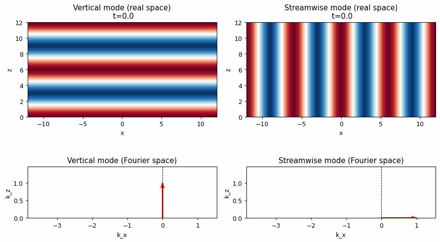
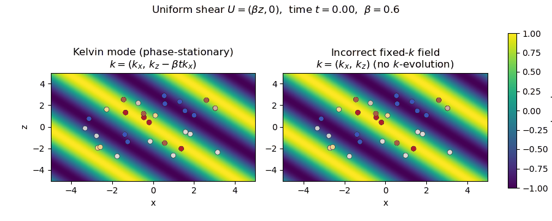
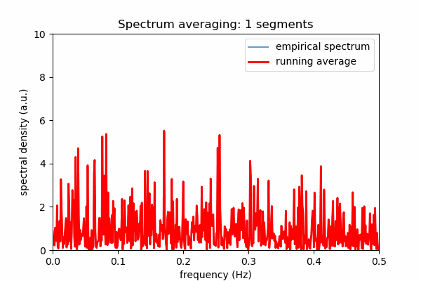

# Mann turbulence model — reconstructed notes and guided narrative

*Working notebook based on your original notes, now reorganized so the discussion reads as a single story while preserving the original technical content.*

This notebook is meant to do more than annotate isolated equations from Mann’s paper. It builds a continuous line of reasoning:

1. start from the statistical objects used to describe turbulence,
2. move from covariance to spectral representations,
3. identify the symmetry constraints that simplify the problem,
4. recover the isotropic von Kármán starting point,
5. introduce Rapid Distortion Theory (RDT) as the mechanism that distorts that isotropic field under shear,
6. obtain the shear-modified spectral tensor used in the Mann model,
7. and finally connect the theory to parameter identification and experimental use.

A practical way to read the notebook is to keep three questions in mind throughout:

* **What is the object being modeled?**  
  Not the instantaneous field itself, but its second-order statistics, especially the spectral tensor.

* **What is the physical mechanism that creates anisotropy?**  
  The distortion of an initially isotropic field by mean shear, treated through RDT together with a finite eddy lifetime.

* **Why is this useful in wind engineering?**  
  Because it gives a compact, physically interpretable spectral model that can be fitted to measurements and then used to generate realistic turbulence with shear-induced anisotropy and coherence structure.


## HOW TO READ THESE NOTES

These notes now follow the same logical order as the model itself.

**Part I — Definitions and statistical representation.**  
We clarify covariance, spectral tensors, Fourier–Stieltjes representations, and cross-spectra. This is the language in which Mann formulates the model.

**Part II — Symmetries and isotropic reference state.**  
Before adding shear, we need to know what isotropy and the associated symmetry restrictions imply. This also leads to the von Kármán spectrum used as the undistorted baseline.

**Part III — Rapid Distortion Theory.**  
Here the mean shear enters. The notebook derives the linear evolution of Fourier modes, explains where the assumptions come from, and shows how the spectral tensor is transformed.

**Part IV — Model closure and validation.**  
Once the distorted tensor is available, the remaining questions are practical: how the parameters are interpreted, how they are estimated, and how the model connects to measured spectra.

Whenever a derivation starts to feel abstract, it helps to return to the core picture: **Mann’s model takes an isotropic spectral field and distorts it through shear in Fourier space, while preserving enough statistical structure to remain measurable, fit-able, and usable in simulation.**

(sec_definition)=
## DEFINITIONS

This opening section establishes the statistical vocabulary used throughout the notebook. The key idea is that the Mann model is built from **second-order turbulence statistics**, so before talking about shear distortion or parameter fitting, we need a clean understanding of covariance, spectral tensors, and the transforms that connect them.

In other words: this is where we decide **what quantity is being modeled** and **why that quantity is the right one**.


(subsec_on_understanding_covariance)=
### UNDERSTANDING COVARIANCE

The first concept to settle is covariance, because it is the most direct second-order description of how turbulent fluctuations at two points are related. Everything that follows in spectral space can be read as a re-expression of this same object.


**PARTING FROM DEFINITION**

A key symmetry property of the two-point velocity covariance tensor in turbulence. Let us go step by step.

Covariance tensor definition (eq. 2.1 in the paper):

$$
R_{ij}(\mathbf{r}) = \langle u_i(\mathbf{x})\, u_j(\mathbf{x} + \mathbf{r}) \rangle .
$$

---

**GOING TO EQUATION (2.2)**

Equation (2.2) in the paper says:

$$
R_{ij}(\mathbf{r}) = R_{ji}(-\mathbf{r}).
$$

This comes from two facts:

1. **Statistical {ref}`homogeneity <note_on_homogeneity>`**:

   In {ref}`homogeneous turbulence <note_on_homogeneity_intuition>`, the statistics depend only on the separation vector $\mathbf{r}$, not on the absolute position $\mathbf{x}$. So, the ensemble average is invariant if you shift coordinates.

3. **SWAPPING INDICES AND SEPARATION**:

    Consider $R_{ji}(-\mathbf{r})$:

   $$
   R_{ji}(-\mathbf{r}) = \langle u_j(\mathbf{x})\, u_i(\mathbf{x} - \mathbf{r}) \rangle.
   $$

   Now, let’s shift the dummy variable $\mathbf{x} \to \mathbf{x} + \mathbf{r}$ (which is allowed because of homogeneity):

   $$
   R_{ji}(-\mathbf{r}) = \langle u_j(\mathbf{x} + \mathbf{r})\, u_i(\mathbf{x}) \rangle.
   $$

   But multiplication is commutative inside the ensemble average:

   $$
   \langle u_j(\mathbf{x} + \mathbf{r})\, u_i(\mathbf{x}) \rangle
   = \langle u_i(\mathbf{x})\, u_j(\mathbf{x} + \mathbf{r}) \rangle
   = R_{ij}(\mathbf{r}).
   $$

---

**HENCE**

Therefore, we get:

$$
R_{ij}(\mathbf{r}) = R_{ji}(-\mathbf{r}).
$$

---

**SUMMARY**

* Equation (2.2) is essentially a **symmetry relation** of the two-point velocity covariance tensor, coming from **homogeneity** and the fact that the product $u_i u_j$ is symmetric under exchange.
* Homogeneity means statistics depend only on the separation vector, not absolute positions.
* That allows us to shift coordinates in the ensemble average.
* This symmetry leads to $R_{ij}(\mathbf{r}) = R_{ji}(-\mathbf{r})$.

(note_on_homogeneity)=
:::{admonition} On homogeneity in turbulence
:class: note

In turbulence (or more generally in random fields), **homogeneity** means that the statistics are invariant under translations in space.

Formally: for the velocity fluctuations $u_i(\mathbf{x})$, the joint probability distributions are invariant if we shift all positions by the same vector $\mathbf{a}$.

That is,

$$
\langle u_i(\mathbf{x}_1) u_j(\mathbf{x}_2) \rangle
= \langle u_i(\mathbf{x}_1 + \mathbf{a}) u_j(\mathbf{x}_2 + \mathbf{a}) \rangle .
$$

This implies that the covariance depends only on the **separation vector** $\mathbf{r} = \mathbf{x}_2 - \mathbf{x}_1$, not on the absolute position $\mathbf{x}_1$.

So instead of writing

$$
R_{ij}(\mathbf{x}_1,\mathbf{x}_2) = \langle u_i(\mathbf{x}_1) u_j(\mathbf{x}_2)\rangle,
$$

we can write

$$
R_{ij}(\mathbf{r}) = \langle u_i(\mathbf{x}) u_j(\mathbf{x}+\mathbf{r})\rangle .
$$

That’s why in the derivation I was allowed to shift $\mathbf{x} \to \mathbf{x} + \mathbf{r}$. It doesn’t matter where the reference point is — only the separation $\mathbf{r}$ matters.

---

We showed:

$$
R_{ji}(-\mathbf{r}) = \langle u_j(\mathbf{x}) u_i(\mathbf{x} - \mathbf{r}) \rangle .
$$

If we shift the coordinate system ($\mathbf{x} \mapsto \mathbf{x} + \mathbf{r}$), homogeneity ensures the statistics don’t change:

$$
R_{ji}(-\mathbf{r}) = \langle u_j(\mathbf{x} + \mathbf{r}) u_i(\mathbf{x}) \rangle .
$$

Now, using the fact that multiplication inside the average is commutative:

$$
R_{ji}(-\mathbf{r}) = \langle u_i(\mathbf{x}) u_j(\mathbf{x} + \mathbf{r}) \rangle = R_{ij}(\mathbf{r}).
$$

That’s the origin of equation (2.2).

:::

(note_on_homogeneity_intuition)=
::::{admonition} On the intuition for homogeneity
:class: note

As the formal definition for homogeneity may be abstract, let’s build some analogies for grasping the idea better.

**Daily analogy 1: a patterned carpet**

Imagine a carpet with a repeating pattern. If you look at one patch, then slide your gaze a meter to the left, the pattern “looks statistically the same.” You don’t care about the absolute position on the carpet, only how far apart two points are.

That’s homogeneity: the statistical properties (like correlations) depend only on the relative displacement between two points, not on where you are on the carpet.

Visually:
!\[..]\(Figs_Mann/07_carpet_composite.gif)
    
* 1. Non-homogeneous (gradient carpet):
    * Properties change with position. Moving across the carpet, the pattern is not the same.
    * Place a small sampling window on the left side of the carpet: the average color inside is dark.
    * Shift the same window to the right: the average color becomes lighter.
    * The mean and variance of the sampled data **depend on absolute position**.
    * This corresponds to non-homogeneous turbulence, where statistics vary with location (e.g. wind speed increasing with height in the atmospheric boundary layer).
    * **Gradient figure:** windows change color intensity with position.

* 2. Homogeneous but anisotropic (striped carpet):
    * The pattern repeats everywhere, but it has a preferred direction (the stripes).
    * Place sampling windows anywhere on the carpet: the average color and variance are the same, so statistics are **independent of absolute position**.
    * But correlations depend on direction:
      * Along the stripes, correlation persists (long correlations).
      * Across the stripes, correlation decays quickly (short correlations).
    * This corresponds to homogeneous anisotropic turbulence: spatially uniform statistics, but with a **preferred orientation** (e.g. eddies stretched in one direction).
    * **Stripes figure:** windows give the same averages everywhere, but orientation matters.

* 3. Homogeneous + isotropic (speckled carpet):
    * Random dots, statistically the same everywhere and in every direction.
    * Place sampling windows at different positions: the mean and variance remain the same, so statistics are **independent of absolute position**.
    * Rotate the sampling window: the statistics inside do not change, because the speckles are equally distributed in all directions.
    * This corresponds to homogeneous isotropic turbulence: the flow looks the same everywhere and has **no preferred direction**.
    * **Speckles figure:** windows give the same statistics under both translations and rotations.

---

**Daily analogy 2: weather vs. turbulence in a cup of coffee**

* Weather outside: turbulence is not homogeneous, because a storm in one place can be very different than calm skies a few kilometers away.
* Stirred coffee: once it’s mixed, the turbulence is (approximately) homogeneous. The swirling motion looks “the same” whether you put your spoon at the top-left or bottom-right of the cup.

So in turbulence:

* **Homogeneous turbulence** = everywhere “statistically the same.”
* **Inhomogeneous turbulence** = properties change with absolute position (e.g. near the ground, or close to a wind turbine rotor).

---

**Mathematical intuition:**

* If turbulence is homogeneous, then the covariance only depends on the vector separating two points ($\mathbf{r}$), not on where the points themselves are ($\mathbf{x}$).
That’s why shifting $\mathbf{x}$ by some amount is allowed — the statistics don’t care where you start.

::::

(note_on_isotropy)=
::::{admonition} On isotropy: the “extra symmetry”
:class: note

**INTUITIVE DEFININTION**

On top of **homogeneity** (translation invariance), **isotropy** means that the statistics are invariant under **rotation** of coordinates.

Formally:

$$
R_{ij}(\mathbf{r}) \quad \text{depends only on the magnitude } |\mathbf{r}|, \text{ not its direction}.
$$

---

**WHY IS THAT POWERFUL?**

Imposing isotropicity in addition to homogeinity sets a further constrain on the form of the covariance tensor:

* **Homogeneity only:**
  The covariance $R_{ij}(\mathbf{r})$ can be any function of the vector $\mathbf{r}$.
* **Homogeneity + Isotropy:**
  $R_{ij}$ must have a very specific form, constrained by symmetry.

In Fourier space, isotropy means the spectral tensor $\Phi_{ij}(\mathbf{k})$ depends only on $|\mathbf{k}|$, and it must be proportional to a {ref}`projection operator <note_on_incompressibility_and_perpendicularity>` that enforces incompressibility:

$$
\Phi_{ij}(\mathbf{k}) = \Phi(k)\left(\delta_{ij} - \frac{k_i k_j}{k^2}\right).
$$

That’s the **famous isotropic turbulence spectrum tensor.**

---

**WHY DOES THE ISOTROPIC TENSOR LOOK THE WAY IT DOES?**

In isotropic, incompressible turbulence, the spectral tensor must satisfy:

1. **Isotropy**: only depends on $|\mathbf{k}|$, not the direction of $\mathbf{k}$.
   → That restricts it to be a combination of $\delta_{ij}$ (identity tensor) and $k_i k_j$ (the only isotropic tensors you can build).

2. **Incompressibility**: velocity field is divergence-free, i.e. $k_i \Phi_{ij}(\mathbf{k}) = 0$.
   → This enforces that the part parallel to $\mathbf{k}$ must vanish.

The only tensor consistent with those is:

$$
\Phi_{ij}(\mathbf{k}) = \Phi(k)\left( \delta_{ij} - \frac{k_i k_j}{k^2} \right).
$$

---

**HOW TO INTERPRET THIS EXPRESSION?**

* $\Phi(k)$: scalar energy spectrum as a function of wavenumber magnitude. It tells you how much energy sits at each scale.
* The term $\left(\delta_{ij} - \frac{k_i k_j}{k^2}\right)$: projection operator onto the plane perpendicular to $\mathbf{k}$.

So, geometrically:

* Turbulence velocity components perpendicular to $\mathbf{k}$ are allowed (transverse modes).
* Components parallel to $\mathbf{k}$ are killed (because incompressibility forbids longitudinal fluctuations).

---

**VISUAL ANALOGY FOR HOMOGENEOUS VS ISOTROPIC**

Imagine dropping dye into water and stirring:

* **Homogeneous turbulence**: no matter where you zoom in the container, the turbulence statistics look the same. (Translation invariance.)
* **Isotropic turbulence**: if you rotate the container, the turbulence looks the same in every direction. (Rotation invariance.)

So:

* Homogeneous turbulence → "same everywhere."
* Isotropic turbulence → "same everywhere, in every direction."

---

**SUMMARY**

* **Homogeneity**: “shifting around in space doesn’t matter” (translation invariance).
* **Isotropy**: “rotating your coordinate system doesn’t matter” (rotation invariance).
* Together: the turbulence looks the same **everywhere** and in **every direction** — like perfectly stirred soup.
* The isotropic tensor form comes from combining **isotropy + incompressibility**, leaving only the projection operator structure.
* Interpretation: $\Phi(k)$ is the energy spectrum, and the tensor enforces that turbulence velocity fluctuations are transverse to $\mathbf{k}$.
* Visual analogies:
    
    * Here’s the sketch for the autocorrelations of homogeneous and isotropic turbulences:
	
		:::{figure} Figs_Mann/01_Homogeneity_vs_Isotropicity.svg
		:name: homogeneity_vs_isotropicity
		:width: 100%
		:align: center

		Homogeneity vs isotropicity
		:::	
  
        * **Left (Homogeneous, anisotropic):** The correlation contours are ellipses. They look the same if you shift around in space (translation invariance), but they depend on direction — stronger correlation along $x$, weaker along $y$.
        * **Right (Homogeneous + Isotropic):** The correlation contours are circles. They look the same under both translation and rotation — no preferred direction.
        * This captures the difference between “everywhere the same” (homogeneous) vs. “everywhere the same and directionless” (isotropic).
    
    * Here’s the spectral-domain analogy:
 
		:::{figure} Figs_Mann/02_Homogeneity_vs_Isotropicity_Fourier.svg
		:name: homogeneity_vs_isotropicity_Fourier
		:width: 100%
		:align: center

		Homogeneity vs isotropicity in Fourier space.
		:::			
        
        * **Left (Anisotropic spectrum):** Energy is elongated along one axis in Fourier space — meaning turbulence has preferred directions (eddies stretched more in one direction).
        * **Right (Isotropic spectrum):** Energy is distributed in circles — no preferred direction, fluctuations are the same in all orientations.
        * So:
            * In **real space**, isotropy gives circular correlation contours (vs ellipses).
            * In **Fourier space**, isotropy gives circular spectral energy lobes (vs elongated/anisotropic lobes).
        * This is why the isotropic tensor form projects onto the plane perpendicular to $\mathbf{k}$ — it enforces that symmetry.
    
    * Here’s the picture of **incompressibility in Fourier space**:
 
		:::{figure} Figs_Mann/03_Isotropicity_Fourier_projection.svg
		:name: isotropicity_Fourier_projection
		:width: 100%
		:align: center

		Isotropicity: projection-based interpretation.
		:::			
		
        
        * The dashed black circle shows *all possible velocity directions*.
        * The red arrow is the wavevector $\mathbf{k}$.
        * The blue curve shows the **allowed velocity directions after projection**: only components **perpendicular to $\mathbf{k}$** survive.
        * So the tensor
        $$
        \delta_{ij} - \frac{k_i k_j}{k^2}
        $$
        acts as a **projection operator** that removes any velocity component parallel to $\mathbf{k}$.
        * That’s exactly what incompressibility means: velocity fluctuations cannot have divergence (no “compression/expansion”), so in Fourier space they must be transverse to $\mathbf{k}$.

    * Here’s the 3D picture of **incompressibility in Fourier space**:
         
		:::{figure} Figs_Mann/04_Isotropicity_3D_Fourier_projection.svg
		:name: isotropicity_3D_Fourier_projection
		:width: 100%
		:align: center

		Isotropicity: 3D-projection-based interpretation.
		:::
        
        * The **red arrow** is the wavevector $\mathbf{k}$ (direction of a Fourier mode).
        * The **blue circle (disk)** is the plane perpendicular to $\mathbf{k}$.
        * That disk is exactly what the projection operator $\delta_{ij} - k_i k_j/k^2$ enforces.
        * The isotropic incompressible spectral tensor
        $$
        \Phi_{ij}(\mathbf{k}) = \Phi(k)\left(\delta_{ij} - \frac{k_i k_j}{k^2}\right)
        $$
        ensures that velocity fluctuations lie **only in this disk**, i.e. perpendicular to $\mathbf{k}$.

(tip_homogeneity_and_isotropy)=
:::{admonition} Homogeneity and isotropy
:class: tip

**LOGICAL RELATIONSHIP**

* **Isotropy implies homogeneity**:

  * If statistics depend only on direction (or magnitude of $\mathbf{r}$), then they cannot depend on the absolute position.
  * Example: the two-point correlation $R_{ij}(\mathbf{r})$ must be a function of $|\mathbf{r}|$ alone → automatically homogeneous.

* **Homogeneity does not imply isotropy**:

  * A shear flow is homogeneous (properties don’t change with $x$, say in streamwise direction), but it’s not isotropic (different variances in streamwise vs vertical directions).

---

**SO CAN WE HAVE ISOTROPY WITHOUT HOMOGENEITY?**

* **Strictly no**:

  * If turbulence is isotropic, then by definition it is also homogeneous, because isotropy requires invariance with respect to *rotations about any point*.
  * If turbulence were isotropic at one location but not homogeneous, then statistics at another location would differ — breaking the rotational invariance.
* **But in practice** you sometimes hear about “local isotropy”:

  * At small scales (in the inertial subrange), turbulence may *appear isotropic* even in globally inhomogeneous flows (like near a wall).
  * This is Kolmogorov’s hypothesis of **local isotropy**: small scales forget about large-scale anisotropy/homogeneity violations.

---

**SUMMARY**

* **Strict sense:** a turbulence field cannot be isotropic without being homogeneous.
* **Practical sense:** you may observe *locally isotropic small-scale turbulence* inside an inhomogeneous flow (boundary layers, jets, wakes). This is an approximation, not a strict isotropic field.

:::

(tip_why_fourier_space)=
:::{admonition} Why Fourier space?
:class: tip

**HOMOGENEITY → FOURIER DIAGONALIZATION**

* In a homogeneous turbulent field, the two-point correlation depends only on **separation** $\mathbf{r}$, not absolute position:

  $$
  R_{ij}(\mathbf{r}) = \overline{u_i(\mathbf{x})u_j(\mathbf{x}+\mathbf{r})}.
  $$
  
* The natural way to analyze such correlations is to use a Fourier transform, because the Fourier basis functions $e^{i\mathbf{k}\cdot\mathbf{x}}$ are eigenfunctions of *translations*.
* In Fourier space, homogeneity implies that different wavenumbers are **uncorrelated**:

  $$
  \langle \hat{u}_i(\mathbf{k}) \hat{u}_j(\mathbf{k}') \rangle \propto \delta(\mathbf{k}+\mathbf{k}').
  $$

* This **diagonalizes the covariance**: a messy correlation function in physical space becomes a simple spectrum in Fourier space.

---

**ISOTROPY → DEPENDENCE ON $|\mathbf{k}|$**

* In isotropic turbulence, the statistics are invariant under rotations.
* In Fourier space, this means the spectrum depends only on the **magnitude** of the wavenumber $|\mathbf{k}|$, not on direction.
* So instead of a tensor function in $\mathbf{r}$-space, we get a **radial scalar spectrum** $E(k)$.
* That’s much simpler to handle mathematically.

---

**ENERGY DISTRIBUTION BY SCALE**

* Turbulence is all about the **cascade of energy across scales**.
* In physical space, “scale” is not explicit — you only see fluctuations in velocity.
* In Fourier space, **scale = wavelength = $2\pi/k$** is explicit.

  * Energy-containing eddies → low $k$.
  * Inertial range → intermediate $k$.
  * Dissipation range → high $k$.

* The energy spectrum $E(k)$ tells you *how much energy lives at each scale*.

---

**THEORETICAL CLOSURE AND DIMENSIONAL ANALYSIS**

* Typical theories (like Kolmogorov’s theory of turbulence scaling, or the famous $-5/3$ law) iare naturally expressed in terms of the energy spectrum $E(k)$.
* Closure models for turbulence (EDQNM, Kraichnan DIA, etc.) are written directly as equations for $E(k)$.
* In physical space, equivalent closure would mean integro-differential equations for correlations — much harder to handle.

---

**SUMMARY**
Fourier (wavenumber) space is the natural language of turbulence because:

* Homogeneity makes the covariance diagonal in Fourier space.
* Isotropy reduces the tensor structure to a function of $|k|$.
* The cascade is a scale-by-scale energy transfer → best described by $E(k)$.
* Dimensional analysis and closure theories work cleanly in spectral space.

:::

(note_on_incompressibility_and_perpendicularity)=
:::{admonition} On incompressibility and perpendicularity
:class: tip

**WHY INCOMPRESSIBILITY FORCES THE VELOCITY TO BE ⟂ TO K**

Start with incompressibility in physical space:

$$
\nabla\!\cdot \mathbf u(\mathbf x)=0.
$$

or in index notation:

$$
\frac{\partial u_i(\mathbf{x})}{\partial x_i} = 0.
$$

This holds pointwise in real space.

Define the Fourier transform of the velocity field (denoted $\hat{\mathbf{u}}(\mathbf{k})$):

$$
\hat{u}_i(\mathbf{k}) = \int_{\mathbb{R}^3} u_i(\mathbf{x}) \, e^{-i \mathbf{k}\cdot \mathbf{x}} \, d\mathbf{x}.
$$

In the expression above, $\hat{u}_i(\mathbf{k})$ is the **spectral amplitude** of the velocity component $i$ at wavevector $\mathbf{k}$.

The inverse transform is:

  $$
  u_i(\mathbf{x}) = \frac{1}{(2\pi)^3}\int_{\mathbb{R}^3} \hat{u}_i(\mathbf{k}) \, e^{i \mathbf{k}\cdot \mathbf{x}} \, d\mathbf{k}.
  $$

So $\hat{u}$ is just the Fourier representation of $u$.

Fourier-transforming the incompressibility condition, i.e., taking $\nabla \cdot \mathbf{u}(\mathbf{x}) = 0$ and writing it in terms of the Fourier expansion:

$$
u_i(\mathbf{x}) = \frac{1}{(2\pi)^3}\int \hat{u}_i(\mathbf{k}) e^{i \mathbf{k}\cdot\mathbf{x}} d\mathbf{k}.
$$

Then:

$$
\nabla \cdot \mathbf{u}(\mathbf{x})
= \frac{\partial u_i}{\partial x_i}
= \frac{1}{(2\pi)^3}\int \hat{u}_i(\mathbf{k}) \, \frac{\partial}{\partial x_i} e^{i \mathbf{k}\cdot\mathbf{x}} \, d\mathbf{k}.
$$

But:

$$
\frac{\partial}{\partial x_i} e^{i \mathbf{k}\cdot\mathbf{x}} = i k_i e^{i \mathbf{k}\cdot\mathbf{x}}.
$$

So:

$$
\nabla \cdot \mathbf{u}(\mathbf{x})
= \frac{1}{(2\pi)^3}\int (i k_i \hat{u}_i(\mathbf{k})) e^{i \mathbf{k}\cdot\mathbf{x}} d\mathbf{k}.
$$

For this to vanish **for all $\mathbf{x}$**, the integrand must vanish pointwise in $\mathbf{k}$:

$$
k_i \hat{u}_i(\mathbf{k}) = 0.
$$

So, interpreting the result:
    
* $\hat{u}_i(\mathbf{k})$ is the Fourier component of the velocity field at wavenumber $\mathbf{k}$.
* The condition $k_i \hat{u}_i(\mathbf{k}) = 0$ means that each Fourier mode of the velocity field is **orthogonal to its wavevector**.

So in Fourier space, incompressibility says:

$$
\hat{\mathbf{u}}(\mathbf{k}) \perp \mathbf{k}.
$$

In other terms:

$$
i\,\mathbf k\!\cdot \hat{\mathbf u}(\mathbf k)=0 \quad\Rightarrow\quad \mathbf k\!\cdot \hat{\mathbf u}(\mathbf k)=0.
$$

So **each Fourier mode** of the velocity is **transverse**: $\hat{\mathbf u}(\mathbf k)$ is perpendicular to $\mathbf k$.

When dealing with the spectral tensor, this means that:

$$
\Phi_{ij}(\mathbf k)=\langle \hat u_i(\mathbf k)\,\hat u_j^*(\mathbf k)\rangle .
$$

Hence, transversality must hold statistically too:

$$
k_i \Phi_{ij}=0,\qquad \Phi_{ij} k_j=0
$$

(for all $\mathbf k$).

If the field is **isotropic**, the most general rotationally invariant rank-2 tensor you can build from $\mathbf k$ is

$$
\Phi_{ij}(\mathbf k)=A(k)\,\delta_{ij}+B(k)\,\frac{k_i k_j}{k^2}.
$$

Contract with $k_i$:

$$
k_i \Phi_{ij}=A(k)\,k_j + B(k)\,\frac{k_i k_i}{k^2}k_j
= \big[A(k)+B(k)\big]\,k_j.
$$

To satisfy $k_i\Phi_{ij}=0$ for all $\mathbf k$, we must have $B(k)=-A(k)$. Hence:

$$
\boxed{\;\Phi_{ij}(\mathbf k)=\Phi(k)\,\Big(\delta_{ij}-\frac{k_i k_j}{k^2}\Big)\;}
$$

with $\Phi(k)\equiv A(k)$. That parenthesis is the **projection operator** onto the subspace perpendicular to $\mathbf k$.

---

**WHY IS IT A “PROJECTION OPERATOR”?**

Define:

$$
P_{ij}(\mathbf k)=\delta_{ij}-\frac{k_i k_j}{k^2}.
$$

Act on any vector $a_j$:

$$
(Pa)_i=a_i-\frac{k_i}{k^2}\,(\mathbf k\!\cdot\!\mathbf a).
$$

Interpretation: it **subtracts the component of $\mathbf a$ parallel to $\mathbf k$**, leaving only the component perpendicular to $\mathbf k$.
Mathematically it’s a projection because:

* **Idempotent:** $P^2=P$ (projecting twice does nothing more).
* **Symmetric:** $P_{ij}=P_{ji}$.
* **Nulls the parallel part:** $P_{ij}k_j=0$ and $k_i P_{ij}=0$.

Thus incompressibility ⇔ “only transverse (solenoidal) components survive,” and $P$ enforces exactly that.

---

**WHAT IS AN “OPERATOR” HERE?**

An **operator** is just a linear map that takes a vector (or function) to another vector (or function). In index form, a rank-2 tensor like $P_{ij}$ acts on a vector $a_j$ to produce a new vector $b_i=P_{ij}a_j$. So we call $P$ the **projection operator** because it’s the linear map that projects any vector onto the plane orthogonal to $\mathbf k$.

---

**SUMMARY**

* **Physics:** $\nabla\cdot\mathbf u=0\Rightarrow \hat{\mathbf u}(\mathbf k)\perp\mathbf k$.
* **Statistics:** enforce transversality on second moments $\Rightarrow k_i\Phi_{ij}=0=\Phi_{ij}k_j$.
* **Symmetry (isotropy):** restricts the tensorial form; with the constraint above you land on

  $$
  \Phi_{ij}(\mathbf k)=\Phi(k)\,P_{ij}(\mathbf k).
  $$

This is why the isotropic incompressible spectral tensor “looks the way it does,” and how the projection operator emerges naturally from incompressibility.


:::

(note_on_incompressibility_interpretation_real_Fourier_spaces)=
:::{admonition} Incompressibility interpretation in real and Fourier spaces.
:class: tip

**INCOMPRESSIBILITY IN REAL SPACE**

$$
\nabla \cdot \mathbf{u}(\mathbf{x},t) = 0.
$$

Interpretation: a small fluid volume cannot expand or contract in time. If velocity has a component pointing “outward,” another must point “inward” to compensate.

In a simple 2D streamwise flow (say $x$-direction streamwise, with $u(x,t)$ and $v(y,t)$ as components), this couples transverse components in time:

$$
\frac{\partial u}{\partial x} + \frac{\partial v}{\partial y} = 0.
$$

---

**MOVING TO FOURIER(SPATIAL FREQUENCY / WAVENUMBER DOMAIN)**

Represent the field as Fourier modes:

$$
u_i(\mathbf{x},t) = \frac{1}{(2\pi)^3}\int \hat{u}_i(\mathbf{k},t) \, e^{i \mathbf{k}\cdot \mathbf{x}} \, d\mathbf{k}.
$$

When you apply $\nabla \cdot$ in Fourier space, derivatives turn into multiplication by $i k_i$.

So incompressibility becomes:

$$
k_i \hat{u}_i(\mathbf{k},t) = 0.
$$

---

**INTERPRETATION IN WAVENUMBER SPACE**

This is a **geometric condition**:

* For each Fourier mode (wavevector $\mathbf{k}$), the velocity amplitude $\hat{\mathbf{u}}(\mathbf{k})$ must be **perpendicular** to $\mathbf{k}$.
* In other words, there are no **longitudinal components** of velocity — only **transverse components** survive.

So instead of thinking about “a fluid parcel not changing its volume,” the frequency-domain picture is:

Each plane-wave building block of the flow is a **transverse wave**, with oscillations orthogonal to its propagation vector $\mathbf{k}$.

This is analogous to how, in electromagnetism, the electric field of a free wave is perpendicular to its wavevector.

---

**LINKING THE TWO VIEWS**

* **Time-domain (real space):**
  Incompressibility = instantaneous constraint: divergence is zero everywhere, volumes don’t expand/contract.
* **Frequency-domain (wavenumber space):**
  Incompressibility = structural constraint on allowed Fourier modes: velocity fields must be built only from transverse waves.

So the real-space condition “no change in volume” **translates into** the spectral condition “velocity ⟂ wavevector.” They are mathematically equivalent views of the same physics.

Visually:

:::{figure} Figs_Mann/06_Incompressibility_in_real_and_Fourier_domains.svg
:name: incompressibility_in_real_and_Fourier_domains
:width: 100%
:align: center

Incompressible condition in real and Fourier domains.
:::

* **Left (real space):** A fluid parcel (gray square). Blue arrow = flow in the streamwise direction. Red arrow = compensating transverse velocity. Together they enforce **no net expansion or contraction** → divergence-free.

* **Right (Fourier space):** The black arrow is a wavevector $\mathbf{k}$. The only allowed velocity components (blue arrows) lie **perpendicular** to $\mathbf{k}$. This is the spectral form of incompressibility: only **transverse modes** exist.

---

**SUMMARY**

* In real space/time: incompressibility links velocity components so volumes don’t expand/contract. Incompressibility = “volume conservation.”
* In Fourier space: incompressibility forbids longitudinal velocity components, leaving only transverse modes. Incompressibility = “no velocity along $\mathbf{k}$.”
* They are two languages describing the same restriction.

:::

(tip_on_incompressibility_translation_into_energy_spectra)=
:::{admonition} Incompressibility translation into energy spectra
:class: tip

**ENERGY IN TURBULENCE**

The kinetic energy per unit mass is:

$$
E = \tfrac{1}{2}\langle u_i u_i \rangle.
$$

Using the covariance tensor at zero separation:

$$
E = \tfrac{1}{2} R_{ii}(0).
$$

In Fourier space (via Parseval/Wiener–Khinchin):

$$
E = \tfrac{1}{2} \int \Phi_{ii}(\mathbf{k}) \, d\mathbf{k}.
$$

So **the trace of the spectral tensor** gives the energy density in wavenumber space.

---

**INCOMPRESSIBILITY CONDITION**

We already saw:

$$
k_i \hat{u}_i(\mathbf{k}) = 0.
$$

At the second-moment (spectral tensor) level:

$$
k_i \Phi_{ij}(\mathbf{k}) = 0, \quad \Phi_{ij}(\mathbf{k}) k_j = 0.
$$

This guarantees that only **transverse velocity components** contribute to the energy at each wavenumber.

---

**STRUCTURE OF $\Phi_{ij}(\mathbf{k})$**

Given isotropy, the most general rank-2 tensor depending on $\mathbf{k}$ is:

$$
\Phi_{ij}(\mathbf{k}) = A(k)\,\delta_{ij} + B(k)\,\frac{k_i k_j}{k^2}.
$$

Incompressibility enforces $B(k) = -A(k)$, leaving:

$$
\Phi_{ij}(\mathbf{k}) = \Phi(k)\left(\delta_{ij} - \frac{k_i k_j}{k^2}\right).
$$

---

**INTERPRETATION**

* $\Phi(k)$: scalar energy spectrum (how much energy at each scale).
* $\delta_{ij} - \tfrac{k_i k_j}{k^2}$: **projection operator** ensuring only velocity components **perpendicular** to $\mathbf{k}$ survive.

So the energy spectrum is entirely in **transverse modes**.

---

**WHY THIS MATTERS**

* In real space: incompressibility means volume-preserving velocity fields.
* In Fourier space: this becomes a **filter** — spectral energy can only appear in directions orthogonal to $\mathbf{k}$.

That’s why when you look at $\Phi_{ij}(\mathbf{k})$, it’s “shaped” like a disk perpendicular to $\mathbf{k}$: all energy lies in that transverse subspace.

So, incompressibility is not just a constraint in real space — it actively **structures the spectral tensor**, ensuring the energy spectrum is transverse at every wavenumber.

:::

::::

(subsec_on_rank_2_tensors)=
### ON RANK-2 TENSORS

A brief tensor detour is useful here because the covariance and spectral objects in turbulence are not just matrices by accident: their rank tells us what kind of information they encode and how they transform under changes of coordinates.


**RANK OF A TENSOR**

The **rank** (sometimes also called "order") of a tensor is the number of indices it carries.

* **Rank-0 tensor:** A scalar (e.g. temperature, pressure).

  $$
  T
  $$

* **Rank-1 tensor:** A vector (1 index, transforms linearly under rotations).

  $$
  v_i
  $$

* **Rank-2 tensor:** An object with two indices.

  $$
  A_{ij}
  $$

  Examples:

  * Stress tensor in fluid mechanics ($\sigma_{ij}$)
  * Velocity gradient tensor ($\partial u_i/\partial x_j$)
  * Covariance tensor in turbulence ($R_{ij}$)

* **Rank-3 tensor:** Three indices, e.g. Levi-Civita symbol $\epsilon_{ijk}$.

* **Rank-4 tensor:** Four indices, e.g. elasticity tensor in solid mechanics $C_{ijkl}$.

---

**GEOMETRIC INTERPRETATION OF A RANK-2**

A rank-2 tensor can be thought of as a **linear map from a vector to a vector**:

$$
b_i = A_{ij} a_j.
$$

So:

* One index “eats” a vector.
* The other index “spits out” the resulting vector.

That’s why things like the projection operator $P_{ij}$ are rank-2: they map a vector $a_j$ to its projection $b_i$. So the way of reading the expression (in a manner so that physical sense can be made out of it) is from right to left.

---

**WHY RANK-2 IN TURBULENCE?**

The velocity field is a **vector**.
When we take correlations, we correlate **two components** of the velocity field:

$$
R_{ij}(\mathbf{r}) = \langle u_i(\mathbf{x}) \, u_j(\mathbf{x}+\mathbf{r}) \rangle.
$$

Since there are two indices $i,j$, the covariance is naturally a **rank-2 tensor**.

Its Fourier transform $\Phi_{ij}(\mathbf{k})$ is also rank-2.

---

**WHAT DOES ISOTROPY MEAN HERE?**

An **isotropic tensor** is one that "looks the same" under any rotation of the coordinate system.
Suppose we have a vector field or tensor field in physical space. If we rotate our coordinate system by a rotation matrix $Q$, then the **components** of any tensor change according to the transformation law.

For a rank-2 tensor $T_{ij}$:

$$
T'_{ij} = Q_{ip} \, Q_{jq} \, T_{pq}.
$$

This is not special to isotropy — it’s the **general rule** for how rank-2 tensors transform under rotations.

* Rank-1 (vector): $v'_i = Q_{ij} v_j$.
* Rank-2 (tensor): $T'_{ij} = Q_{ip} Q_{jq} T_{pq}$.
* And so on.

**Isotropy** means “looks the same in all orientations.”

In other words: if you rotate your coordinate system, the tensor should **not change** in form.

That is:

$$
T'_{ij} = T_{ij} \quad \text{for all rotations } Q.
$$

Substitute the transformation law:

$$
T_{ij} = Q_{ip} Q_{jq} T_{pq}.
$$

This is the condition I wrote before. It is simply the **mathematical statement of isotropy**: the tensor is invariant under all rotations.

* **Scalar (rank-0):** Any scalar $a$ is automatically isotropic, because it doesn’t change under rotations.
* **Vector (rank-1):** The only isotropic vector is the zero vector, because a nonzero vector always defines a preferred direction.
* **Tensor (rank-2):**

  * If no other vector is present, the only isotropic rank-2 tensor is proportional to the identity: $T_{ij} = \alpha \delta_{ij}$.
  * If a vector $\mathbf{k}$ is given, then isotropy relative to $\mathbf{k}$’s magnitude allows $T_{ij}$ to involve both $\delta_{ij}$ and $k_i k_j$.

So the equation:

$$
T_{ij} = Q_{ip} Q_{jq} T_{pq}
$$

is not an assumption pulled out of thin air — it is the precise condition for a tensor to be **isotropic (rotation-invariant)**.

It guarantees that no matter what coordinate system you choose, the tensor has the same “physical meaning.”

Hence formally, under a rotation $Q$, an isotropic tensor $T_{ij}$ must satisfy:

$$
T_{ij} = Q_{ip} Q_{jq} T_{pq}.
$$

So the question becomes: what tensors have this property?

---

**BUILDING BLOCKS AVAILABLE**

If the only vector you have is the wavevector $\mathbf{k}$, then the only things you can form are:

* **Scalars depending only on $|\mathbf{k}|$:** e.g. $A(k)$, $B(k)$.
* **Isotropic rank-2 objects:**

  1. The **identity tensor** $\delta_{ij}$.

     * It's the same in all directions.
     * Any rotation $Q$ satisfies $Q_{ip}Q_{jq}\delta_{pq}=\delta_{ij}$.
     * Tensor transformation under rotation:

        $$
        T'_{ij} = Q_{ip} Q_{jq} T_{pq}.
        $$

        For $\delta_{pq}$:
        
        $$
        T'_{ij} = Q_{ip} Q_{jq} \delta_{pq} = Q_{ip} Q_{jp}.
        $$
        
        Since $Q$ is orthogonal:
        
        $$
        Q_{ip} Q_{jp} = \delta_{ij}.
        $$
        
        So $\delta'_{ij} = \delta_{ij}$.
 
        ---

        **Explicit example (2D, 90° rotation):**

        $$
        Q = \begin{bmatrix}0 & -1 \\ 1 & 0\end{bmatrix}, \quad
        \delta = \begin{bmatrix}1 & 0 \\ 0 & 1\end{bmatrix}.
        $$
        
        $$
        \delta' = Q \delta Q^T = Q I Q^T = I.
        $$
        
        The Kronecker delta remains the same.

  2. The dyadic product of the vector with itself: $k_i k_j$.

     * Under rotation, $k\to Qk$, so $k_i k_j \to Q_{ip}Q_{jq}k_p k_q$.
     * That has the correct transformation law for a rank-2 tensor.
     * A vector transforms as $k'_i = Q_{ip} k_p$.

        So:
        
        $$
        T'_{ij} = k'_i k'_j = Q_{ip} Q_{jq} k_p k_q.
        $$
        
        This matches the tensor transformation rule.
        So $k_i k_j$ **rotates covariantly with $k$**.
        
        ---
        
        **Explicit example (2D, $k=\begin{bmatrix}1\\2\end{bmatrix}$)**
        
        Original dyad:
        
        $$
        k\otimes k = \begin{bmatrix}1 & 2 \\ 2 & 4\end{bmatrix}.
        $$
        
        Rotate the vector:
        
        $$
        k' = Qk = \begin{bmatrix}-2 \\ 1\end{bmatrix}, \quad
        k'\otimes k' = \begin{bmatrix}4 & -2 \\ -2 & 1\end{bmatrix}.
        $$
        
        Now apply transformation law:
        
        $$
        Q(k\otimes k)Q^T = \begin{bmatrix}4 & -2 \\ -2 & 1\end{bmatrix}.
        $$
        
        Matches exactly.
        So $k_i k_j$ rotates consistently with the vector.

That’s it. There are no other independent rank-2 isotropic objects you can build from a **single vector** and the isotropy requirement.

---

**WHY NOT OTHER POSSIBILITIES?**

* **Levi-Civita symbol $\epsilon_{ijk}$:**

  * It is isotropic in a sense (invariant under proper rotations), but **antisymmetric** and changes sign under reflections.
  * If you contract it with $k$, e.g. $\epsilon_{ijk} k_k$, you get an antisymmetric rank-2 tensor.
  * That corresponds to *helical turbulence* (breaks mirror symmetry). If you assume parity symmetry, you exclude this.

* **Higher powers of $k$:**

  * $k_i k_j k_m k_n$ is rank-4, not rank-2.
  * To reduce it to rank-2 you’d need to contract with $\delta_{mn}$, which just reduces back to $k_i k_j$.

* **Any other construction:**

  * Can be written as a linear combination of $\delta_{ij}$ and $k_i k_j$.

  * Take a tensor that “prefers” a direction, e.g.

    $$
    A = \begin{bmatrix}2 & 0 \\ 0 & 1\end{bmatrix}.
    $$
    
    Transform under rotation:
    
    $$
    A' = Q A Q^T.
    $$
    
    If $A$ were isotropic, we’d get $A'=A$.
    But in general we won’t.
    
    Explicit example (90° rotation)

    $$
    A = \begin{bmatrix}2 & 0 \\ 0 & 1\end{bmatrix}, \quad
    Q = \begin{bmatrix}0 & -1 \\ 1 & 0\end{bmatrix}.
    $$
    
    Compute:
    
    $$
    QA = \begin{bmatrix}0 & -1 \\ 2 & 0\end{bmatrix}, \quad
    QAQ^T = \begin{bmatrix}1 & 0 \\ 0 & 2\end{bmatrix}.
    $$
    
    This is not equal to $A$.
    
    So $A$ is not isotropic — it has a “preferred” axis (the $x$-direction).

---

**PUTTING IT TOGETHER**

Thus the most general isotropic rank-2 tensor depending on $\mathbf{k}$ is:

$$
\Phi_{ij}(\mathbf{k}) = A(k)\, \delta_{ij} + B(k)\, \frac{k_i k_j}{k^2}.
$$

* $A(k)$: isotropic part (same in all directions).
* $B(k)$: anisotropy induced by the direction of $\mathbf{k}$.
* Both are functions only of the magnitude $k=|\mathbf{k}|$.
* Visually, this is appreciated in the following figure:
  
  :::{figure} Figs_Mann/05_Isotropy_preserving_matrices.svg
  :name: isotropy_preserving_matrices
  :width: 100%
  :align: center

  Isotropy-preserving matrices.
  :::

  Here the contrasts are much clearer thanks to filled contours:

    1. **Kronecker delta** → Circles before and after rotation. Rotation does nothing — perfect isotropy.
    2. **Dyad $k \otimes k$** → Elongated ellipse before rotation, and after rotation the ellipse simply turns by 45° with $k$. The *shape* is preserved, only orientation changes (covariant).
    3. **Anisotropic diag(2,1)** → Ellipse before rotation, but after rotation the ellipse doesn’t simply rotate: its axes and stretch ratio no longer align cleanly with the rotated system. This shows true anisotropy (a preferred direction baked in).

    This picture makes the hierarchy explicit:

    * $\delta_{ij}$: invariant.
    * $k_i k_j$: rotates properly with $\mathbf{k}$.
    * Generic anisotropic tensor: fails.

---

**SUMMARY**

* **Rank = number of indices.**
* Rank-2 tensors are matrix-like objects that linearly map vectors to vectors.
* In turbulence, the covariance tensor is rank-2 because it links two velocity components.
* The **Kronecker delta** is the only universal isotropic rank-2 tensor.
* The **dyad $k_i k_j$** is the only other option once you introduce a vector $\mathbf{k}$.
* Everything else reduces to combinations of those (unless you allow helicity, then $\epsilon_{ijk}k_k$ appears).

(subsec_on_connection_between_covariance_and_tensors)=
### CONNECTION BETWEEN COVARIANCE AND SPECTRAL TENSORS

This is the first major conceptual hinge in the notebook. Once covariance and spectral tensors are recognized as Fourier pairs, real-space intuition and spectral-space analysis become interchangeable viewpoints on the same information.


**CONNECTION**

The covariance tensor and the spectral tensor are {ref}`Fourier pairs <note_on_Wiener_Khinchin_theorem>`:

$$
R_{ij}(\mathbf{r}) = \int \Phi_{ij}(\mathbf{k}) e^{i \mathbf{k}\cdot \mathbf{r}} \, d\mathbf{k},
$$

$$
\Phi_{ij}(\mathbf{k}) = \frac{1}{(2\pi)^3} \int R_{ij}(\mathbf{r}) e^{-i \mathbf{k}\cdot \mathbf{r}} \, d\mathbf{r}.
$$

Because $R_{ij}(\mathbf{r}) = R_{ji}(-\mathbf{r})$, this implies in Fourier space:

$$
\Phi_{ij}(\mathbf{k}) = \Phi_{ji}^*(\mathbf{k}),
$$

where $^*$ means complex conjugation.

This property is called **Hermitian symmetry**, and it guarantees that $R_{ij}(\mathbf{r})$ is real-valued when we invert the Fourier transform.

---

**SUMMARY**

* In Fourier space, this gives the Hermitian property $\Phi_{ij}(\mathbf{k}) = \Phi_{ji}^*(\mathbf{k})$, which is critical in the Mann/OpenFAST turbulence model.

---

(note_on_Wiener_Khinchin_theorem)=
::::{admonition} On the Wiener-Khinchin theorem
:class: note

The Fourier-transform-based connection between the covariance and spectral tensors is not “just by definition” — it comes from **Wiener–Khinchin theorem** (or more generally, from spectral analysis of random fields).

* The **covariance tensor** $R_{ij}(\mathbf{r})$ tells you how two velocity components are correlated at two points separated by $\mathbf{r}$.
* The **spectral tensor** $\Phi_{ij}(\mathbf{k})$ tells you how much “energy” is distributed across spatial wavenumbers $\mathbf{k}$.

The theorem says: if a random field is **stationary/homogeneous**, then its covariance and its spectrum are Fourier pairs.

So we write

$$
R_{ij}(\mathbf{r}) = \int_{\mathbb{R}^3} \Phi_{ij}(\mathbf{k}) \, e^{i \mathbf{k}\cdot\mathbf{r}} \, d\mathbf{k}.
$$

That’s the {ref}`spatial equivalent <note_time_domain_equivalence>` of the time-domain result that the autocorrelation and the power spectral density are Fourier pairs.


(note_time_domain_equivalence)=
:::{admonition} On the time-domain equivalence $R_{ij}(\mathbf{r})-R(\tau)$
:class: note

**TIME-DOMAIN CASE**

In classic signal processing, if you have a stationary time signal $u(t)$:

* The **autocorrelation function** is

  $$
  R(\tau) = \langle u(t)\, u(t+\tau) \rangle .
  $$

* The **power spectral density (PSD)** is

  $$
  S(\omega) = \frac{1}{2\pi}\int_{-\infty}^\infty R(\tau)\, e^{-i\omega \tau}\, d\tau .
  $$

This is the **Wiener–Khinchin theorem**: autocorrelation and PSD are Fourier transform pairs.

---

**SPATIAL CASE (TURBULENCE)**

Now replace **time** with **space**:

* For turbulence in a homogeneous field, we look at velocities at two *spatial* points, not two *time* instants.

* The **spatial correlation tensor** is

  $$
  R_{ij}(\mathbf{r}) = \langle u_i(\mathbf{x})\, u_j(\mathbf{x}+\mathbf{r}) \rangle .
  $$

* The **spectral tensor** is

  $$
  \Phi_{ij}(\mathbf{k}) = \frac{1}{(2\pi)^3} \int R_{ij}(\mathbf{r})\, e^{-i\mathbf{k}\cdot \mathbf{r}}\, d\mathbf{r} .
  $$

This is exactly the same structure — just in 3D space instead of 1D time.

---

**WHY IS IT “THE SPATIAL EQUIVALENT”?**

* In time signals:

  * lag $\tau$ ↔ frequency $\omega$.
* In turbulence:

  * spatial separation $\mathbf{r}$ ↔ wavenumber $\mathbf{k}$.

So:

* **Autocorrelation in time** ↔ **Covariance in space**.
* **Power spectral density in frequency** ↔ **Spectral tensor in wavenumber space**.

---

**SUMMARY**

That’s why I said it’s the “spatial equivalent.”

The logic is:

* Stationary in time → correlation depends only on lag $\tau$.
* Homogeneous in space → correlation depends only on separation $\mathbf{r}$.

And in both cases, the Fourier transform pair links correlation and spectral density.

:::

:::{admonition} On the wide-sense-stationary nature of the turbulence signal
:class: tip

The Wiener-Khinchin theorem is expressed as stating that the autocorrelation function of a *wide-sense-stationary* random process has a spectral decomposition given by the power spectral density of that process.

**WHAT IS A *WIDE-SENSE-STATIONARY* (WSS) PROCESS?**

A random process $x(t)$ is **wide-sense stationary (WSS)** if:

1. **Constant mean:**

   $$
   \mathbb{E}[x(t)] = \mu \quad \text{independent of } t.
   $$

2. **Autocovariance depends only on lag:**

   $$
   R(\tau) = \mathbb{E}\big[(x(t)-\mu)(x(t+\tau)-\mu)\big]
   $$

   depends only on the time difference $\tau$, not on the absolute time $t$.

That’s weaker than *strict stationarity*, which would require **all statistics of all orders** to be time-invariant. WSS cares only about **first and second moments**, which is enough to define and use the Wiener–Khinchin theorem.

---

**WHY IS TURBULENCE OFTEN MODELED AS WSS?**

In turbulence, we usually cannot track every detail, so we focus on statistical descriptions. Under some assumptions:

* **Mean velocity** (after subtracting it) is treated as constant in time at a fixed point.
* **Fluctuations** are assumed to have statistics that don’t drift in time (on average).
* **Autocorrelations** depend mainly on the *time lag* (or spatial separation), not on the absolute observation time or location — provided the turbulence is **statistically stationary** (in time) and **homogeneous** (in space).

This is not *exactly true* in real flows (boundary layers evolve, wakes spread, etc.), but:

* Over short enough times and within limited regions, turbulence can be treated as WSS.
* This approximation is what makes it possible to apply spectral methods and the Wiener–Khinchin theorem.

---

**CONNECTION TO TURBULENCE SPECTRA**

Because turbulence can be modeled as WSS:

* The **autocorrelation function** of the velocity fluctuations depends only on lag.
* By Wiener–Khinchin, this autocorrelation and the **power spectral density (energy spectrum)** are Fourier transform pairs.
* That’s why we can talk about turbulence in terms of *energy distribution across frequencies or wavenumbers*.

---

**QUICK ANALOGY**

Think of **listening to ocean waves**:

* If you stand on the shore, the sound of waves is random, but its average loudness doesn’t drift over time (constant mean).
* The way two “splashes” are correlated depends only on how far apart they are in time, not on *when* you started listening.
* That’s wide-sense stationarity.

Similarly, turbulence noise (velocity fluctuations) has stable statistics in the WSS sense, so you can analyze it spectrally.

---

**WHEN TURBULENCE CEASES TO BE WSS**

The assumption of turbulence as a **wide-sense stationary** process (constant mean, autocorrelation depending only on lag) is an **idealization**. In reality, turbulence often departs from WSS in these situations:

* a) **Decaying turbulence**:
    * Example: turbulence in a wind tunnel after grids.
    * The turbulent kinetic energy decreases steadily with time.
    * Mean and variance are no longer constant → not WSS.

* b) **Developing boundary layers**:
    * Near a wall, turbulence grows in intensity with distance from the leading edge.
    * Statistics change in space (not homogeneous) and in time if the flow is not yet fully developed.

* c) **Shear layers and wakes**:
    * Turbulence characteristics evolve downstream: wake widens, shear layer thickens.
    * So statistics depend on absolute position → non-stationary.

* d) **Atmospheric turbulence**:
    * Turbulence varies with diurnal cycle, weather patterns, stratification, etc.
    * On short timescales it’s approximately WSS; on long timescales it drifts significantly.

---

**WHY WE STILL ASSUME WSS (LOCALLY)**

* Over **short time windows** and **restricted spatial regions**, turbulence can be treated as “frozen” in its statistical properties.
* This **local stationarity** justifies applying Wiener–Khinchin and spectral methods to study turbulence.
* Mathematically, one often assumes **ergodicity**: time averages = ensemble averages, so one record is enough to estimate correlations and spectra.

---

**SUMMARY**

* WSS = constant mean + autocorrelation depends only on lag.
* **Turbulence** is modeled as WSS (and homogeneous in space) because, after subtracting mean flow and over reasonable scales, its statistics are effectively steady.
* This assumption enables the use of **Wiener–Khinchin theorem** and the whole machinery of turbulence spectra.
* Wiener–Khinchin links autocorrelation ↔ power spectrum.
* Real turbulence is not globally WSS (decaying, evolving, stratified), but **locally and over limited scales** it can be approximated as WSS, making spectral analysis valid.

:::

::::

(subsec_Fourier_Stieltjes_integral)=
### UNDERSTANDING THE FOURIER-STIELTJES INTEGRAL

The Fourier–Stieltjes viewpoint matters because turbulence is fundamentally multi-scale. Mann’s model lives in spectral space precisely because the separation of scales, anisotropy, and shear distortion are most naturally expressed there.


**WHY INTRODUCE A FOURIER REPRESENTATION OF TURBULENCE**

In turbulence theory we rarely try to describe the **instantaneous velocity field** point by point. That is chaotic, unpredictable, and not mathematically manageable as a starting point. Instead, what matters are the **statistics**:

* **Mean velocity field** $\langle u_i(\mathbf{x}) \rangle$.
* **Covariances** $R_{ij}(\mathbf{r}) = \langle u_i(\mathbf{x})u_j(\mathbf{x}+\mathbf{r})\rangle$.
* **Energy spectra** — how kinetic energy is distributed among different length scales.

Why spectra? Because turbulence is inherently **multi-scale**. Large, energy-containing eddies coexist with small dissipative eddies. Fourier analysis decomposes the flow into contributions from different **wavenumbers** $\mathbf{k}$ (i.e. different length scales):

* Small $|\mathbf{k}|$ = large eddies.
* Large $|\mathbf{k}|$ = small eddies.

Moreover, some constraints of fluid mechanics are much easier to express in Fourier space:

* **Incompressibility** ($\nabla\cdot \mathbf{u}=0$) translates to $\mathbf{k}\cdot \hat{\mathbf u}(\mathbf k)=0$: every Fourier mode is transverse to its wavevector.
* **Homogeneity** (statistics depend only on separations, not absolute positions) implies different Fourier components are uncorrelated.

So Fourier methods are not just convenient — they’re the **natural language** of turbulence.

---

**THE OBSTACLE: TURBULENCE IS NOT SQUARE-INTEGRABLE**

Ordinary Fourier transforms are rigorously defined for functions in $L^2(\mathbb{R}^3)$, the space of square-integrable functions:

$$
L^2(\mathbb{R}^3)=\Big\{f:\mathbb{R}^3\to\mathbb{C}\;\Big|\;\int_{\mathbb{R}^3}|f(\mathbf{x})|^2\,d\mathbf{x}<\infty\Big\}.
$$

For such functions, we can define

$$
\hat f(\mathbf{k})=\frac{1}{(2\pi)^{3/2}}\int f(\mathbf{x})\,e^{-i\mathbf{k}\cdot\mathbf{x}}\,d\mathbf{x},
$$

and Plancherel’s theorem guarantees that $\hat f \in L^2$ too, with **energy preserved**:

$$
\int |f(\mathbf{x})|^2\,d\mathbf{x} = \int |\hat f(\mathbf{k})|^2\,d\mathbf{k}.
$$

**Physical meaning:** the “total energy” of a signal or field can be computed equivalently in real space or in Fourier space.

But turbulence poses a problem:

* At each point, the velocity variance $\langle |u|^2\rangle$ is finite,
* yet turbulence fills the entire space — it doesn’t decay to zero at infinity,
* so if you integrate $|u(\mathbf{x})|^2$ over $\mathbb{R}^3$, the result diverges:

  $$
  \int_{\mathbb{R}^3}|u(\mathbf{x})|^2\,d\mathbf{x}=\infty.
  $$

This means turbulence is **not square-integrable**. It is not in $L^2(\mathbb{R}^3)$.
Therefore, its Fourier transform cannot be defined as an ordinary function.

---

**MANN’S SOLUTION: THE STOCHASTIC FOURIER–STIELTJES INTEGRAL**

To overcome this, Mann introduces a **generalized Fourier representation**:

$$
u_i(\mathbf{x})=\int e^{i\mathbf{k}\cdot \mathbf{x}} \, dZ_i(\mathbf{k}).
$$

This looks like a Fourier integral, but with an important twist:

* Instead of Fourier **coefficients** $\hat u(\mathbf{k})$, we have infinitesimal **random increments** $dZ(\mathbf{k})$.
* The integration is in the sense of **stochastic integration** (Fourier–Stieltjes).
* The increments $dZ$ are mean-zero, Gaussian (in Mann’s model), and uncorrelated for disjoint regions of $\mathbf{k}$-space (reflecting **homogeneity**).

This formulation allows us to define turbulence rigorously at the second-order (covariance) level, even though the velocity field is not in $L^2$.

---

**WHAT DOES “MEASURE” MEAN HERE?**

In ordinary calculus, a **measure** tells you the “size” of infinitesimal pieces you are integrating over. For example:

* In $\int f(x)\,dx$, the measure is $dx$: the infinitesimal length element.
* In $\int f(\mathbf{x})\,dV$, the measure is $dV$: the infinitesimal volume element.

In the Fourier–Stieltjes integral, $dZ(\mathbf{k})$ plays that role, but with a crucial difference:

* Instead of being a deterministic size (like $dx$ or $dV$), it is a **random increment**.
* Each little Fourier box contributes not a fixed value, but a **random one**, with variance dictated by the physics.

So you can think of $dZ(\mathbf{k})$ as a “noisy infinitesimal measure.”

---

**CONNECTION TO THE SPECTRAL TENSOR**

The increments $dZ$ are tied to the **spectral tensor** $\Phi_{ij}(\mathbf{k})$, which describes how turbulence energy is distributed in Fourier space. Specifically:

$$
\frac{\langle dZ_i^*(\mathbf{k})\, dZ_j(\mathbf{k})\rangle}{dk_1\,dk_2\,dk_3}=\Phi_{ij}(\mathbf{k}).
$$

Interpretation:

* Take a tiny volume element in $\mathbf{k}$-space of size $d\mathbf{k}=dk_1\,dk_2\,dk_3$.
* The random increment $dZ(\mathbf{k})$ has covariance $\Phi_{ij}(\mathbf{k})\,d\mathbf{k}$.
* So $\Phi_{ij}(\mathbf{k})$ is the **variance density** in Fourier space.

In other words: the spectral tensor prescribes **how much random energy** each wavenumber box contributes to the flow.

---

**INTUITIVE VISUALIZATION OF $dZ$**

It may help to picture Fourier space as a grid of small boxes:

1. Partition $\mathbf{k}$-space into tiny boxes $[\mathbf{k},\mathbf{k}+d\mathbf{k}]$.
2. Each box contributes a Fourier mode $e^{i\mathbf{k}\cdot\mathbf{x}}$, but with a **random amplitude** $dZ(\mathbf{k})$.
3. Different boxes contribute independently.
4. The variance of each contribution is $\Phi_{ij}(\mathbf{k})\,d\mathbf{k}$.
5. Summing them all gives the full velocity field.

So, just as in calculus each cube of volume $dV$ adds a little deterministic contribution, here each Fourier cube adds a little **random contribution**.

The **cartoon with boxes and red arrows** makes this explicit: each cell in Fourier space “spits out” a random arrow $dZ(\mathbf{k})$, and adding them up produces turbulence.

---

**ACTUAL VISUALIZATION OF THE $R_{ij}$ CONSTRUCTION VIA $\mathrm{d}Z\left(\mathbf{k}\right)$**

The goal is to build a random field $u(x)$ so that its covariance is the Fourier transform of a given spectrum $\Phi(k)$:

$$
R(r)=\mathbb E[u(x)\,u(x+r)] \stackrel{?}{=} \int_{-\infty}^{\infty}\Phi(k)\,e^{ik r}\,dk.
$$

The Fourier-Stieltjes-integral-based construction parts from:

$$
u(x)=\int e^{ikx}\,dZ(k),
$$

where $dZ(k)$ are mean-zero random increments with:

$$
\mathbb E\big[dZ^*(k)\,dZ(k')\big]=\Phi(k)\,\delta(k-k')\,dk\,dk',
$$

being independent increments across disjoint $k$-intervals; the variance density is $\Phi(k)$.

Compute covariance yields:

$$
\begin{aligned}
R(r)
&= \mathbb E\!\left[\int e^{ikx}\,dZ(k)\;\int e^{ik'(x+r)}\,dZ^*(k')\right]\\
&= \iint e^{ikx}e^{ik'(x+r)}\,\mathbb E[dZ(k)\,dZ^*(k')]\\
&= \iint e^{ikx}e^{ik'(x+r)}\,\Phi(k)\,\delta(k-k')\,dk\,dk'\\
&= \int e^{ikr}\,\Phi(k)\,dk.
\end{aligned}
$$

So the field built from $dZ$ **automatically** has the covariance that is the Fourier transform of $\Phi$. That’s the whole justification for tying $dZ$ to $\Phi$.

The code employed for generating the visualization:
* picks a smooth target spectrum $\Phi(k)$ (a Gaussian bump),
* draws complex Fourier increments with variance $\mathbb E|A_k|^2\approx \Phi(k)\,\Delta k$,
* enforces Hermitian symmetry so the field is real,
* builds $u(x)=\sum_k A_k e^{ikx}$,
* compares the **empirical covariance** of that realization with the **theoretical** $R(r)=\sum_k \Phi(k)e^{ikr}\Delta k$,
* also checks $|A_k|^2/\Delta k$ vs $\Phi(k)$ (noisy for a single realization).
* $R_{\text{emp}}(r)$ tracks $R_{\text{th}}(r)$ (they match best at small $r$; noise decays if you increase $L$ so more $k$-bins lie under the spectral peak, or average multiple realizations).
* The point $r=0$ equals the variance. If you subtract the sample mean, also remove the $k=0$ contribution from the theoretical curve for a fair comparison.

What the figure proves:
1. **Algebraically**: if $u(x)=\int e^{ikx} dZ(k)$ with
   $\mathbb E[dZ^*(k)\,dZ(k')]=\Phi(k)\delta(k-k')\,dk\,dk'$,
   then $R(r)=\int \Phi(k)e^{ikr} dk$.
2. **Numerically**: building $u$ from i.i.d. complex Gaussian increments with the correct variance density reproduces the prescribed covariance (up to sampling noise for a single realization). You can shrink the noise by:
    * enlarging $L$ (smaller $\Delta k$ → more $k$-bins under the peak), or
    * averaging $R_{\text{emp}}$ over multiple independent realizations.

---

**LINK TO WIENER–KHINCHIN: COVARIANCE AND SPECTRUM**

The final piece is to see why the **spectral tensor** is the Fourier transform of the covariance function.

Covariance definition:

$$
R_{ij}(\mathbf r)=\langle u_i(\mathbf x) u_j(\mathbf x+\mathbf r)\rangle.
$$

Using Mann’s representation:

$$
u_i(\mathbf x)=\int e^{i\mathbf{k}\cdot \mathbf{x}}\,dZ_i(\mathbf{k}),
$$

plugging this into the definition of $R_{ij}$, and using the independence of increments, we get:

$$
R_{ij}(\mathbf r)=\int e^{i\mathbf{k}\cdot\mathbf r}\,\Phi_{ij}(\mathbf{k})\,d\mathbf{k}.
$$

So indeed:

* **Covariance** and **spectral tensor** are Fourier pairs.
* This is the spatial version of the **Wiener–Khinchin theorem**.

---

**WHY INTRODUCE THE FOURIER–STIELTJES REPRESENTATION AT ALL?**

At this point, one might wonder: if we already have $\Phi_{ij}(\mathbf k)$ and its link to $R_{ij}(\mathbf r)$, why bother introducing $dZ$ and the Fourier–Stieltjes representation of the velocity field?

Here’s why:

* The **spectral tensor** is a **statistical object**. It tells us what the covariances look like, but it doesn’t give us an actual velocity field.
* Mann’s **goal** is not just theoretical description — it’s to **synthesize turbulence fields** for engineering use (e.g. wind turbine simulations).
* To simulate, you need an actual field $\mathbf u(\mathbf x)$, not just expected values.

The Fourier–Stieltjes integral provides the **construction manual**:

$$
u_i(\mathbf{x})=\int e^{i\mathbf{k}\cdot \mathbf{x}}\,dZ_i(\mathbf{k}),\quad \langle dZ_i^*dZ_j\rangle=\Phi_{ij}(\mathbf{k})\,d\mathbf{k}.
$$

* The increments $dZ(\mathbf k)$ are the random building blocks.
* Their variance density is prescribed by $\Phi_{ij}(\mathbf k)$.
* Adding them up yields realizations of velocity fields that automatically have the right autocorrelation.

---

**HOW TO INTERPRET THE LOGIC (WITHOUT CIRCULARITY)**

It can feel circular:

1. Measure $u$.
2. Compute $R_{ij}$.
3. Fourier-transform to $\Phi_{ij}$.
4. Reconstruct $u$ with Fourier–Stieltjes?

But Mann isn’t describing the experimental procedure. He’s building a **theoretical framework** with two complementary uses:

* **Analysis direction (data → statistics):**

  * From measured/simulated velocity fields, compute $R_{ij}$.
  * Fourier-transform to get $\Phi_{ij}$.

* **Synthesis direction (model → fields):**

  * Postulate or model a spectral tensor $\Phi_{ij}$ with desired properties.
  * Use Fourier–Stieltjes to build synthetic realizations of $u$.

The Fourier–Stieltjes integral is crucial in the **synthesis direction**. It makes $\Phi_{ij}$ not just descriptive, but constructive.

---

**THE OVERALL LOGIC**

Here’s the overall flow of Mann’s logic:

* **Autocorrelation** defines second-order statistics in real space.
* **Spectral tensor** encodes them compactly in Fourier space, where constraints are transparent.
* **Fourier–Stieltjes** provides the mechanism to generate fields with those statistics — essential for turbulence synthesis.

(note_on_square_integrability)=
::::{admonition} On the square-integrability and the Fourier transforms
:class: note

**SQUARE-INTEGRABILITY IN FOURIER ANALYSIS**

In classical Fourier theory, we take a function $f(x)$ and define its Fourier transform:

$$
\hat f(k) = \int_{-\infty}^{\infty} f(x) e^{-ikx}\, dx.
$$

But this only makes sense under certain conditions. A big class of functions where it works nicely is the space $L^2$:

$$
L^2(\mathbb{R}) = \{ f: \int |f(x)|^2 dx < \infty \}.
$$

This is the **space of square-integrable functions**.

Why $L^2$? Because Fourier analysis is built around the **Plancherel theorem**:

* The Fourier transform maps $L^2$ to $L^2$.
* Energy is preserved:

  $$
  \int |f(x)|^2 dx = \int |\hat f(k)|^2 dk.
  $$

So in $L^2$, the Fourier transform is a **unitary operator**: you can go back and forth between $f$ and $\hat f$ without losing information.

(tip_on_relevance_of_Fourier_L2)=
:::{admonition} On the relevance of Fourier space being $L^2$
:class: tip

**FOURIER ANALYSIS IS NATURALLY AN $L^2$ THEORY**

The Fourier transform arises from representing functions as superpositions of exponentials $e^{i kx}$. Those exponentials form an **orthonormal basis** in the Hilbert space $L^2$.

* Inner product in $L^2$:

  $$
  \langle f,g\rangle = \int f(x)\,\overline{g(x)}\, dx.
  $$
* Energy (norm squared):

  $$
  \|f\|^2 = \int |f(x)|^2 dx.
  $$

Because of this Hilbert space structure:

* Fourier transform is a **unitary operator** on $L^2$.
* Plancherel’s theorem holds: energy is preserved.
* You can expand functions in terms of orthogonal basis functions.

This Hilbert-space machinery only works for the “2” — not for $L^3$, $L^4$, etc., because those are Banach spaces (they have norms but no inner product).

---

**WHAT ABOUT $L^p$ WITH $p \neq 2$?**

There is Fourier analysis in $L^p$ spaces too (Hausdorff–Young theorem, etc.), but:

* For $1 \leq p \leq 2$, the Fourier transform maps $L^p$ into $L^q$ with $1/p+1/q=1$.
* For $p>2$, the Fourier transform isn’t well behaved in the same sense (it may not even be defined pointwise).
* Crucially, the **Parseval/Plancherel identity** (preservation of energy) is unique to $L^2$.

So while you *can* define Fourier transforms for $L^1$, $L^p$, etc., only in $L^2$ do you get the clean equivalence between time-domain energy and frequency-domain energy.

---

**PHYSICAL MEANING OF “SQUARE”**

Why is the second power, specifically, the physically relevant one in turbulence?

* Because **kinetic energy density** is quadratic in velocity: $\tfrac{1}{2}\rho u^2$.
* The whole point of turbulence spectra is to describe how that energy is distributed across scales.
* So the natural mathematical setting is square-integrability: finite energy.

If we asked for cubic-integrability, we’d be measuring something like $\int |u|^3 dx$, which has no direct physical interpretation as a conserved or meaningful quantity in turbulence.

---

**CONNECTING BACK TO MANN**

So:

* Square-integrability is the condition that would let turbulence have a finite **total kinetic energy** across infinite space.
* Because turbulence fails this (energy per unit volume is finite, but the domain is infinite), it falls outside $L^2$.
* Mann’s Fourier–Stieltjes construction says: fine, instead of requiring global $L^2$, let’s build turbulence via random measures in Fourier space, where the spectral tensor describes the *density* of energy.

---

**SUMMARY**

We use “square-integrability” because $L^2$ is the Hilbert space where Fourier analysis is unitary, Plancherel’s theorem holds, and — most importantly — because turbulence physics is about quadratic energy. Higher powers ($L^3$, $L^4$, etc.) don’t align with the geometry of Fourier bases or the physics of kinetic energy.

:::

---

**WHY TURBULENCE RUNS INTO TROUBLE**

Turbulent velocity fields $\mathbf u(\mathbf x)$ don’t decay to zero at infinity. They’re more like a “carpet of fluctuations” that fills space.

* Locally, at a point, the variance $\langle |u|^2\rangle$ is finite.
* Globally, if you integrate over all of space:

  $$
  \int_{\mathbb{R}^3} |u(\mathbf x)|^2\, d\mathbf x = \infty.
  $$

So turbulence is **not in $L^2$**.
That means:

* The Fourier transform cannot be defined in the usual $L^2$ sense.
* The Plancherel identity breaks down.
* You can’t just say “$\hat u(\mathbf k)$ is the Fourier transform of $u(\mathbf x)$.”

This is why Mann (and earlier turbulence theorists like Batchelor) had to resort to **generalized constructions**.

---

**WHY THIS MATTERS CONCEPTUALLY**

Square-integrability is relevant here because it marks the **boundary between “ordinary” Fourier analysis and generalized/stochastic Fourier analysis**.

* If turbulence were square-integrable, you could just take its Fourier transform as usual.
* But because it’s not, you need a **generalized Fourier representation** that only requires second-order structure (covariances), not integrability.

That’s where the **Fourier–Stieltjes integral** comes in:

$$
u_i(\mathbf{x}) = \int e^{i\mathbf{k}\cdot \mathbf{x}} \, dZ_i(\mathbf{k}).
$$

Here, instead of demanding that $u$ itself be integrable, we represent it as a stochastic integral whose increments are tied directly to the **spectral tensor**.

---

**PHYSICAL INTERPRETATION**

Think of it like this:

* If turbulence were in $L^2$, you could compute its Fourier transform and know both $\hat u$ and $u$ exactly (deterministically).
* But turbulence fills infinite space — you can’t normalize its “total energy.”
* What *is* well defined is its **energy density** (variance per wavenumber) — the spectral tensor.
* By moving to the Fourier–Stieltjes picture, you give up pointwise control of $\hat u(\mathbf k)$, but you keep the important **second-order statistics**.

So square-integrability is the fork in the road: if you have it, classical Fourier works. If you don’t (like turbulence), you must move to stochastic/generalized Fourier tools.

---

**SUMMARY**
The notion of square-integrability is central because it defines the class of functions where Fourier transforms are well behaved. Turbulence lies outside this class, so Mann must use the Fourier–Stieltjes representation — which encodes turbulence not by exact transforms, but by random increments consistent with the spectral tensor.

::::

(note_how_to_link_dZ_to_phi)=
::::{admonition} How to link $\mathrm{d}Z(\mathbf{k})$ to $\Phi_{ij}\left(\mathbf{k}\right)$
:class: note

**START WITH WHAT WE WANT: THE COVARIANCE STRUCTURE**

We want a random velocity field $u_i(\mathbf{x})$ that has the right autocovariance:

$$
R_{ij}(\mathbf{r}) = \langle u_i(\mathbf{x}) u_j(\mathbf{x}+\mathbf{r})\rangle.
$$

By the Wiener–Khinchin theorem, this is equivalent to requiring that $R_{ij}$ is the Fourier transform of the spectral tensor $\Phi_{ij}(\mathbf{k})$:

$$
R_{ij}(\mathbf{r}) = \int e^{i\mathbf{k}\cdot\mathbf{r}} \, \Phi_{ij}(\mathbf{k}) \, d\mathbf{k}.
$$

So **our task** is to build a random field $u(\mathbf{x})$ whose covariance works out to this expression.

---

**TRY THE FOURIER-STIELTJES REPRESENTATION**

Suppose we represent $u$ as a stochastic Fourier integral:

$$
u_i(\mathbf{x}) = \int e^{i\mathbf{k}\cdot\mathbf{x}} \, dZ_i(\mathbf{k}).
$$

Here, $dZ(\mathbf{k})$ are random increments (complex-valued, Gaussian in Mann’s model). The question is: what must their statistics be for this construction to yield the right covariance?

---

**COMPUTE THE COVARIANCE USING THIS REPRESENTATION**

Plugging into the definition of $R_{ij}$:

$$
\begin{aligned}
R_{ij}(\mathbf{r})
&= \langle u_i(\mathbf{x}) u_j(\mathbf{x}+\mathbf{r}) \rangle \\
&= \left\langle \int e^{i\mathbf{k}\cdot \mathbf{x}} \, dZ_i(\mathbf{k}) \;
               \int e^{i\mathbf{k}'\cdot (\mathbf{x}+\mathbf{r})} \, dZ_j(\mathbf{k}') \right\rangle.
\end{aligned}
$$

Now, use **homogeneity**: increments corresponding to disjoint regions in $\mathbf{k}$-space are uncorrelated. This means:

$$
\langle dZ_i(\mathbf{k}) \, dZ_j^*(\mathbf{k}') \rangle = 0 \quad \text{if } \mathbf{k}\neq \mathbf{k}'.
$$

So only terms with $\mathbf{k}=\mathbf{k}'$ survive. We can then write

$$
\langle dZ_i^*(\mathbf{k}) dZ_j(\mathbf{k})\rangle = \Gamma_{ij}(\mathbf{k}) \, d\mathbf{k},
$$

where $\Gamma_{ij}(\mathbf{k})$ is some function to be determined.

---

**MATCH THE COVARIANCE TO WIENER-KHINCHING**

With this structure, the covariance simplifies to:

$$
R_{ij}(\mathbf{r}) = \int e^{i\mathbf{k}\cdot \mathbf{r}} \, \Gamma_{ij}(\mathbf{k}) \, d\mathbf{k}.
$$

But Wiener–Khinchin already told us that the covariance must be the Fourier transform of the **spectral tensor** $\Phi_{ij}(\mathbf{k})$.

The only way these two can be consistent is if

$$
\Gamma_{ij}(\mathbf{k}) = \Phi_{ij}(\mathbf{k}).
$$

Thus we must define

$$
\boxed{\;\; \langle dZ_i^*(\mathbf{k}) \, dZ_j(\mathbf{k})\rangle = \Phi_{ij}(\mathbf{k}) \, d\mathbf{k}. \;\;}
$$

---

**INTERPRETATION**

* The **spectral tensor** gives the variance density of the random increments in Fourier space.
* The **increments $dZ$** are like “elementary random building blocks,” and their statistics are **entirely prescribed** by $\Phi_{ij}(\mathbf{k})$.
* When you integrate them with plane waves $e^{i\mathbf{k}\cdot\mathbf{x}}$, you reconstruct a field whose covariance automatically matches the one dictated by turbulence theory.

So the justification is not arbitrary: it comes from demanding that the Fourier–Stieltjes representation of $u$ yields the same covariance structure that the Wiener–Khinchin theorem requires.

In other words: **$dZ$ is introduced as a convenient stochastic device, and its statistics are fixed by the requirement that the field it builds has the right spectral tensor.**

::::

(note_on_intuitive_explanation_of_dZ)=
::::{admonition} On a more intuitive explanation of the $\mathrm{d}Z(\mathbf{k})$ notion
:class: note

**WHY A PLAIN FOURIER TRANSFORM FAILS**

* The standard Fourier transform assumes the function $u(x)$ is **square-integrable** ($\int |u(x)|^2 dx < \infty$).
* For turbulence, this fails in an infinite domain: the velocity variance per unit volume is finite, but integrating over all space would give infinite energy.
* So, $u(x)$ is *not* in $L^2$, and the textbook Fourier transform “doesn’t converge.”

The problem isn’t that turbulence has infinite energy locally — it’s that over an infinite domain the total energy blows up.

---

**SHIFT OF PERSPECTIVE: REPRESENTING STATISTICS, NOT A SINGLE REALIZATION**

* We don’t care about one infinite field $u(x)$ in isolation.
* What matters are its **statistical properties**: covariance functions and spectra.
* These *are* finite and well-defined (the variance at a point, the covariance between two points, the energy spectrum).

So instead of a deterministic Fourier transform, we need a *stochastic* Fourier representation that preserves second-order statistics.

---

**THE FOURIER–STIELTJES IDEA**

We write

$$
u(x) = \int e^{i k x}\, dZ(k).
$$

* Here $dZ(k)$ is **not** a function, but a random increment of a stochastic process $Z(k)$. As we have assumed turbulence as a *random field* (a stochastic process in space and time):
    * The Fourier coefficients are just linear functionals of the field.
    * Since the field is random, those coefficients are random too.
    * The role of $dZ(\mathbf{k})$ is to *carry the randomness* while being constrained so that its second-order statistics match the spectral tensor.
* Think of $Z(k)$ as a kind of “cumulative noise source” distributed over wavenumber space.
* The increment $dZ(k)$ is the infinitesimal contribution from the band of wavenumbers around $k$.

Physically: at each scale (wavenumber), turbulence gets a “kick” of random amplitude/phase, and the field is the superposition of all those kicks.

---

**WHY IT MAKES SENSE**

We define $dZ$ so that:

$$
\mathbb E\big[ dZ_i(k)\, dZ_j^*(k') \big] = \Phi_{ij}(k)\, \delta(k-k')\, dk\, dk'.
$$

This means:

* Different wavenumber bands are **uncorrelated** (independent contributions).
* The variance (expected energy) contributed by each band is proportional to the spectral tensor $\Phi_{ij}(k)$.

So when you build $u(x)$ by summing up all increments $e^{ikx}dZ(k)$, the covariance of $u$ comes out as:

$$
R_{ij}(r)=\int \Phi_{ij}(k)\, e^{i k\cdot r}\, dk,
$$

exactly as desired.

---

**PHYSICAL CONCEPTUALIZATION OF $dZ$**

Here’s a way to picture $dZ(k)$:

* Imagine turbulence as a “symphony” of infinitely many instruments, each playing at a different frequency (wavenumber).
* In deterministic Fourier analysis, each instrument plays with a fixed amplitude/phase.
* In turbulence, each instrument is noisy: the amplitude/phase are random variables, and each instrument contributes an *increment of noise*.
* The variable $dZ(k)$ is the “random note” played by the instrument at wavenumber $k$.

By construction, the variance of that note is set by the spectral tensor $\Phi_{ij}(k)$.

---

**WHY THE STOCHASTIC INTEGRAL IS CALLED “STIELTJES”**

* A Riemann–Stieltjes integral is an integral of the form $\int f\, dG$, where $dG$ can represent increments of a function, not just $dx$.
* In the stochastic case, $dZ(k)$ is the increment of a random process $Z(k)$.
* So the Fourier–Stieltjes integral is just the natural stochastic analogue of the deterministic Fourier series/integral.

---

**SUMMARY**

“We can’t Fourier transform the turbulent velocity field directly because it’s not square-integrable over infinite space. Instead, we represent it as a stochastic Fourier–Stieltjes integral, where each infinitesimal wavenumber band contributes a random increment $dZ(k)$ whose variance is given by the spectral tensor. Physically, $dZ(k)$ is like the random ‘note’ contributed by the turbulence at scale $1/k$, and the whole field is the noisy superposition of these notes.”

::::

(note_on_homogeneity_and_incompressibility_Stieltjes)=
::::{admonition} On homogeinity and incompressibility in terms of the Stieltjes integral
:class: note

**WHY $dZ$ INCREMENTS ARE UNCORRELATED**

The rule Mann writes down is:

$$
\mathbb{E}\big[dZ_i(k)\, dZ_j^*(k')\big] \;=\; \Phi_{ij}(k)\,\delta(k-k')\, dk\, dk'.
$$

This says that if you pick two different wavenumbers $k\neq k'$, the random increments are **uncorrelated**. Why?

* Homogeneity means: statistics of turbulence depend only on **separations**, not on absolute positions.
* In Fourier space, this implies that the energy at each wavenumber is “stored independently”: the Fourier modes don’t talk to each other statistically.
* Mathematically, homogeneity translates to the covariance function depending only on $\mathbf r$. Its Fourier transform is diagonal in $k$, i.e. proportional to a delta function $\delta(k-k')$.

So **homogeneity $\Rightarrow$ uncorrelated increments at different $k$.**

This is the spatial analogue of a stationary time series: in time, stationarity implies the Fourier transform coefficients are uncorrelated across frequencies.

---

**WHERE DOES INCOMPRESSIBILITY ENTER?**

Incompressibility imposes **deterministic constraints** on what directions the velocity components can point, at a given $k$.

* For each $\mathbf k$, the velocity Fourier amplitude $\hat u(\mathbf k)$ must be perpendicular to $\mathbf k$:

  $$
  \mathbf k \cdot \hat u(\mathbf k)=0.
  $$
* This means that at wavenumber $\mathbf k$, the covariance tensor has the form:

  $$
  \Phi_{ij}(\mathbf k) = E(|\mathbf k|)\, P_{ij}(\mathbf k), 
  \quad 
  P_{ij}=\delta_{ij}-\frac{k_i k_j}{k^2}.
  $$

So incompressibility doesn’t couple *different* wavenumbers — it just restricts the *structure* of correlations **within each $k$**.

* Incompressibility = “transverse projector.”
* Homogeneity = “uncorrelated across different $k$.”

---

**PUTTING THEM TOGETHER**

* **Homogeneity**: ensures different Fourier modes (different $k$) are statistically independent (uncorrelated).
* **Isotropy**: ensures the spectrum depends only on $|k|$, not direction.
* **Incompressibility**: enforces that within each $k$, the tensor structure is transverse (projection operator).

So:

* Across wavenumbers: randomness is uncorrelated (thanks to homogeneity).
* At each wavenumber: the randomness lives in a restricted subspace (thanks to incompressibility).

They complement each other, not contradict each other.

---

**VISUAL ANALOGY**

Imagine two panels:

**Panel A: Deterministic Fourier decomposition.**

* Horizontal axis: wavenumber $k$.
* At each $k$, draw a fixed vector arrow (amplitude and phase).
* The field is the sum of these fixed arrows times $e^{ikx}$.

**Panel B: Stochastic Fourier–Stieltjes decomposition.**

* Horizontal axis: wavenumber $k$.
* At each $k$, instead of a fixed arrow, draw a **little cloud of random arrows** — each realization picks one arrow randomly.
* The “spread” of the cloud at each $k$ is set by $\Phi(k)$.
* Clouds at different $k$ are independent (homogeneity).
* Within each cloud, arrows are all perpendicular to $k$ (incompressibility).

Here’s the basic sketch:

:::{figure} Figs_Mann/08_determ_vs_stoch_Fourier.svg
:name: determ_vs_stoch_Fourier
:width: 100%
:align: center

Deterministic vs stochastic Fourier representations.
:::

* **Left panel (Deterministic Fourier):**
  Each wavenumber $k$ has one fixed arrow (a fixed amplitude and phase). The field is just the sum of these sinusoids.

* **Right panel (Stochastic Fourier–Stieltjes):**
  Each wavenumber $k$ has a *cloud of random arrows* (increments $dZ(k)$). In each realization, you pick one arrow at random. The spread of the cloud is given by $\Phi(k)$.

Here's the enriched sketch, including not just the deterministic vs stochastic notion, but also adding the incompressibility constrain:

:::{figure} Figs_Mann/09_determ_vs_stoch_plus_incomp_Fourier.svg
:name: determ_vs_stoch_Fourier_plus_incomp_Fourier
:width: 100%
:align: center

Deterministic vs stochastic Fourier representations with the incompressibility condition.
:::

* **Left panel (Deterministic Fourier):**
  Each wavevector $\mathbf k$ (arrows from origin) has a *fixed* coefficient vector attached (colored arrows).

* **Right panel (Stochastic Fourier–Stieltjes):**
  Each $\mathbf k$ still defines a direction, but the coefficients are now *random increments* $dZ(\mathbf k)$.

  * They form **clouds of random points** perpendicular to $\mathbf k$ (the incompressibility constraint).
  * Different clouds ($k$ values) are **independent** (homogeneity).

So homogeneity gives you **uncorrelatedness across wavenumbers**, while incompressibility gives you **perpendicularity within each wavenumber cloud**.

Hence:

* Homogeneity ensures different $k$-clouds are independent (no correlation across wavenumbers).
* Incompressibility just restricts which directions the arrows can point **within each cloud** (perpendicular to $\mathbf k$), but doesn’t create cross-$k$ correlations.

---

**SUMMARY**

The increments $dZ(k)$ are uncorrelated across different $k$ because homogeneity implies the Fourier-space covariance is diagonal ($\delta(k-k')$). Incompressibility doesn’t contradict this — it only restricts the *direction* of the fluctuations at each $k$. So homogeneity governs the independence across scales, while incompressibility governs the geometry within each scale.

::::

(note_on_the_shape_of_dz)=
::::{admonition} On the shape of $\mathrm{d}Z(\mathbf{k})$
:class: note

**WHAT DO WE KNOW ABOUT $dZ(\mathbf k)$?**

By definition in Mann (and in stochastic process theory more generally):

$$
u_i(\mathbf x) = \int e^{i \mathbf k \cdot \mathbf x}\, dZ_i(\mathbf k)
$$

with the conditions

$$
\langle dZ_i(\mathbf k)\rangle = 0, \qquad
\langle dZ_i(\mathbf k)\, dZ_j^*(\mathbf k')\rangle
= \Phi_{ij}(\mathbf k)\,\delta(\mathbf k-\mathbf k')\,d\mathbf k .
$$

So, the requirements are:

* **Zero mean** increments.
* **Second-order covariance** tied to the spectral tensor.
* **Independence (orthogonality)** between disjoint wavenumber sets (that’s what the $\delta(\mathbf k-\mathbf k')$ means).

---

**WHAT IS THE “SHAPE” OF $dZ$?**

That’s the key: the **theory only fixes the second-order statistics**. It doesn’t tell us the full probability distribution.

* If we assume turbulence is **Gaussian**, then by the central limit theorem the increments $dZ_i(\mathbf k)$ can be taken as **complex Gaussian random variables** with mean 0 and covariance as above.

* This is exactly what we did in the Python codes: draw Gaussian Re and Im parts, enforce Hermitian symmetry.

* If turbulence has **non-Gaussian features** (e.g. intermittency, skewness), then in principle one could use other distributions for $dZ$. But for Mann’s model (and most spectral-based synthetic turbulence models), **Gaussianity is assumed** because it makes the field fully determined by the spectrum.

So: the *statistical “shape”* of $dZ$ is **complex Gaussian, zero mean, covariance $\Phi_{ij}(\mathbf k)\,d\mathbf k$**.

---

**HOW WOULD YOU CONSTRUCT $dZ$ IN PRACTICE?**

1. **Discretize wavenumber space** into bins $\Delta \mathbf k$.
2. For each bin:

   * Compute the variance tensor: $\Phi_{ij}(\mathbf k)\,\Delta \mathbf k$.
   * Draw a complex Gaussian random vector $(dZ_i)$ with that covariance.
   * Enforce conjugate symmetry so that $u(\mathbf x)$ is real.
3. Assemble the velocity field by summing

   $$
   u_i(\mathbf x) \approx \sum_{\mathbf k} e^{i\mathbf k\cdot \mathbf x}\, dZ_i(\mathbf k).
   $$

That’s precisely the Fourier–Stieltjes version of “drawing random Fourier coefficients with the right variance.”

---

**WHY IS GAUSSIAN A NATURAL CHOICE?**

* **Central limit theorem argument:**
  The velocity field is a sum of contributions from many eddies. The Fourier amplitude at each $\mathbf k$ can be seen as the sum of many random contributions → tends to Gaussian.

* **Consistency:**
  If $dZ$ are Gaussian, then the entire velocity field is a Gaussian random field. That means all higher-order statistics can be expressed in terms of second-order ones (closure).

* **Computational practicality:**
  It’s simple to implement, and the variance structure ensures the correct spectrum is reproduced.

---

**ARE THERE OTHER CHOICES?**

1. **Non-Gaussian increments: heavy-tailed (e.g. Lévy, Student-t)**

* **Motivation:** Turbulent velocity increments (in real space) show **intermittency** and **heavy tails** — i.e. rare, strong fluctuations more frequent than Gaussian predicts.
* **How:** Instead of drawing $dZ$ from a Gaussian, you draw them from a heavy-tailed distribution but scale them so that $\mathbb E|dZ|^2 = \Phi\,d\mathbf k$.
* **Who/where:** Used in *intermittency modeling* and *synthetic turbulence for atmospheric flows*. E.g. Schmitt & Marsan (2001) used multiplicative cascades → effectively non-Gaussian Fourier weights.
* **Effect:** Fields have correct spectrum **plus** heavy-tailed distributions in physical space.
* For the practical realization of $\mathrm{d}Z(k)$, let $X,Y\sim\mathcal N(0,1)$ i.i.d., and
    $$
    dZ(k) \;=\; \sigma_k\,(X+iY),\qquad \sigma_k^2 \;=\; \tfrac{1}{2}\,\Phi(k)\,dk.
    $$
* Variance preservation:
    ```{math}
    \mathbb{E}|dZ(k)|^2 \;=\; \mathbb{E}\{\sigma_k^2(X^2+Y^2)\}
    = \sigma_k^2(\mathbb{E}X^2+\mathbb{E}Y^2)
    = \sigma_k^2(1+1) = 2\sigma_k^2 = \tfrac{1}{2}\Phi(k)dk\cdot 2 = \Phi(k)dk,
    ```
    **for the pair** $\pm k$. On the **+k** bin alone, $\mathbb{E}|dZ(+k)|^2=\tfrac{1}{2}\Phi(k)\,dk$.

---

2. **Phase-randomized deterministic amplitudes**

* **Idea:** Fix $|dZ(\mathbf k)| = \sqrt{\Phi(\mathbf k)\,d\mathbf k}$, but assign random phases uniformly in $[0,2\pi)$.
* **Result:** Still yields the correct covariance (since only phases matter for second-order statistics).
* **When used:** Fast turbulence synthesis in wind tunnel / aeroacoustic simulations (Chebyshev et al., sometimes called *phase-randomized Fourier method*).
* **Drawback:** Distribution of $u(x)$ is not Gaussian; it becomes closer to a sinusoidal superposition (less intermittent).
* For the practical realization of $\mathrm{d}Z(k)$, let $\theta\sim\text{Unif}[0,2\pi)$ and
    $$
    dZ(k) = \sqrt{\tfrac{1}{2}\,\Phi(k)\,dk}\;e^{i\theta}.
    $$
* Variance preservation:
    $|dZ(k)|^2=\tfrac{1}{2}\Phi(k)\,dk$ **deterministically** on +k, so the **pair** gives $\Phi(k)\,dk$.

---

3. **Wavelet- or multifractal-based $dZ$**

* **Approach:** Replace Gaussian $dZ$ by wavelet-based random coefficients with **cascade-like statistics** (e.g. lognormal weights).
* **Why:** To model **intermittency scaling laws** in turbulence, not captured by Gaussian random fields.
* **Who:** Works by Bacry & Muzy (1990s, multifractal random measures) → they essentially replace Gaussian $dZ$ with *lognormal multipliers*.
* **Use case:** Geophysical turbulence, financial time series (same math).
* Wavelet-based case with Student-t for heavy tails:
    * For the realization of $\mathrm{d}Z(k)$, let $R,I \sim \tfrac{\sigma_{\!t}}{\sqrt{\nu/(\nu-2)}}\,T_\nu$ i.i.d., where $T_\nu$ is standard Student-t with df $\nu>2$ and $\mathrm{Var}(T_\nu)=\nu/(\nu-2)$. Choose
        ```{math}
        \sigma_{\!t}^2 = \tfrac{1}{2}\,\Phi(k)\,dk \;\; \Rightarrow\;\; \mathrm{Var}(R)=\mathrm{Var}(I)=\tfrac{1}{2}\,\sigma_{\!t}^2.
        ```
    * Variance preservation:
        ```{math}
        \mathbb{E}|dZ(k)|^2 = \mathrm{Var}(R)+\mathrm{Var}(I) = \tfrac{1}{2}\sigma_{\!t}^2+\tfrac{1}{2}\sigma_{\!t}^2
        = \sigma_{\!t}^2 = \tfrac{1}{2}\Phi(k)dk,
        ```
        again **per +k bin**, so the pair $\pm k$ yields $\Phi(k)\,dk$.
* Multifractal/lognormal-based case (variance-preserving):
    * For the realization of $\mathrm{d}Z(k)$ (injecting **intermittency** while **preserving the second moment**, let
        $$
        dZ(k) \;=\; \sqrt{\tfrac{1}{2}\,\Phi(k)\,dk}\;\frac{M(k)}{\sqrt{\mathbb{E}[M(k)^2]}}\;e^{i\theta(k)},
        \quad \theta\sim U[0,2\pi),
        $$
        where $M(k)$ is **lognormal** with $\log M\sim \mathcal N(-\tfrac12\sigma^2,\sigma^2)$ (so $\mathbb{E}M=1$) and $\mathbb{E}[M^2]=e^{\sigma^2}$.
    * Variance preservation: dividing by $\sqrt{\mathbb{E}[M^2]}$ ensures
        $$
        \mathbb{E}|dZ(+k)|^2 = \tfrac{1}{2}\Phi(k)\,dk,
        $$
        while higher moments become multifractal. (A full **cascade** can be implemented by correlating $M$ across dyadic bands; this snippet uses i.i.d. multipliers for clarity.)

The bottom line for the $\mathrm{d}Z(\mathbf{k})$ choiches made so far is that: all three constructions match the **second-order** target; their differences show up in **higher-order statistics** (tails, intermittency).

---

4. **Stable (α-stable) increments**

* **Motivation:** Some turbulence measurements show increment distributions consistent with α-stable laws (heavy tails, infinite variance).
* **Construction:** Replace Gaussian $dZ$ with α-stable distributed random variables with appropriate scaling.
* **Effect:** Produces fields with infinite-variance increments (mathematically extreme, physically controversial).
* **Use case:** Mostly academic, not common in engineering practice.
* For the realization of $\mathrm{d}Z(k)$, use the Chambers-Mallows-Stuck approach. For $\alpha\in(0,2]$, sample a **symmetric α-stable** $S\alpha S(\alpha,c)$ random variable (scale $c$). For $\alpha<2$ the **variance is infinite**, so $\mathbb{E}|dZ|^2$ does **not** exist: you cannot match $\Phi(k)dk$ in the variance sense. You can still **set a scale $c$** to control typical magnitudes, but second-order matching breaks. (When $\alpha=2$, it reduces to Gaussian.)

---

**VISUALIZATION**

Here are the complex-plane clouds for a **single $k$-bin** at +k:

:::{figure} Figs_Mann/10_dz_distributions.svg
:name: dz_distributions
:width: 100%
:align: center

Different dz distributions.
:::

* Gaussian → round cloud
* Phase-only → perfect circle (fixed radius)
* Student-t → round cloud with outliers
* Multifractal (lognormal) → ring with strongly varying radii
* α-stable (α=1.5) → very heavy outliers; variance diverges

---

**SUMMARY**

* The Fourier–Stieltjes increments $dZ(\mathbf k)$ are not arbitrary — they are **random complex variables** with:

  * Zero mean.
  * Variance structure dictated by $\Phi_{ij}(\mathbf k)\,d\mathbf k$.
  * Independence across different $\mathbf k$.

* Their precise distribution is not fixed by theory, but in **Mann’s model** and in most synthetic turbulence approaches, they are assumed **Gaussian**.

* This assumption allows you to generate a turbulent field from scratch: draw Gaussian $dZ$ with the right variance, sum up their contributions, and you recover a field with the correct autocorrelation and spectrum.

* **If you care about second-order statistics only** (spectra, covariances, coherence): Gaussian $dZ$ is enough, because the field is fully specified by $\Phi$.
* **If you want higher-order moments** (skewness, flatness, intermittency):

  * Heavy-tailed or multifractal $dZ$ are used.
  * Phase-only randomization is used in fast simulators, but it doesn’t add intermittency — it’s just computationally cheap.
* **In Mann’s model:** The focus is on *coherence* and *covariance* (second-order), so Gaussian is the natural and sufficient choice.

::::

(note_on_reconstructing_u_from_dz)=
::::{admonition} Reconstructing $u(\mathbf{x})$ from $\mathrm{d}Z(\mathbf{k})$
:class: note

Assuming a gaussian $\mathrm{d}Z(\mathbf{k})$, the synthesized velocity-field $u(\mathbf{x})$ is built the following way:

1. pick grid $(N,L)$ and wavenumbers $k$;
2. choose target $\Phi(k)$;
3. draw complex Gaussian $A_k$ with the correct variance and Hermitian symmetry;
4. $u(x)=\sum A_k e^{ikx}$ via IFFT (mean removed);
5. verify:

   * **spectrum:** $|A|^2/dk$ matches target $\Phi(k)$;
   * **covariance:** inverse FFT of $|\hat u|^2$ matches the **theoretical** $R(r)=\sum \Phi(k)e^{ikr}\,dk$ (with DC removed to match zero-mean).

The relevant figures are:

:::{figure} Figs_Mann/12_ux_from_gaussian_dz.svg
:name: ux_from_gaussian_dz
:width: 100%
:align: center

Velocity from Gaussian dz.
:::

:::{figure} Figs_Mann/13_spectrum_from_gaussian_dz_against_theoretical.svg
:name: spectrum_from_gaussian_dz_against_theoretical
:width: 100%
:align: center

Spectrum from gaussian dz against theoretical representation.
:::

:::{figure} Figs_Mann/14_covariance_from_gaussian_dz_against_theoretical.svg
:name: covariance_from_gaussian_dz_against_theoretical
:width: 100%
:align: center

Covariance from gaussian dz against theoretical.
:::

What the figures show:

* **u(x) snippet:** it looks turbulent, as it should.
* **PDF of u:** it is “close” to the theoretical Gaussian.
* **Spectrum:** the empirical spectrum $|A|^2/dk$ hugs the target $\Phi(k)$ (within single-realization noise), confirming they share the same second-order statistics.

::::

(subsec_understanding_the_cross_spectra)=
### UNDERSTANDING THE CROSS-SPECTRA

Cross-spectra enter as soon as we stop asking only how much energy each component carries and start asking how components and points are related in phase and amplitude across scales.


**WHAT ARE CROSS-SPECTRA (INTUITION)**

You start with a homogeneous turbulent velocity field $u_i(\mathbf x)$. The full 3-D spectral tensor $\Phi_{ij}(\mathbf k)$ encodes all second-order statistics in $\mathbf k=(k_1,k_2,k_3)$. For **loads** you often care about how fluctuations at *two distinct points* (e.g., two heights on a tower or two blade stations) are correlated **as a function of streamwise scale/frequency**. That’s exactly what the **cross-spectrum**

$$
\chi_{ij}(k_1;\Delta y,\Delta z)
$$

gives you: the spectral density at streamwise wavenumber $k_1$ between a point and another displaced by $(0,\Delta y,\Delta z)$ laterally/vertically. It’s a 1-D spectral description indexed by the transverse separation.

---

**FORMAL DEFINITION (MANN’S 2.6 EQUATION)**

Let the homogeneous cross-covariance be

$$
R_{ij}(\mathbf r)=\langle u_i(\mathbf x)\,u_j(\mathbf x+\mathbf r)\rangle,\qquad
\mathbf r=(x,\Delta y,\Delta z).
$$

Define the **cross-spectrum** as the 1-D Fourier transform in $x$ only:

$$
\boxed{\;
\chi_{ij}(k_1;\Delta y,\Delta z)
=\frac{1}{2\pi}\int_{-\infty}^{\infty} R_{ij}(x,\Delta y,\Delta z)\,e^{-ik_1 x}\,dx. \;}
$$

(That $1/2\pi$ matches Mann’s transform convention so that $(1/2\pi)\!\int e^{i(k_1'-k_1)x}dx=\delta(k_1'-k_1)$.)

---

**LINK TO THE SPECTRAL TENSOR (MANN’S 2.7 EQUATION)**

Homogeneity gives the 3-D spectral representation:

$$
R_{ij}(\mathbf r)=\int_{\mathbb R^3}\Phi_{ij}(\mathbf k)\,e^{i\mathbf k\cdot\mathbf r}\,d^3k.
$$

Substitute this into Mann's (2.6) equation and exchange integrals (Tonelli/Fubini):

$$
\begin{aligned}
\chi_{ij}(k_1;\Delta y,\Delta z)
&=\frac{1}{2\pi}\!\int\!\!\int\!\!\int
\Phi_{ij}(k_1',k_2,k_3)\,e^{i(k_1' x+k_2\Delta y+k_3\Delta z)}e^{-ik_1 x}\,dx\,dk_1' dk_2 dk_3\\
&=\int \Phi_{ij}(k_1',k_2,k_3)\,e^{i(k_2\Delta y+k_3\Delta z)}
\underbrace{\Big[\frac{1}{2\pi}\int e^{i(k_1'-k_1)x}\,dx\Big]}_{=\;\delta(k_1'-k_1)}\,dk_1' dk_2 dk_3\\
&=\boxed{\;\int_{\mathbb R^2}\Phi_{ij}(k_1,k_2,k_3)\,e^{i(k_2\Delta y+k_3\Delta z)}\,dk_2\,dk_3.\;}
\end{aligned}
$$

Mann abbreviates the last integral as $\int d\mathbf k_\perp$ with $\mathbf k_\perp=(k_2,k_3)$.

**Why the $1/2\pi$ in (2.6)?**
To make the identity $(1/2\pi)\int e^{i(k_1'-k_1)x}dx=\delta(k_1'-k_1)$ hold with the **same** $2\pi$ placement Mann uses elsewhere. Different books place the $2\pi$ differently; consistency is what matters.

---

::::{admonition} Remember
:class: tip

**MATHEMATICAL FOUNDATIONS & ASSUMPTIONS**

* **Homogeneity (wide-sense stationarity in space):** $R_{ij}$ depends only on $\mathbf r$, not on $\mathbf x$. Needed for the spectral representation $R \leftrightarrow \Phi$.
* **Second-order finiteness:** $R_{ij}(0)$ finite, $\Phi_{ij}$ integrable enough for the above integrals to exist (often in the $L^1$/tempered distribution sense).
* **Spectral representation theorem:** A homogeneous vector random field admits

  $$
  u_i(\mathbf x)=\int e^{i\mathbf k\cdot\mathbf x}\,dZ_i(\mathbf k),\quad
  \langle dZ_i^*(\mathbf k)\,dZ_j(\mathbf k')\rangle=\Phi_{ij}(\mathbf k)\,\delta(\mathbf k-\mathbf k')\,d^3k\,d^3k',
  $$

  which justifies everything at the level of *random measures*. (This is the background we already used for Mann’s (2.4)–(2.5).)
* **Tonelli/Fubini:** justify interchanging expectations and integrals.

::::

---

**KEY PROPERTIES OF $\chi_{ij}$**

1. **Contains the same information as $\Phi_{ij}$:**
   For each fixed $k_1$, (2.7) is a 2-D FT in $(\Delta y,\Delta z)$. The inverse is

   $$
   \Phi_{ij}(k_1,k_2,k_3)=\frac{1}{(2\pi)^2}\int_{\mathbb R^2}\chi_{ij}(k_1;\Delta y,\Delta z)\,e^{-i(k_2\Delta y+k_3\Delta z)}\,d\Delta y\,d\Delta z.
   $$
2. **Hermitian symmetry (real fields):**

   $$
   \chi_{ij}(k_1;\Delta y,\Delta z)=\chi_{ji}(-k_1;-\Delta y,-\Delta z)^{*}.
   $$

   For $i=j$ and $\Delta y=\Delta z=0$, $\chi_{ii}$ is real and nonnegative.
3. **Positive semidefinite (PSD) matrix:**
   For any complex vector $a\in\mathbb C^3$, $a^*\,\chi(k_1;\Delta y,\Delta z)\,a\ge 0$ for each $k_1$. This follows from Cauchy–Schwarz and the definition via Fourier transforms of finite-energy processes; it ensures realizability.
4. **Limits and special cases:**

   * **Autospectrum (1-D):** $\chi_{ii}(k_1;0,0)=\int \Phi_{ii}(k_1,k_2,k_3)\,dk_2dk_3$ (the 3-D spectrum integrated over transverse wavenumbers).
   * **Large separations:** $|\chi_{ij}(k_1;\Delta y,\Delta z)|\to 0$ as $\sqrt{\Delta y^2+\Delta z^2}\to\infty$ under mild conditions (phase cancellations).
   * **Coherence bound:** Defining $\gamma_{ij}(k_1;\Delta y,\Delta z)=\chi_{ij}/\sqrt{\chi_{ii}(k_1;0,0)\chi_{jj}(k_1;0,0)}$, we have $|\gamma_{ij}|\le 1$.

---

**PHYSICAL INTERPRETATION**

* $\Phi_{ij}(\mathbf k)$ spreads energy over all wavevectors.
* The cross-spectrum at fixed $k_1$ **superposes** all transverse modes with a **phase weight** $e^{i(k_2\Delta y+k_3\Delta z)}$.
* As $(\Delta y,\Delta z)$ increases, these phase factors oscillate faster across $k_2,k_3$; the integral cancels out more → **coherence decays**.
* The **rate** of decay encodes how “wide” the energy is across transverse wavenumbers: narrow $k_\perp$ spread ⇒ slow decay (eddies extended laterally); broad $k_\perp$ spread ⇒ fast decay.

---

::::{admonition} On the particular shape of the cross-spectra in the isotropic case
:class: note

**ISOTROPIC/INCOMPRESSIBLE CASE: A USEFUL REDUCTION**

For isotropic, incompressible turbulence,

$$
\Phi_{ij}(\mathbf k)=\Phi(k)\left(\delta_{ij}-\frac{k_i k_j}{k^2}\right),\qquad k=\sqrt{k_1^2+k_2^2+k_3^2}.
$$

When computing $\chi_{ij}(k_1;\Delta y,\Delta z)$, change variables to polar in the transverse plane:

$$
k_\perp=\sqrt{k_2^2+k_3^2},\quad \rho=\sqrt{\Delta y^2+\Delta z^2},\quad
\theta=\text{angle between } \mathbf k_\perp \text{ and } \Delta\mathbf r_\perp.
$$

Then

$$
e^{i(k_2\Delta y+k_3\Delta z)}=e^{i k_\perp \rho \cos\theta}
\;\Rightarrow\;
\int_0^{2\pi} e^{i k_\perp \rho \cos\theta} d\theta=2\pi J_0(k_\perp\rho),
$$

so for components without angular anisotropy in the integrand,

$$
\chi_{ij}(k_1;\rho)
=2\pi\int_{0}^{\infty} \left[\Phi_{ij}(k_1,k_\perp)\right] J_0(k_\perp\rho)\,k_\perp\,dk_\perp,
$$

i.e. a **Hankel transform** in the transverse plane. This explicitly shows how $J_0$’s oscillations generate the coherence decay and possible sign-changes with $\rho$.

---

**VISUALIZATION**

Here’s the computation of the cross-spectrum
$\chi_{11}(k_1;\rho)$ from an **isotropic, incompressible** 3-D spectrum via the transverse integral (Mann's Eq. 2.7), *without* relying on special functions. The figures plot **coherence** $|\chi_{11}(k_1;\rho)|/\chi_{11}(k_1;0)$ vs $\rho$ and show:
* how coherence decays faster when the **transverse spectrum is broader** (parameter $k_0$), and
* how it depends on **streamwise wavenumber** $k_1$ through the projection factor $1-k_1^2/k^2$.

:::{figure} Figs_Mann/10_coherence_wrt_k0.svg
:name: coherence_wrt_k0
:width: 100%
:align: center

Coherence with respect to k0.
:::

:::{figure} Figs_Mann/11_coherence_wrt_k1.svg
:name: coherence_wrt_k1
:width: 100%
:align: center

Coherence with respect to k1.
:::

* At $\rho=0$ all curves start at 1 (by normalization).
* As $\rho$ grows, the oscillatory phase $e^{i k_\perp\rho\cos\theta}$ produces **phase cancellation**; broader $k_\perp$ content (larger $k_0$) decorrelates **faster**.
* Larger $k_1$ reduces the weight of small $k_\perp$ through $1-k_1^2/k^2$, modifying the decay.

::::

---

**WHY ENGINEERS PREFER $\chi_{ij}$ IN PRACTICE**

* **Directly observable:** With two time series at separated points, you estimate the **cross-power spectral density (CPSD)**; via Taylor, that’s $\chi_{ij}(k_1;\Delta y,\Delta z)$.
* **Loads & coherence:** Structural responses depend on how inputs at different stations co-vary at each frequency. $\chi_{ij}$ (or its normalized $\gamma_{ij}$) is exactly that.
* **No information loss in principle:** The set $\{\chi_{ij}(k_1;\Delta y,\Delta z)\}$ for all separations in the plane is invertible back to $\Phi_{ij}(\mathbf k)$.

(subsec_understanding_the_cross_spectrum_phase)=
### UNDERSTANDING THE CROSS-SPECTRUM'S PHASE

The phase of a cross-spectrum is often what turns a formally correct definition into a physically interpretable quantity. It tells us whether two signals fluctuate together, lag one another, or combine in a way that produces cancellation in the real part.


**CROSS-SPECTRUM AS A COMPLEX QUANTITY**

The cross-spectrum between velocity components $i$ and $j$, at a streamwise wavenumber $k_1$ and transverse separations $(\Delta y, \Delta z)$, is defined as

$$
\chi_{ij}(k_1, \Delta y, \Delta z) \;=\; |\chi_{ij}(k_1, \Delta y, \Delta z)| \,\exp\!\big(i \varphi_{ij}(k_1, \Delta y, \Delta z)\big).
$$

So $\chi_{ij}$ is **complex**:

* Its **magnitude** encodes how strongly correlated the two signals are at that frequency.
* Its **phase** $\varphi_{ij}$ encodes the *relative timing/shift* of oscillations between the two signals.

---

**SYMMETRY PROPERTIES**

From the spectral tensor properties:

* $\Phi_{ij}(\mathbf{k}) = \Phi_{ji}^*(\mathbf{k})$, i.e. {ref}`Hermitian symmetry <note_on_the_hermitian_symmetry_imposition>`.
* Consequently, the phases satisfy:

$$
\varphi_{ij}(k_1,\Delta y,\Delta z) = - \varphi_{ji}(k_1,-\Delta y,-\Delta z).
$$

This symmetry ensures that covariance functions are real when transformed back to physical space.

---

**PHYSICAL INTERPRETATION**

The phase tells us **how fluctuations in component $i$ are shifted relative to fluctuations in component $j$** when measured across a separation.

* If $\varphi_{ij}=0$: the two components oscillate *in phase* at that wavenumber.
* If $\varphi_{ij}=\pi/2$: one component leads/lags the other by a quarter wavelength.
* More generally: the phase encodes directional relationships and asymmetries between components, such as how streamwise fluctuations may be shifted relative to vertical ones due to shear.

---

**RELATION TO VARIANCES AND COVARIANCES**

Mann notes that with this formalism, variances and covariances can be written as integrals over spectra:

$$
\langle u_i u_j \rangle = \int_{-\infty}^{\infty} \chi_{ij}(k_1)\, dk_1
= \int \Phi_{ij}(\mathbf{k})\, d\mathbf{k}.
$$

Here:

* $\chi_{ij}(k_1)$ is the **cross-spectrum** in the streamwise direction.
* Its magnitude controls how much $u_i$ and $u_j$ “share” energy at each wavenumber.
* Its phase controls the *relative oscillation shift* of the components.

---

**WHY IT MATTERS IN MANN'S MODEL**

* The **magnitude** of $\chi_{ij}$ encodes coherence (how quickly turbulence decorrelates across spanwise/vertical separation).
* The **phase** $\varphi_{ij}$ encodes how shear introduces systematic shifts between components.
* Together, they provide a **complete complex-valued description** of cross-spectral structure, consistent with the spectral tensor.

Thus, while $\Phi_{ij}(\mathbf{k})$ is the most fundamental representation, the cross-spectral phase $\varphi_{ij}$ is essential when analyzing how different velocity components interact in space — particularly for applications like load calculations on wind turbines, where relative timing of fluctuations matters.

---

**SUMMARY**

The phase $\varphi_{ij}$ in Mann’s formulation is the argument of the cross-spectrum, representing the **relative oscillatory shift** between velocity components across separations. Its symmetry ensures real-valued covariances, and physically it encodes the effect of shear and spatial structure beyond just energy content.

(note_on_the_hermitian_symmetry_imposition)=
::::{admonition} On the Hermitian symmetry imposition
:class: note

**HERMITIAN SYMMETRY AND REAL COVARIANCE FUNCTIONS**

The spectral tensor has the property

$$
\Phi_{ij}(\mathbf{k}) = \Phi_{ji}^*(\mathbf{k}),
$$

i.e. it is **Hermitian**.

From this, the cross-spectrum inherits the relation

$$
\chi_{ij}(k_1, \Delta y, \Delta z) = \chi_{ji}^*(k_1, -\Delta y, -\Delta z).
$$

Now consider the covariance written in terms of the cross-spectrum:

$$
R_{ij}(\Delta y, \Delta z) \;=\; \int_{-\infty}^{\infty} \chi_{ij}(k_1, \Delta y, \Delta z)\, dk_1.
$$

Substitute the Hermitian property:

$$
R_{ji}(-\Delta y, -\Delta z) \;=\; \int_{-\infty}^{\infty} \chi_{ji}(k_1, -\Delta y, -\Delta z)\, dk_1
= \int_{-\infty}^{\infty} \chi_{ij}^*(k_1, \Delta y, \Delta z)\, dk_1.
$$

But covariance matrices are symmetric: $R_{ij}(\Delta) = R_{ji}(-\Delta)$.
So we have

$$
R_{ij}(\Delta y, \Delta z) = \big(R_{ij}(\Delta y, \Delta z)\big)^*.
$$

This means that **the covariance is real**. The Hermitian symmetry of the spectral tensor forces the imaginary parts of the Fourier integrals to cancel, leaving only real-valued covariances in physical space.

::::

(subsec_checkpoint_1)=
### CHECKPOINT 1

At this point it is useful to compress the preceding material into a single checkpoint. The goal is to make sure the notebook is not just accumulating formulas, but preserving the equivalence between the different statistical representations being introduced.


(important_information_equivalence)=
::::{important} Conceptual summary: information-equivalence of turbulence representation

**AUTOCORRELATION FUNCTION**

* **Definition (tensor form):**

  $$
  R_{ij}(\mathbf r) = \langle u_i(\mathbf x)\,u_j(\mathbf x+\mathbf r)\rangle .
  $$

  This is the two-point, second-order moment of the velocity field.

* **Physical meaning:**

  * Measures **similarity of velocity components** $i,j$ at two points separated by $\mathbf r$.
  * Large $R_{ij}$ ⇒ velocities strongly correlated; decay of $R_{ij}$ with $|\mathbf r|$ reflects turbulent mixing and eddy turnover.

* **In turbulence:**
  Encodes the **spatial memory** of turbulent eddies. The autocorrelation is the natural object in physical space.

---

**SPECTRAL TENSOR $\Phi_{ij}(\mathbf k)$**

* **Definition (Wiener–Khinchin for homogeneous turbulence):**

  $$
  R_{ij}(\mathbf r) \;=\; \int_{\mathbb R^3} \Phi_{ij}(\mathbf k)\, e^{i\mathbf k\cdot\mathbf r}\, d\mathbf k .
  $$

  So $\Phi_{ij}(\mathbf k)$ and $R_{ij}(\mathbf r)$ are **Fourier pairs**.

* **Physical meaning:**

  * $\Phi_{ij}(\mathbf k)$ distributes the covariance among Fourier modes, i.e. it tells how much variance each wavenumber $\mathbf k$ carries.
  * The tensor structure reflects both **energy distribution** (diagonal terms) and **component correlations** (off-diagonal terms).
  * In isotropic incompressible turbulence:

    $$
    \Phi_{ij}(\mathbf k) = \Phi(k)\Big(\delta_{ij} - \frac{k_i k_j}{k^2}\Big).
    $$

* **Information-equivalence:**
  $R_{ij}(\mathbf r)$ ↔ $\Phi_{ij}(\mathbf k)$ contain the same second-order statistics, expressed in different “languages”: **physical space vs Fourier space**.

---

**FOURIER-STIELTJES REPRESENTATION AND $dZ(\mathbf k)$**

* **Velocity field representation:**

  $$
  u_i(\mathbf x) \;=\; \int_{\mathbb R^3} e^{i\mathbf k\cdot \mathbf x}\, dZ_i(\mathbf k).
  $$

* Here $dZ_i(\mathbf k)$ are **random Fourier increments** (Fourier–Stieltjes measures).

  * Zero mean: $\langle dZ_i(\mathbf k)\rangle=0$.
  * Second-order moments:

    $$
    \langle dZ_i(\mathbf k)\, dZ_j^*(\mathbf k')\rangle
      = \Phi_{ij}(\mathbf k)\,\delta(\mathbf k-\mathbf k')\,d\mathbf k .
    $$

* **Physical meaning:**

  * Each $dZ_i(\mathbf k)$ is like a **random “phasor”** associated with wavenumber $\mathbf k$.
  * Their variances are controlled by the spectral tensor.
  * Summing them reconstructs a realization of the turbulent field with the correct statistics.

* **Why this matters (Mann’s step):**
  The Fourier–Stieltjes integral solves the problem that a turbulent velocity field is not square-integrable over infinite space (so a plain Fourier transform is ill-defined). Instead, we define the field as a random superposition of increments $dZ$ with covariance fixed by $\Phi_{ij}$.

---

**CROSS-SPECTRUM $\chi_{ij}(k_1;\rho)$**

* **Definition (Mann’s Eq. 2.7 type):**
  Fix a streamwise wavenumber $k_1$ and a transverse separation $\rho=\sqrt{\Delta y^2+\Delta z^2}$. Then

  $$
  \chi_{ij}(k_1;\rho) = \iint \Phi_{ij}(k_1,k_2,k_3)\, e^{i(k_2\Delta y+k_3\Delta z)}\, dk_2\,dk_3 .
  $$

* **Physical meaning:**

  * This is the Fourier transform (over transverse wavenumbers) of the spectral tensor.
  * Encodes how turbulence at a given **streamwise wavenumber $k_1$** remains correlated across **transverse separation $\rho$**.
  * Tells us how energy in eddies of a particular streamwise scale is shared between two probes offset transversely.

---

**WHY THE CROSS-SPECTRA PHASE MATTERS PHYSICALLY**

* **Cross-spectra are complex**, so we write

$$
\chi_{ij}(k_1, \Delta y, \Delta z) = |\chi_{ij}|\, e^{i\varphi_{ij}(k_1,\Delta y,\Delta z)}.
$$

* The **magnitude** controls the coherence (strength of correlation) across separations.
* The **phase $\varphi_{ij}$** controls the relative oscillatory shift between components.
    * $\varphi_{ij} = 0$: components oscillate in phase.
    * $\varphi_{ij} = \pi/2$: one component leads/lags by a quarter wavelength.
* Nonzero phases encode systematic spatial shifts (e.g. vertical velocity lagging streamwise velocity in shear).

Thus the phase complements the magnitude: together they describe not only how strongly components correlate, but also how they are shifted in space.

---

**COHERENCE $\gamma_{ij}(k_1;\rho)$**

* **Definition (normalized cross-spectrum):**

  $$
  \gamma_{ij}(k_1;\rho) = 
  \frac{|\chi_{ij}(k_1;\rho)|}{\chi_{ii}(k_1;0)^{1/2}\,\chi_{jj}(k_1;0)^{1/2}} .
  $$

  For auto-coherence (same component, same statistics), this reduces to

  $$
  \gamma_{ii}(k_1;\rho) = \frac{|\chi_{ii}(k_1;\rho)|}{\chi_{ii}(k_1;0)}.
  $$

* **Range:** between 0 and 1.

* **Physical meaning:**

  * Quantifies the **fraction of correlation** retained at transverse separation $\rho$ for eddies of streamwise scale $k_1$.
  * Large-scale eddies (small $k_1$) ⇒ coherence decays slowly with $\rho$.
  * Small-scale eddies (large $k_1$) ⇒ coherence decays rapidly.

---

**SUMMARY: INFORMATION EQUIVALENCE**

* **Autocorrelation $R_{ij}(\mathbf r)$** and **spectral tensor $\Phi_{ij}(\mathbf k)$** are **Fourier pairs**. They carry the same second-order statistics, just expressed in real vs Fourier space.
* **Fourier–Stieltjes increments $dZ(\mathbf k)$** are the *mechanism* that lets us reconstruct realizations of $u_i(\mathbf x)$ consistent with $\Phi_{ij}$.
* **Cross-spectrum $\chi_{ij}(k_1;\rho)$** is the mixed object: it bridges $\Phi_{ij}$ and $R_{ij}$, asking about correlation at fixed streamwise wavenumber and transverse offset.
* **Coherence $\gamma_{ij}(k_1;\rho)$** is the normalized form of $\chi$, highlighting the **scale-dependent correlation decay** between two probes.

Thus, these objects are not different data — they are **different lenses** onto the same turbulent physics:

* **$R_{ij}$:** similarity in space.
* **$\Phi_{ij}$:** energy distribution across scales.
* **$dZ$:** stochastic building blocks realizing the field.
* **$\chi_{ij}$:** how spectral content correlates between probes.
* **$\gamma_{ij}$:** normalized measure of shared signal at a given scale.

::::

(sec_symmetries)=
## SYMMETRIES

Once the statistical objects are in place, the next question is what physical and geometrical constraints they must satisfy. Symmetry arguments answer exactly that. They reduce the number of independent quantities, explain the structure of cross-spectra, and prepare the transition from a general tensor description to the more specific assumptions used in the Mann model.


(subsec_why_to_talk_about_symmetries)=
### WHY TALK ABOUT SYMMETRIES?

This subsection explains why symmetry deserves its own place in the narrative. Once the turbulence is described by a tensor-valued spectrum, symmetry becomes one of the strongest tools for deciding what form that tensor can and cannot take.


**MOTIVATION**

Mann notes that by exploiting the **symmetries of the spectral tensor**, one can determine:

* Whether certain cross-spectra are **real**, **purely imaginary**, or **zero**.
* How to simplify the **numerical calculation** of cross-spectra from the spectral tensor.

So the idea is: *not all cross-spectra need to be computed independently; symmetries constrain their form.*

---

**SYMMETRY GROUP OF TURBULENCE**

He defines the **second-order symmetry group** of a turbulent field as the set of spatial transformations (rotations and reflections) that leave the **second-order statistics** unchanged.

* That is, if you rotate or reflect the coordinate system in certain ways, the covariance structure of turbulence remains the same.
* Mathematically, these are orthonormal transformations $T\in O(3)$ (rotations and reflections) such that the covariance tensor is invariant under them.

---

**SYMMETRY IN COVARIANCE**

The covariance tensor is defined as

$$
R_{ij}(\mathbf{r}) = \langle u_i(\mathbf{x}) u_j(\mathbf{x} + \mathbf{r}) \rangle.
$$

Applying a transformation $T$:

* The spatial shift becomes $\mathbf{r} \mapsto T\mathbf{r}$.
* The velocity components transform as $u_i \mapsto T_{i\ell} u_\ell$.

So the covariance {ref}`transforms as <note_on_matrix_transformations>`

$$
R_{ij}(\mathbf{r}) \;\mapsto\; T_{i\ell} R_{\ell m}(T\mathbf{r}) T_{jm}.
$$

If the transformation is in the symmetry group, this leaves $R_{ij}$ unchanged.

---

**SYMMETRY IN SPECTRAL TENSOR**

The Fourier-transformed version (the spectral tensor) inherits the same invariance:

$$
\Phi_{ij}(\mathbf{k}) = T_{i\ell}\, \Phi_{\ell m}(T^\top \mathbf{k})\, T_{jm}.
$$

This is Eq. (2.12) in Mann’s excerpt.

Intuitively:

* If the turbulent field looks “the same” under certain transformations, then its spectrum must also transform accordingly.
* For example: isotropic turbulence is invariant under **all rotations**.
* For shear turbulence (Mann’s case), only a **restricted subgroup** of symmetries survives.

---

**PHYSICAL MEANING**

This symmetry property tells you **what cross-spectra can or cannot look like**:

* In isotropic turbulence: the spectral tensor is isotropic, and many off-diagonal terms vanish by symmetry.
* In shear turbulence: only some symmetries are valid, so some cross-spectra remain nonzero, but their phases or reality properties are constrained.

This is exactly what Mann exploits later: he doesn’t need to compute every $\chi_{ij}$ independently — symmetry dictates their form.

---

**BROADER PERSPECTIVE**

This ties back to a fundamental fact in turbulence modeling:

* **Symmetry assumptions** (isotropy, homogeneity, axisymmetry) are what let us reduce the complexity of the tensor structure.
* Without them, the spectral tensor would be a fully general complex-valued Hermitian function of $\mathbf{k}$, far too many degrees of freedom to model.

Mann’s model: starts with isotropic turbulence (full rotational invariance), then **distorts it with shear** (breaking most symmetries, but not all). The remaining symmetries still help simplify the form of the spectral tensor.

---

**SUMMARY**

This excerpt formalizes the fact that turbulence statistics must respect the symmetries of the flow. For isotropic turbulence, the symmetry group is the full rotation group. For shear turbulence, it’s smaller. These symmetries constrain the covariance tensor and the spectral tensor, reducing redundancy and fixing whether certain cross-spectra are real, imaginary, or vanish.

(note_on_matrix_transformations)=
::::{admonition} On matrix transformations: explicit sums and Einstein notation
:class: note

**COVARIANCE DEFINITION AND TRANSFORMATION**

The covariance is defined as

$$
R_{ij}(\mathbf r) = \langle u_i(\mathbf x)\,u_j(\mathbf x+\mathbf r)\rangle.
$$

Apply an orthonormal transformation $T$:

* The separation vector rotates as

  $$
  \mathbf r' = T\mathbf r.
  $$

* The velocity vector transforms as

  $$
  u'_i(\mathbf x') = T_{i\ell} \, u_\ell(\mathbf x), \quad \mathbf x' = T\mathbf x.
  $$

So the transformed covariance is

$$
R'_{ij}(\mathbf r) = \langle u'_i(\mathbf x)\,u'_j(\mathbf x+\mathbf r)\rangle.
$$

---

**WHY THERE ARE THREE T'S (AND WHERE THEY GO)**

Substitute the velocity transforms:

$$
R'_{ij}(\mathbf r) = \langle (T_{i\ell} u_\ell(\mathbf x))\,(T_{jm} u_m(\mathbf x+T\mathbf r)) \rangle.
$$

Factor out the $T$’s:

$$
R'_{ij}(\mathbf r) = T_{i\ell}\, \langle u_\ell(\mathbf x)\,u_m(\mathbf x+T\mathbf r)\rangle\, T_{jm}.
$$

Inside the brackets we recognize the original covariance, but evaluated at the rotated separation:

$$
R'_{ij}(\mathbf r) = T_{i\ell}\, R_{\ell m}(T\mathbf r)\, T_{jm}.
\tag{★}
$$

Now, why the three T’s?

1. The **first T** ($T_{i\ell}$) converts the *first velocity component index* $\ell$ into the new index $i$. → **pre-multiplication**.
2. The **second T** ($T_{jm}$) converts the *second velocity component index* $m$ into the new index $j$. → **post-multiplication**.
3. The **third T** acts on the separation vector $\mathbf r$ inside $R_{\ell m}(T\mathbf r)$.

So we end up with a structure exactly like in matrix algebra:

$$
R'(\mathbf r) = T \, R(T\mathbf r)\, T^\top.
$$

---

**Explicit double sum version**

For $i=1,j=1$:

$$
R'_{11}(\mathbf r) = \sum_{\ell=1}^3 \sum_{m=1}^3 T_{1\ell}\, R_{\ell m}(T\mathbf r)\, T_{1m}.
$$

That’s nine terms. Einstein notation collapses this to (★).

---

**FOURIER RELATION AND SPECTRAL TENSOR**

Covariance ↔ spectral tensor:

$$
R_{ij}(\mathbf r) = \int e^{i\mathbf k\cdot\mathbf r}\,\Phi_{ij}(\mathbf k)\,d\mathbf k.
$$

After transformation:

$$
R_{ij}(T\mathbf r) = \int e^{i\mathbf k\cdot(T\mathbf r)}\,\Phi_{ij}(\mathbf k)\,d\mathbf k.
$$

---

**Breaking down the scalar product**

$$
\mathbf k\cdot(T\mathbf r) = \sum_{p=1}^3 k_p (T\mathbf r)_p.
$$

But $(T\mathbf r)_p = \sum_{q=1}^3 T_{pq} r_q$. So:

$$
\mathbf k\cdot(T\mathbf r) = \sum_{p=1}^3 \sum_{q=1}^3 k_p\, T_{pq}\, r_q.
$$

Group terms:

$$
= \sum_{q=1}^3 \Big(\sum_{p=1}^3 T_{pq} k_p \Big) r_q.
$$

That’s just $(T^\top \mathbf k)_q r_q = (T^\top \mathbf k)\cdot \mathbf r.$

So: **wavevectors transform with $T^\top$**.

---

**Spectral vector transformation**

From (★), one gets

$$
\Phi_{ij}(\mathbf k) = T_{i\ell}\,\Phi_{\ell m}(T^\top \mathbf k)\,T_{jm}.
$$

This is the spectral counterpart.

---

**SEPARATION VECTOR TRANSFORM**

**Explicit sums:**

$$
\begin{aligned}
r'_1 &= T_{11}r_1+T_{12}r_2+T_{13}r_3,\\
r'_2 &= T_{21}r_1+T_{22}r_2+T_{23}r_3,\\
r'_3 &= T_{31}r_1+T_{32}r_2+T_{33}r_3.
\end{aligned}
$$

**Einstein:**

$$
r'_i = T_{ij}r_j.
$$

**Matrix form:**
$\mathbf r' = T\mathbf r.$

---

**VELOCITY VECTOR TRANSFORM**

**Explicit sums:**

$$
\begin{aligned}
u'_1(\mathbf x') &= T_{11}u_1(\mathbf x)+T_{12}u_2(\mathbf x)+T_{13}u_3(\mathbf x),\\
u'_2(\mathbf x') &= T_{21}u_1(\mathbf x)+T_{22}u_2(\mathbf x)+T_{23}u_3(\mathbf x),\\
u'_3(\mathbf x') &= T_{31}u_1(\mathbf x)+T_{32}u_2(\mathbf x)+T_{33}u_3(\mathbf x).
\end{aligned}
$$

**Einstein:**

$$
u'_i(\mathbf x') = T_{ij} u_j(\mathbf x),\qquad \mathbf x'=T\mathbf x.
$$

**Matrix form:**
$\mathbf u'(\mathbf x') = T \mathbf u(\mathbf x).$

---

**SUMMARY**

* The covariance transform has **three $T$’s**:

  * **pre-multiplying $R$** to rotate the first index,
  * **post-multiplying $R$** to rotate the second index,
  * acting on the **separation vector** inside $R$.

* This mirrors matrix algebra: $R' = T R(T\mathbf r) T^\top$.

* The Fourier dual requires $\mathbf k \mapsto T^\top \mathbf k$, because $\mathbf k\cdot(T\mathbf r) = (T^\top \mathbf k)\cdot\mathbf r$.

* Einstein notation is just a shorthand for these explicit summations, compressing the 9-term expansions into neat compact forms.

(tip_on_higher_rank_matrix_transformations)=
:::{admonition} On higher rank matrix transformations
:class: tip

**GENERAL TRANSFORMATION RULE**

For a tensor $A$ of rank $r$ (with $r$ indices), under an orthogonal transformation $T$:

$$
A'_{i_1 i_2 \dots i_r} = T_{i_1 j_1}\, T_{i_2 j_2}\, \dots\, T_{i_r j_r}\, A_{j_1 j_2 \dots j_r}.
$$

* Each index $i_k$ picks up its own $T_{i_k j_k}$.
* The repeated $j_k$’s are summed.
* The number of $T$’s equals the rank of the tensor.

---

**RANK-2 CASE (MATRIX FORM)**

For rank-2 (covariance tensor $R_{ij}$):

$$
R'_{ij} = T_{i\ell}\,R_{\ell m}\,T_{jm}.
$$

This can be written in **matrix form** as

$$
R' = T \, R \, T^\top.
$$

Why does it look like pre- and post-multiplication? Because rank-2 tensors can be represented as **matrices**, and each index transformation corresponds to left (rows) or right (columns) multiplication.

---

**RANK-3 CASE**

Suppose you have a rank-3 tensor $C_{ijk}$ (for example, the third-order correlation $\langle u_i u_j u_k\rangle$). Then:

$$
C'_{ijk} = T_{i\ell}\,T_{jm}\,T_{kn}\,C_{\ell m n}.
$$

* Now there are **three T’s**, one for each index.
* There’s no natural way to write this as “pre- and post-multiplication” because we’ve left the realm of matrices.
* You can think of it as: “each index gets rotated separately.”

---

**EXPLICIT 2D EXAMPLE FOR RANK-3**

Take 2D with rotation matrix

$$
T = \begin{bmatrix}
\cos\theta & -\sin\theta \\
\sin\theta & \cos\theta
\end{bmatrix}.
$$

Then, say we want $C'_{111}$:

$$
C'_{111} = T_{1\ell}\,T_{1m}\,T_{1n}\,C_{\ell m n}.
$$

Expanding:

$$
C'_{111} = (\cos\theta) (\cos\theta) (\cos\theta) C_{111} 
+ (\cos\theta)(\cos\theta)(-\sin\theta) C_{112} + \dots
$$

and so on, with 8 terms total. Each term is a product of three T-entries multiplying the corresponding $C_{\ell mn}$.

So: you can no longer compress into a neat $TCT^\top$; you just keep the Einstein notation.

---

**GEOMETRIC INTERPRETATION**

* **Rank-1 tensors (vectors):** one $T$, so $\mathbf v' = T\mathbf v$.
* **Rank-2 tensors (matrices):** two $T$’s, which can be combined as $TAT^\top$.
* **Rank-3 tensors:** three $T$’s, acting independently on each index; no simple pre/post multiplication form.
* In general: **Rank-r → r transformation matrices.**

---

**SUMMARY**

* For rank-2 tensors, you get the neat “pre- and post-multiplication” picture because there are exactly two indices (rows and columns).
* For rank-3 (or higher), each index still transforms with its own $T$, but you can’t write it as simple left/right multiplications anymore — instead you must stick to Einstein notation:

  $$
  A'_{i_1 i_2 \dots i_r} = T_{i_1 j_1} \dots T_{i_r j_r} A_{j_1 \dots j_r}.
  $$

:::

::::

(subsec_symmetries_in_the_us_model)=
### SYMMETRIES IN THE UNIFORM SHEAR (US) MODEL

The uniform-shear model is the simplest nontrivial setting in which shear-induced anisotropy can be studied analytically. It is therefore both a model of physical interest and a controlled laboratory for the spectral symmetries used later by Mann.


**BACKGROUND: UNIFORM SHEAR**

The mean flow is given by

$$
U(x) = z \frac{dU}{dz}\, e_1,
$$

i.e. a **linear shear in the $x_1$-direction**, with shear rate $dU/dz$.

The turbulence develops on top of this shear, which distorts the fluctuations.

---

**WHICH SYMMETRIES APPLY?**

Mann highlights two essential symmetries for the **US model** (and US+B with buoyancy, ignoring Earth’s rotation):

1. **Left-right symmetry**: Since Coriolis forces are ignored, the flow is symmetric under reflection in the $y$-axis (no preferred “handedness” of rotation).

2. **Rotation by 180° about the $x_2$-axis (the y-axis)**: If you flip the system upside-down around $y$, the shear field itself is unchanged (because the shear depends only on $z$), and so the turbulent fluctuations should also be statistically invariant under this symmetry.

Thus, ignoring gravity, the fluctuating field inherits these symmetries.

---

**THE SYMMETRY GROUP FOR THE US MODEL**

Mann lists the **four elements** of the group (Eq. 2.14):

$$
\left\{ 
\begin{pmatrix} 1&0&0 \\ 0&1&0 \\ 0&0&1 \end{pmatrix},\quad
\begin{pmatrix} 1&0&0 \\ 0&-1&0 \\ 0&0&1 \end{pmatrix},\quad
\begin{pmatrix} -1&0&0 \\ 0&1&0 \\ 0&0&-1 \end{pmatrix},\quad
- I
\right\}.
$$

* $I$: identity.
* Reflection in $y$ ($x_2\to -x_2$).
* 180° rotation about $y$ ($x_1\to -x_1,\;x_3\to -x_3$).
* $-I$: inversion through the origin.

This is a **discrete group of symmetries**.

---

**CONSEQUENCES FOR THE SPECTRAL TENSOR**

From Eq. (2.12), $\Phi_{ij}(\mathbf k)$ must be invariant under these group actions.

* **From $-I$:**

  * This forces $\Phi$ to be real.
  * Since $\Phi$ is Hermitian by definition, it is then also symmetric.

* **From the 180° rotation about the y-axis:**

  * One can show that {ref}`certain cross-spectra must be purely imaginary <note_how_symmetries_dictate_shape>`.
  * Specifically:

    $$
    \chi_{ij}(k_1, y, 0) \quad \text{is purely imaginary if } \{i,j\}=\{1,2\}\ \text{or}\ \{2,3\},
    $$

    and real otherwise.

  For example:

  * $\chi_{23}(k_1,\Delta y, 0)$ is purely imaginary → the phase $\varphi_{23} = \pm 90^\circ$.
  * This means the spanwise–vertical cross-spectrum represents a **quadrature relationship** (a 90° phase shift) between $u_2$ and $u_3$.

---

**PHYSICAL INTERPRETATION**

* Symmetries kill degrees of freedom: many possible cross-spectra either vanish, or must be real, or must be purely imaginary.
* The US symmetry group enforces **mirror symmetry in y**, **π-rotation in y**, and **full inversion**, reducing the number of independent cross-spectra.
* For example, if you measure $\langle v w\rangle$ ($R_{23}$), flipping across the y-axis forces it to change sign. So the only way the statistics can be invariant is if $R_{23}(x,y,0)=-R_{23}(-x,y,0)$. This makes its Fourier transform purely imaginary.

---

**BROADER MODELING RATIONALE**

Why is this important?

Because the **symmetry group defines the allowable structure** of the spectral tensor. Instead of freely modeling $\Phi_{ij}(\mathbf k)$ with 9 independent functions, the group constraints tell you which components are zero, real, or imaginary. This dramatically simplifies the model.

---

**SUMMARY**

For the uniform shear model, Mann identifies a four-element symmetry group (identity, reflection, 180° rotation, inversion). These symmetries enforce constraints: some cross-spectra are real, some are purely imaginary (90° phase shifted), and some must vanish. This reduces the number of degrees of freedom in the spectral tensor and matches the physical invariances of the turbulent shear flow.

The symmetries of the US model (identity, y-reflection, 180° rotation about y, inversion $-I$) impose strong restrictions on turbulence statistics:

* y-reflection comes from ignoring Coriolis → no preferred handedness.
* $-I$ forces the spectral tensor to be even, real, and symmetric.
* The 180° rotation about y mixes velocity components: v stays, u and w flip sign.
* For v–w along $x$: odd parity → purely imaginary cross-spectrum (90° phase shift).
* For v–w along $z$: contradictory parity requirements → must vanish.
* For u–v along $z$: same reasoning → must vanish.

Thus the covariance and spectral tensor structure is pruned: some cross-spectra are imaginary, some real, some zero. This reduction in degrees of freedom is essential for building models like Mann’s, ensuring that synthesized turbulence fields respect the fundamental physical symmetries of shear flows.

(note_how_symmetries_dictate_shape)=
::::{admonition} How symmetries dictate the shape of the spectrum and cross-spectra
:class: note

**SETUP AND SYMMETRY ACTION (US MODEL)**

An element in the symmetry group is the rotation by $180^\circ$ about the $y$-axis:

$$
\mathcal R_y: (x,y,z)\mapsto (-x,\,y,\,-z).
$$

Velocities transform as vectors, so

$$
(u,v,w)\mapsto (-u,\,v,\,-w).
$$

The symmetry group also includes the inversion $-I: (x,y,z)\mapsto(-x,-y,-z)$. This is a full inversion through the origin. It forces the spectral tensor to be an even function of $\mathbf k$. Combined with Hermitian symmetry, this makes $\Phi$ real and symmetric.

The covariance is defined as

$$
R_{ij}(\mathbf r)=\langle u_i(\mathbf x)\,u_j(\mathbf x+\mathbf r)\rangle,
$$

with separation vector $\mathbf r=(r_x,r_y,r_z)$. The cross-spectrum is its Fourier transform:

$$
\chi_{ij}(\mathbf k)=\int R_{ij}(\mathbf r)\,e^{-i\mathbf k\cdot\mathbf r}\,d\mathbf r,
$$

where $\mathbf k=(k_1,k_2,k_3)$. Symmetry operations act both on the positions $\mathbf r$ and on the velocity components, inducing sign flips. These combined effects dictate whether correlations are even, odd, or must vanish. Fourier analysis then tells us whether cross-spectra are real, imaginary, or zero.

---

**DEFINITIONS (WHAT WE TRANSFORM)**

* Covariance at separation $\mathbf r=(r_x,r_y,r_z)$:

  $$
  R_{ij}(\mathbf r)=\big\langle u_i(\mathbf X)\,u_j(\mathbf X+\mathbf r)\big\rangle .
  $$
* 1D cross-spectrum (streamwise Fourier transform at fixed $\Delta y,\Delta z$):

  $$
  \chi_{ij}(k_1;\Delta y,\Delta z)=\int_{-\infty}^{\infty}
  R_{ij}(x,\Delta y,\Delta z)\,e^{-ik_1 x}\,dx .
  $$

---

**GENERAL PRINCIPLE: PARITY AND FOURIER CHARACTER**

Parity in the covariance directly determines the nature of the spectrum:

* If $R(\mathbf r)$ is **even** ($R(\mathbf r)=R(-\mathbf r)$), then its Fourier transform is **real**.
* If $R(\mathbf r)$ is **odd** ($R(\mathbf r)=-R(-\mathbf r)$), then its Fourier transform is **purely imaginary**.
* If symmetry forces a function to be both even and odd, the only possible solution is the trivial one: $R\equiv 0$.

Thus, the real-space action of symmetries maps to spectral constraints: real-valued, imaginary-valued, or identically zero cross-spectra.

---

**STEP-BY-STEP: WHY $R_{23}(x,\Delta y,0)=-R_{23}(-x,\Delta y,0)$**

Definition:

$$
R_{23}(x,\Delta y,0)=\big\langle v(\mathbf X)\,w(\mathbf X+(x,\Delta y,0))\big\rangle .
$$

Apply the rotation $\mathcal R_y$:

* Points: $\mathbf X\mapsto \mathcal R_y\mathbf X$, $\mathbf X+(x,\Delta y,0)\mapsto \mathcal R_y\mathbf X+(-x,\Delta y,0)$.
* Components: $v\mapsto v$, $w\mapsto -w$.

So

$$
\begin{aligned}
R_{23}(x,\Delta y,0)
&=\Big\langle v(\mathcal R_y\mathbf X)\,\big[-w(\mathcal R_y\mathbf X+(-x,\Delta y,0))\big]\Big\rangle \\
&=-\,\Big\langle v(\mathcal R_y\mathbf X)\,w(\mathcal R_y\mathbf X+(-x,\Delta y,0))\Big\rangle .
\end{aligned}
$$

Relabel $\mathbf X'=\mathcal R_y\mathbf X$ (allowed by homogeneity/statistical invariance):

$$
R_{23}(x,\Delta y,0)=-R_{23}(-x,\Delta y,0).
$$

So the covariance is **odd in $x$**.

---

**WHY $\chi_{23}(k_1,\Delta y,0)$ IS PURELY IMAGINARY**

Start from the Fourier definition:

$$
\chi_{23}(k_1;\Delta y,0)=\int_{-\infty}^{\infty} R_{23}(x,\Delta y,0)\,e^{-ik_1 x}\,dx .
$$

Decompose into cosine and sine:

$$
\chi_{23}(k_1;\Delta y,0)=
\int R_{23}(x,\Delta y,0)\cos(k_1 x)\,dx \;-\; i\int R_{23}(x,\Delta y,0)\sin(k_1 x)\,dx .
$$

* $R_{23}(x,\Delta y,0)$ is odd.
* $\cos(k_1 x)$ is even → product odd → integral zero.
* $\sin(k_1 x)$ is odd → product even → integral possibly nonzero, real.

Thus

$$
\chi_{23}(k_1;\Delta y,0)=-\,i\int R_{23}(x,\Delta y,0)\sin(k_1 x)\,dx,
$$

which is **purely imaginary**. This means the v–w cross-spectrum in the x-direction has a phase of $\pm 90^\circ$.

---

**STEP-BY-STEP: WHAT HAPPENS FOR $R_{23}(0,0,z)$**

Definition:

$$
R_{23}(0,0,z)=\big\langle v(\mathbf X)\,w(\mathbf X+(0,0,z))\big\rangle .
$$

1. Apply $\mathcal R_y$: $z\mapsto -z$, $v\mapsto v$, $w\mapsto -w$.

   $$
   R_{23}(0,0,z)=-R_{23}(0,0,-z) \quad\Rightarrow\quad \text{odd in } z.
   $$

2. Apply $\mathcal S_y$ (reflection in y): separation vector $(0,0,z)$ is unchanged, but $v\mapsto -v$, $w\mapsto w$.

   $$
   R_{23}(0,0,z)\mapsto -R_{23}(0,0,z).
   $$

   Invariance requires equality, so the only solution is

   $$
   R_{23}(0,0,z)\equiv 0.
   $$

Thus the v–w covariance vanishes for all vertical separations.

Its Fourier transform is therefore identically zero:

$$
\chi_{23}(0,0,k_3)=\int R_{23}(0,0,z)\,e^{-ik_3 z}\,dz=0.
$$

---

**STEP-BY-STEP: WHAT HAPPENS FOR $R_{12}(0,0,z)$**

Definition:

$$
R_{12}(0,0,z)=\big\langle u(\mathbf X)\,v(\mathbf X+(0,0,z))\big\rangle .
$$

Apply $\mathcal R_y$: $u\mapsto -u$, $v\mapsto v$, $z\mapsto -z$.

$$
R_{12}(0,0,z)=-R_{12}(0,0,-z)\quad\text{(odd in \(z\))}.
$$

Apply $\mathcal S_y$: $u\mapsto u$, $v\mapsto -v$. Then

$$
R_{12}(0,0,z)\mapsto -R_{12}(0,0,z).
$$

Invariance requires equality, so again

$$
R_{12}(0,0,z)\equiv 0.
$$

Thus the u–v covariance vanishes in the vertical, and

$$
\chi_{12}(0,0,k_3)=\int R_{12}(0,0,z)\,e^{-ik_3 z}\,dz=0.
$$

::::

(subsec_us_limitations_and_other_symmetries)=
### US LIMITATIONS AND OTHER SYMMETRY MODELS

This discussion is important because the symmetries used in a clean theoretical model are never automatically exact in the atmospheric boundary layer. The question is not only what symmetries can be written down, but which of them remain plausible once walls, logarithmic mean profiles, and finite measurement geometries are considered.


**SYMMETRY GROUP OF AXISYMMETRIC TURBULENCE**

  * Defined as: all rotations about the axis of symmetry, plus reflections in planes containing the axis and in the horizontal surface plane.
  * Implies invariance of turbulence statistics under these transformations.

**LIMITATIONS OF THE THIRD SYMMETRY (180° ROTATION ABOUT THE $y$-AXIS)**

  * In the neutral atmospheric boundary layer, the velocity profile is logarithmic due to the ground, not linear.
  * As a result, 180° rotational symmetry is **only approximately valid**.
  * Valid only for eddies much smaller than the vertical scale over which shear varies.
  * A model based strictly on a logarithmic profile would become mathematically intractable.
  * **Compromise:** US+8 model → uniform shear, but breaks the 180° symmetry about the $y$-axis to account for surface blocking.

---

**EXPERIMENTAL EVIDENCE FOR BROKEN SYMMETRY**

  * Skewness of the vertical velocity:

    $$
    S_w = \frac{\langle w^3 \rangle}{\sigma_w^3}.
    $$
  * Kansas experiment: $S_w \in [0.1, 0.2]$ (Izumi, 1971), higher for unstable, near zero for stable conditions.
  * Great Belt Coherence Experiment: $S_w \approx 0.27$.
  * LAMEX: $S_w \approx -0.12$.
  * Nonzero skewness contradicts perfect 180° symmetry.
  * LES: produce small negative skewness near the surface (C.-H. Moeng, 1993), but cannot sufficiently resolve near-surface motions → limitations of LES in reproducing observed skewness.

---

**AXISYMMETRIC TURBULENCE MODELS**

  * Chandrasekhar (1950), Sreenivasan & Narasimha (1978): turbulence axis aligned with vertical.
  * Useful for convective turbulence without shear.
  * Implies vertical and horizontal variances equal:

    $$
    \sigma_u^2 = \sigma_w^2,
    $$

    which is not observed in high-wind atmospheric surface-layer turbulence.

---

**KRISTENSEN ET AL (1989) SPECTRAL TENSOR MODEL**

  * Inspired by axisymmetric turbulence.
  * Symmetry group:

    $$
    \begin{pmatrix}
    \pm 1 & 0 & 0 \\
    0 & \pm 1 & 0 \\
    0 & 0 & \pm 1
    \end{pmatrix}.
    $$
  * Introduced 7 independent parameters $F_1(k_1), F_2(k_1), F_3(k_1)$ for longitudinal, transverse, and vertical wind fluctuations.
  * Achieved reasonable fits for one-point spectra, variances, and length scales.
  * **Problem:** Overestimated coherences when instrument separations were large compared to height.
  * Additional constraint: forced vanishing of certain components, e.g.

    $$
    \chi_{13}(k_1, 0, 0) = 0, \quad \varphi_{11}(k_1, \sigma, \Delta z) = 0,
    $$

    but data shows these are not zero.

---

**SUMMARY**

  * Full axisymmetric symmetry group is too restrictive for surface-layer turbulence.
  * Observed features (nonzero skewness, unequal variances, nonvanishing tensor components) show that 180° rotation and strict axisymmetry are broken by shear and surface blocking.
  * Practical turbulence models must adopt a **reduced symmetry group** (as in eq. 2.2): keep some reflection symmetries but abandon full rotational invariance.
  * This compromise balances **mathematical tractability** with **physical realism**.

(note_on_atmosphere_types)=
::::{admonition} On atmosphere types
:class: note

**NEUTRAL ATMOSPHERE**

* **Definition:**

  * The vertical potential temperature gradient $\frac{d\theta}{dz} \approx 0$.
  * The actual lapse rate equals the dry adiabatic lapse rate (\~9.8 K/km).
  * Buoyancy does not enhance or suppress turbulence.
* **Dynamics:**

  * Turbulence is produced mainly by **mechanical shear** (wind interacting with the surface, obstacles, etc.).
  * Commonly occurs under overcast skies with strong winds, or during transitional periods (sunrise/sunset).
* **Boundary layer:**

  * Called the *neutral boundary layer* or *logarithmic layer*.
  * The mean wind profile follows the **logarithmic law**:

    $$
    U(z) = \frac{u_*}{\kappa} \ln\!\left(\frac{z}{z_0}\right),
    $$

    where $u_*$ is friction velocity, $\kappa$ is von Kármán’s constant, and $z_0$ is roughness length.

---

**UNSTABLE (CONVECTIVE) ATMOSPHERE**

* **Definition:**

  * The vertical temperature gradient is **steeper** than the dry adiabatic lapse rate (superadiabatic).
  * Potential temperature decreases with height: $\frac{d\theta}{dz} < 0$.
* **Dynamics:**

  * Warm air parcels rise freely → buoyancy is a **source of turbulence**.
  * Vertical mixing is vigorous; eddies are large and energetic.
* **When it happens:**

  * Sunny days over land, when the surface is strongly heated.
* **Boundary layer:**

  * Called the *convective boundary layer (CBL)*.
  * Dominated by thermal plumes and large-scale overturning motions.

---

**STABLE ATMOSPHERE**

* **Definition:**

  * The vertical temperature gradient is **shallower** than the dry adiabatic lapse rate (subadiabatic).
  * Potential temperature increases with height: $\frac{d\theta}{dz} > 0$.
* **Dynamics:**

  * Buoyancy **suppresses turbulence** (vertical motions damped).
  * Turbulence is weak, intermittent, and often anisotropic.
* **When it happens:**

  * Clear nights with surface cooling, especially under light winds.
* **Boundary layer:**

  * Called the *stable boundary layer (SBL)*.
  * Shallow, with reduced mixing and strong stratification; important for pollution dispersion and fog formation.

---

**COMPARISON TABLE**

| Atmosphere type | Potential temp. gradient ($d\theta/dz$) | Buoyancy effect       | Turbulence driver   | Typical condition |
| --------------- | --------------------------------------- | --------------------- | ------------------- | ----------------- |
| **Unstable**    | Negative ($< 0$)                        | Enhances turbulence   | Buoyancy + shear    | Sunny afternoon   |
| **Neutral**     | Zero ($\approx 0$)                      | Negligible            | Shear only          | Cloudy windy day  |
| **Stable**      | Positive ($> 0$)                        | Suppresses turbulence | Weak shear (if any) | Clear calm night  |

---

**SUMMARY**

* **Neutral atmosphere** → turbulence driven only by shear.
* **Unstable atmosphere** → turbulence boosted by buoyancy.
* **Stable atmosphere** → turbulence damped by buoyancy, often weak and intermittent.

:::{admonition} The dry adiabatic lapse rate and the Monin-Obukhov length
:class: tip

**DRY ADIABATIC LAPSE RATE**

* **Definition:**

    The rate at which a parcel of **dry air** (unsaturated, no condensation) cools as it rises adiabatically (without exchanging heat with the environment).


* **Derivation**

    We want the rate of temperature change with height for a rising unsaturated (dry) air parcel.

    **First law of thermodynamics (adiabatic, $dq = 0$):**
    
    $$
    dq = c_p \, dT - \frac{R}{p} T \, dp = 0
    $$
    
    Simplify (no heat exchange):
    
    $$
    c_p \, dT = \frac{R}{p} T \, dp
    $$
    
    **Hydrostatic balance:**
    
    $$
    dp = -\rho g \, dz = -\frac{p}{R T} g \, dz
    $$
    
    Substitute into first law:
    
    $$
    c_p \, dT = \frac{R}{p} T \left(-\frac{p}{R T} g \, dz\right) = - g \, dz
    $$
    
    So:
    
    $$
    \frac{dT}{dz} = - \frac{g}{c_p}
    $$
    
    **Final expression:**
    
    $$
    \Gamma_d = -\frac{dT}{dz} = \frac{g}{c_p} \approx 9.8 \, \text{K km}^{-1}
    $$
    
    where:
    
    * $g \approx 9.81 \, \text{m s}^{-2}$ (gravity),
    * $c_p \approx 1004 \, \text{J kg}^{-1} \text{K}^{-1}$ (specific heat at constant pressure).
    
* **Meaning**
  * If a parcel rises 100 m, it cools by \~1 K.
  * If it descends 100 m, it warms by \~1 K.
  * This is the reference against which atmospheric stability is judged.

---

**MONIN–OBUKHOV LENGTH**

* **Derivation**

    We want a length scale $L$ where **shear production of turbulence** balances **buoyant production/suppression**.

* **Turbulent kinetic energy (TKE) budget terms**

  * Shear production: $P = \frac{u_*^3}{\kappa z}$ (order of magnitude).
  * Buoyant production/suppression: $B = \frac{g}{\overline{\theta_v}} (w'\theta_v')$.
  * Balance occurs at height $z = L$:
    
    $$
    \frac{u_*^3}{\kappa L} \sim - \frac{g}{\overline{\theta_v}} (w'\theta_v')
    $$
    
    Rearrange:
    
    $$
    L = - \frac{u_*^3 \, \overline{\theta_v}}{\kappa g (w'\theta_v')}
    $$

    where:
    * $u_*$: friction velocity (measure of shear stress),
    * $\overline{\theta_v}$: mean virtual potential temperature,
    * $w'\theta_v'$: kinematic virtual heat flux (turbulent transport of heat),
    * $\kappa \approx 0.4$: von Kármán constant.

* **Interpretation:**

    $L$ represents the height at which **mechanical shear production of turbulence** balances **buoyant production or suppression**.

    It essentially sets the **stability regime**:

    - **Unstable (convective):**
    
      * $L < 0$ (upward heat flux, surface heating).
      * Buoyancy enhances turbulence.
      * Convective eddies dominate.
    
    - **Neutral:**
    
      * $L \to \infty$ (heat flux ≈ 0).
      * Buoyancy negligible.
      * Shear is the only driver of turbulence.
    
    - **Stable:**
    
      * $L > 0$ (downward heat flux, surface cooling).
      * Buoyancy suppresses turbulence.
      * Turbulence intermittent, shear must overcome stratification.

* **Link to lapse rate:**

    * If the environmental lapse rate = **dry adiabatic lapse rate** → atmosphere is **neutral**.
    * If the environmental lapse rate is **steeper** (larger decrease of temperature with height than $\Gamma_d$) → **unstable** (parcel rises, remains warmer than surroundings).
    * If the environmental lapse rate is **shallower** (smaller decrease or even increase of temperature with height) → **stable** (parcel resists vertical motion).

---

**VISUALIZATION AND ESTIMATIONS**

* Here's a plot showing the evolution of the temperature profiles and the Monin-Obukhov lengths for the three different atmosphere types discussed:
    
	:::{figure} Figs_Mann/15_T_profile_and_O_length.svg
	:name: T_profile_and_O_length
	:width: 100%
	:align: center

	T profile and O length.
	:::	
    
    * **Left:** temperature profiles for *unstable, neutral,* and *stable* cases (neutral follows the dry adiabatic rate).
    * **Right:** **Businger–Dyer** stability functions $\phi_m$ and $\phi_h$ vs. $\zeta=z/L$.
    
      * $\zeta<0$ → **unstable** (buoyancy enhances mixing).
      * $\zeta=0$ → **neutral**.
      * $\zeta>0$ → **stable** (buoyancy suppresses mixing).

* For the estimation of the orders of magnitude, considering the following:

    * **Shear production**
    
      $$
      P \sim \frac{u_*^3}{\kappa\, z}
      \quad [\text{m}^2\,\text{s}^{-3}]
      $$
    * **Buoyancy term**
    
      $$
      B \sim \frac{g}{\bar{\theta}_v}\, (w'\theta_v')
      \quad [\text{m}^2\,\text{s}^{-3}]
      $$
    * **Balance at $z=L$**
    
      $$
      \frac{u_*^3}{\kappa\, L} \approx - \frac{g}{\bar{\theta}_v}\,(w'\theta_v') 
      \;\Rightarrow\;
      L = -\,\frac{u_*^3\,\bar{\theta}_v}{\kappa\, g\,(w'\theta_v')}.
      $$

    * **Typical values**
        * $\kappa=0.4$, $\bar{\theta}_v\approx 300\,\text{K}$, $g=9.81\,\text{m s}^{-2}$.
        * Heights $z=\{10, 50\}\,\text{m}$.
        * Friction velocities $u_*=\{0.3,\,0.5\}\,\text{m s}^{-1}$.
        * Heat flux (kinematic) cases:
        
          * **Unstable (daytime):** $w'\theta_v' \approx +0.10\,\text{K m s}^{-1}$.
          * **Neutral:** $w'\theta_v' \approx 0$.
          * **Stable (night):** $w'\theta_v' \approx -0.05\,\text{K m s}^{-1}$.

    | z (m) | u\_\* (m/s) | Case               | Shear P (m²/s³) | Buoyancy B (m²/s³) | Implied \|L\| (m) |
    | ----- | ----------- | ------------------ | --------------- | ------------------ | ----------------- |
    | 10    | 0.3         | Unstable (daytime) | 0.00675         | +0.00327           | 20.6              |
    | 10    | 0.3         | Neutral            | 0.00675         | 0.00000            | ∞                 |
    | 10    | 0.3         | Stable (nighttime) | 0.00675         | –0.00164           | 41.3              |
    | 10    | 0.5         | Unstable (daytime) | 0.03125         | +0.00327           | 95.6              |
    | 10    | 0.5         | Neutral            | 0.03125         | 0.00000            | ∞                 |
    | 10    | 0.5         | Stable (nighttime) | 0.03125         | –0.00164           | 191.1             |
    | 50    | 0.3         | Unstable (daytime) | 0.00135         | +0.00327           | 102.6             |
    | 50    | 0.3         | Neutral            | 0.00135         | 0.00000            | ∞                 |
    | 50    | 0.3         | Stable (nighttime) | 0.00135         | –0.00164           | 205.2             |
    | 50    | 0.5         | Unstable (daytime) | 0.00625         | +0.00327           | 477.8             |
    | 50    | 0.5         | Neutral            | 0.00625         | 0.00000            | ∞                 |
    | 50    | 0.5         | Stable (nighttime) | 0.00625         | –0.00164           | 955.6             |

    * **Interpretation**
      * At **$z=10$ m**:
          * $u_*=0.3$ m s$^{-1}$,
          * $P \sim 6.8\times10^{-3}$ m$^2$ s$^{-3}$,
          * $B$ is $\sim +3.3\times10^{-3}$ (unstable), $0$ (neutral), or $-1.6\times10^{-3}$ (stable) m$^2$ s$^{-3}$.
          * the implied $|L|$ is $\approx 21$ m (unstable) or $\approx 41$ m (stable).
      * At **$z=50$ m**:
          * $u_*=0.5$ m s$^{-1}$,
          * $P \sim 3.1\times10^{-2}$ m$^2$ s$^{-3}$,
          * same $B$ values as above,
          * The implied $|L|$ grows to $\approx 96$ m (unstable), reflecting stronger shear relative to buoyancy.
      * For **neutral**, $w'\theta_v'\to 0$ ⇒ $B\to 0$ and $L\to \infty$: buoyancy is negligible compared with shear.

---

**SUMMARY**

* The **dry adiabatic lapse rate** (9.8 K/km) is the natural benchmark for stability.
* Monin-Obukhov length reframes stability in terms of **fluxes** (through the Obukhov length $L$) rather than just temperature gradients.
* Neutral corresponds to $L \to \infty$ (no heat flux, shear-only turbulence), unstable to $L < 0$ (surface heating), and stable to $L > 0$ (surface cooling).

:::

::::

(subsec_on_taylor_hypothesis_with_shear)=
### ON TAYLOR'S HYPOTHESIS WITH SHEAR

Taylor’s hypothesis is one of the standard tools connecting temporal measurements to spatial structure. In shear flows, however, its use becomes subtle, and that subtlety matters because the Mann model is often confronted with time-series data from fixed probes.


**TAYLOR’S HYPOTHESIS WITH SHEAR**

* With **zero shear** (mean velocity the same everywhere), Taylor’s hypothesis applies cleanly:

  * A time series at one point can be reinterpreted as a spatial series.
  * Two-point time spectra can be treated as space cross-spectra.
* With **nonzero shear**, direct use is problematic:

  * If $U(x)$ varies with position, the “naïve” mapping

    $$
    \tilde{u}(x_1,t) \mapsto u(x_1 - U(x_1)t, 0), \qquad  
    \tilde{u}(x_2,t) \mapsto u(x_2 - U(x_2)t, 0)
    $$

    assigns **different advection speeds** to different points.
  * The same turbulent eddy would be mapped along different trajectories.
  * This **violates homogeneity**, making cross-spectral analysis inconsistent.

---

**HEURISTIC ADAPTATION**

* To avoid this inconsistency, the excerpt prescribes a **heuristic workaround**:

  * Restrict attention to two points $x_1$ and $x_2$ with separation vector **perpendicular to the mean flow direction** $\mathbf U(x)$.
  * Replace the local velocities $U(x_1), U(x_2)$ with a **shared midpoint velocity**:

    $$
    U_m = \frac{U(x_1) + U(x_2)}{2}.
    $$
  * Then interpret both signals as:

    $$
    \tilde{u}(x_1,t) \mapsto u(x_1 - U_m t, 0), \qquad  
    \tilde{u}(x_2,t) \mapsto u(x_2 - U_m t, 0).
    $$

---

**WHY THIS HELPS**

* Cross-spectral and coherence analyses require **statistical homogeneity**.
* If each point is advected with its own local velocity, homogeneity is broken → signals appear artificially decorrelated.
* Using a **common convection velocity** enforces coherence: both signals are samples of the same homogeneous frozen field.

---

**WHY THE AVERAGE VELOCITY**

* Using $U(x_1)$ would mis-advect the signal at $x_2$.
* Using $U(x_2)$ would mis-advect the signal at $x_1$.
* Taking the average $U_m$ splits the error evenly:

  * It avoids bias toward either point.
  * It preserves symmetry between them.
  * It minimizes the inconsistency introduced by shear.

---

**SUMMARY**

* The **direct local use** of Taylor’s hypothesis under shear is invalid — it breaks homogeneity.
* The excerpt prescribes a **practical fix**: when two points are separated **perpendicular to the mean flow**, reinterpret both signals as convected with the **shared midpoint velocity $U_m$**.
* This is not exact, but it **restores homogeneity and consistency**, enabling meaningful use of cross-spectral methods in shear flows.

(subsec_isotropic_tensor_von_karman_spectrum)=
### THE ISOTROPIC TENSOR WITH VON-KÁRMÁN SPECTRUM

The isotropic von Kármán tensor is the baseline from which the Mann model departs. Understanding it well is essential, because the later anisotropy is not created from nothing: it is a distortion of this isotropic reference state.


**ISOTROPIC TURBULENCE: SYMMETRY AND ASSUMPTIONS**

* The symmetry group of isotropic turbulence is **all rotations and reflections in 3D space**.
* Isotropy means that the statistical properties of turbulence do not depend on direction; they only depend on the magnitude of the wavevector $|\mathbf{k}|$.
* The mean velocity field is assumed to be **constant** (no shear), so that there is no anisotropy introduced by background flow gradients.
* **Incompressibility** (valid for subsonic turbulence) requires that the Fourier modes of velocity fluctuations are divergence-free:

  $$
  k_i \hat{u}_i(\mathbf{k}) = 0.
  $$

  This condition strongly constrains the spectral tensor.

---

**GENERAL FORM OF THE SPECTRAL TENSOR**

* In isotropic turbulence, the only available tensorial building blocks in $k$-space are:

  * The Kronecker delta $\delta_{ij}$,
  * The dyad $\tfrac{k_i k_j}{k^2}$.
* The most general second-order isotropic tensor therefore has the form:

  $$
  \Phi_{ij}(\mathbf{k}) = A(k)\,\delta_{ij} + B(k)\,\frac{k_i k_j}{k^2},
  $$

  where $A(k)$ and $B(k)$ are scalar functions of $|k|$.
* Applying the incompressibility condition $k_i \Phi_{ij}=0$ gives:

  $$
  (A+B)\,k_j = 0 \quad \Rightarrow \quad B(k)=-A(k).
  $$
* Hence the tensor simplifies to the **projector** onto the plane perpendicular to $\mathbf{k}$:

  $$
  \Phi_{ij}(\mathbf{k}) = A(k)\left(\delta_{ij} - \frac{k_i k_j}{k^2}\right).
  $$

---

**CONNECTING TO THE ENERGY SPECTRUM**

* Kinetic energy per unit mass is defined by the 1D spectrum:

  $$
  \frac{1}{2}\overline{u_i u_i} = \int_0^\infty E(k)\,dk.
  $$
* In spectral tensor form, the variance is:

  $$
  \overline{u_i u_i} = \int \Phi_{ii}(\mathbf{k})\, d^3k.
  $$
* The trace of the tensor is $\Phi_{ii} = 2A(k)$.
* In isotropy, integration over all orientations reduces to spherical shells:

  $$
  d^3k = 4\pi k^2 \, dk.
  $$
* So:

  $$
  \overline{u_i u_i} = 8\pi \int A(k) k^2 \, dk.
  $$
* Consistency with the definition of $E(k)$ fixes

  $$
  A(k) = \frac{E(k)}{4\pi k^2}.
  $$
* The spectral tensor becomes:

  $$
  \Phi_{ij}(\mathbf{k}) = \frac{E(k)}{4\pi k^4}\,(\delta_{ij}k^2 - k_i k_j).
  $$

---

**WHY THE $1/k^4$ FACTOR APPEARS**

* **From isotropy:**

  * Energy is distributed uniformly over all directions in $k$-space.
  * All vectors with the same $|k|$ lie on the surface of a sphere of area $4\pi k^2$.
  * To ensure equal weight across directions, the tensor must compensate with a $1/k^2$ factor.
* **From incompressibility:**

  * The velocity field must be divergence-free.
  * Mathematically, this requires projecting out the component of fluctuations along $\mathbf{k}$.
  * This projection operator introduces an additional division by $k^2$.
* Together, these effects yield the $1/k^4$ scaling in the tensor prefactor.

---

**THE PROBLEM WITH PURE KOLMOGOROV SCALING**

* Kolmogorov (1941) established the inertial subrange scaling:

  $$
  E(k) \sim C\, \varepsilon^{2/3} k^{-5/3}, \quad k \to \infty.
  $$
* This scaling is valid only for the “middle” range of scales (inertial subrange), where neither production nor dissipation dominates.
* But if you naïvely extend $E(k)\propto k^{-5/3}$ all the way down to small $k$ (large eddies), you run into a problem:

  $$
  \int_0^{k_{\min}} k^{-5/3}\,dk \to \infty.
  $$
* In other words: the total turbulent energy would diverge → physically impossible, since real flows have **finite-sized largest eddies**.

---

**VON KÁRMÁN’S IDEA**

* Von Kármán (1948) proposed a **model spectrum** that:

  1. **Matches Kolmogorov** scaling at high $k$ (inertial subrange).
  2. **Rolls off smoothly** at low $k$, reflecting the fact that eddies cannot grow larger than the system (finite integral length scale $L$).
  3. Guarantees that the **total energy** (integral of $E(k)$) is finite.

---

**THE MATHEMATICAL FORM**

$$
E(k) = \alpha\, \varepsilon^{2/3}\, L^{5/3}\, \frac{(Lk)^4}{\big(1+(Lk)^2\big)^{17/6}}.
$$

* For **large scales** ($kL \ll 1$): numerator behaves as $(Lk)^4$, so $E(k)\sim k^4$.

  * This ensures smoothness at the origin (no singularity).
  * The $k^4$ scaling is the lowest-order analytic behavior consistent with isotropy and finite variance.
* For **small scales** ($kL \gg 1$): denominator dominates, behaving like $(Lk)^{17/3}$. Combined with numerator $(Lk)^4$, we get $E(k)\sim k^{-5/3}$.

  * This recovers Kolmogorov’s inertial-range scaling.
* The parameter $L$ sets the **energy-containing scale**:

  * Larger $L$ → larger eddies, cutoff shifts left (lower $k$).
* The parameter $\alpha$ is a dimensionless constant controlling the **magnitude** of the spectrum.

* Features:

  Here’s the **Von Kármán spectrum** (solid line) compared with the pure **Kolmogorov $-5/3$ law** (dashed line):
  
	:::{figure} Figs_Mann/16_von_karman_spectrum.svg
	:name: von_karman_spectrum
	:width: 100%
	:align: center

	Von Karman spectrum.
	:::	
  
  * At $kL \ll 1$: $E(k)\sim k^4$, ensuring finite energy at the largest scales. Von Kármán rolls off like $k^4$, ensuring smooth large-scale energy distribution.
  * At $kL \gg 1$: $E(k)\sim k^{-5/3}$, recovering Kolmogorov inertial scaling.
  * The vertical dotted line marks $kL=1$, the **integral scale cutoff** where the transition occurs.
  * The denominator provides a **smooth interpolation** between large-scale and inertial-range behavior.

* Effect of $\alpha$ (shape fixed, vertical scaling changes):
    * $\alpha$ is a **prefactor**. Increasing $\alpha$ lifts the spectrum **uniformly at all $k$** (including the compensated spectrum).
    * In the compensated plot, the curves are roughly **flat** at large $k$ and separated vertically by the same multiplicative factor—confirming $\alpha$ only scales the amplitude.

* Effect of $L$ (horizontal shift & energy-containing range):
  * $L$ is the **integral length scale**; it sets where the large-eddy roll-off occurs:
  * The turnover (peak) in $E(k)$ sits near **$kL\sim O(1)$**. Larger $L$ shifts this break to **smaller $k$** (bigger eddies).
  * In the compensated spectrum, larger $L$ pushes the start of the flat inertial plateau to **smaller $k$**.
  * Because the form is $E(k)\propto L^{5/3} (Lk)^4/[1+(Lk)^2]^{17/6}$, changing $L$ **both shifts and rescales** the magnitude: the whole spectrum tilts so that large $L$ gives **more energy at low $k$** and reaches Kolmogorov scaling earlier (in $k$).

* Physically, Von Kármán’s model guarantees:
  * Finite variance of velocity.
  * Realistic representation of both large-eddy (energy-containing) and inertial dynamics.
  * A tunable scale $L$ that represents the finite size of the largest turbulent motions.

::::{admonition} An isotropic and homogeneous spectrum
:class: note

**COMPACT FORM**

* Von Kármán’s energy spectrum is:

  $$
  E(k) = \alpha \varepsilon^{2/3} L^{5/3}\, \frac{(Lk)^4}{\big(1+(Lk)^2\big)^{17/6}}.
  $$
  
* This $E(k)$ is **isotropic by construction**: it depends only on the magnitude of $k$.
* Plugging it into the spectral tensor:

  $$
  \Phi_{ij}(\mathbf{k}) = \frac{E(k)}{4\pi k^4}\,(\delta_{ij}k^2 - k_i k_j),
  $$

  gives a tensor that:

  * Is rotationally symmetric (isotropy).
  * Is spatially homogeneous (no $\mathbf{x}$-dependence).
  * Automatically satisfies incompressibility ($k_i\Phi_{ij}=0$).

Hence, Von Kármán’s spectrum **ensures homogeneity** because the statistics depend only on relative separation, not absolute position, and **ensures isotropy** because $E(k)$ depends only on the magnitude of the wavenumber and the tensor structure is built from isotropic invariants ($\delta_{ij}, k_i k_j$). The combination makes it the canonical isotropic–homogeneous turbulence spectrum.

---

**MATRIX FORM**

* Let $\mathbf{k}=(k_x,k_y,k_z)$, $k=\|\mathbf{k}\|=\sqrt{k_x^2+k_y^2+k_z^2}$.
* Writing the compact form explicitly as a $3\times3$ matrix:

    $$
    \Phi(\mathbf{k})=\frac{E(k)}{4\pi k^4}
    \begin{pmatrix}
    k^2-k_x^2 & -\,k_x k_y & -\,k_x k_z\\[4pt]
    -\,k_y k_x & k^2-k_y^2 & -\,k_y k_z\\[4pt]
    -\,k_z k_x & -\,k_z k_y & k^2-k_z^2
    \end{pmatrix}.
    $$

* Equivalently (to highlight the projector onto the plane normal to $\mathbf{k}$), let $\mathbf{n}=\mathbf{k}/k$. Then

$$
\Phi(\mathbf{k})=\frac{E(k)}{4\pi k^2}\,\big(I-\mathbf{n}\mathbf{n}^{\!\top}\big).
$$

* **Checks & properties:**

    * **Symmetry:** $\Phi_{ij}=\Phi_{ji}$ (matrix is symmetric).
    * **Incompressibility:** $k_i\Phi_{ij}=0$ (rows/columns sum to zero when weighted by $k_i$).
    * **Trace (two transverse d.o.f.):**
    
      $$
      \mathrm{tr}\,\Phi(\mathbf{k})=\Phi_{ii}=\frac{2E(k)}{4\pi k^2}.
      $$
    * **Positive semidefinite on the plane $\perp \mathbf{k}$** and zero in the longitudinal direction $\parallel \mathbf{k}$.

(tip_on_positive_semi_definiteness)=
:::{admonition} Positive semi-definiteness
:class: tip

**DEFINITION**

A real symmetric matrix $A$ is called **positive semidefinite (PSD)** if, for every nonzero vector $\mathbf{x}$,

$$
\mathbf{x}^\top A \mathbf{x} \;\;\geq\; 0.
$$

If the inequality is **strict** ($>0$ for all nonzero $\mathbf{x}$), then the matrix is **positive definite (PD)**.

---

**GEOMETRIC INTERPRETATION**

* Think of $\mathbf{x}^\top A \mathbf{x}$ as a kind of "quadratic form" that measures how the matrix acts on vectors.
* If $A$ is PSD, the quadratic form is never negative — it’s always zero or positive.
* In physical terms (like turbulence spectral tensors), this means the matrix cannot produce **negative energy** from any velocity component or direction.

---

**EIGENVALUE CONDITION**

* For symmetric matrices (like our turbulence spectral tensor $\Phi_{ij}$), positive semidefiniteness is equivalent to:

  $$
  \lambda_i \geq 0 \quad \text{for all eigenvalues } \lambda_i.
  $$
* Positive definiteness means all eigenvalues are strictly positive.

---

**CONNECTION TO TURBULENCE SPECTRAL TENSOR**

The Von Kármán tensor:

$$
\Phi(\mathbf{k})=\frac{E(k)}{4\pi k^2}\,\big(I-\mathbf{n}\mathbf{n}^\top\big), \quad \mathbf{n}=\frac{\mathbf{k}}{k}.
$$

* $I-\mathbf{n}\mathbf{n}^\top$ is a **projection operator** onto the plane perpendicular to $\mathbf{k}$.
* Its eigenvalues are $\{1,1,0\}$.
* Multiplying by $E(k)/(4\pi k^2)$ (which is nonnegative) keeps them $\geq 0$.
* So $\Phi(\mathbf{k})$ is PSD: it never produces negative energy, and has one zero eigenvalue corresponding to the longitudinal (incompressible) direction.

---

**SUMMARY**

A positive semidefinite matrix is one whose quadratic form $\mathbf{x}^\top A \mathbf{x}$ is always nonnegative. In turbulence, this ensures the spectral tensor represents a physically valid distribution of energy — all components are nonnegative, and incompressibility appears as a zero eigenvalue (no energy along $\mathbf{k}$).

:::

* **Explicit special orientations:**

    * If $\mathbf{k}=(k,0,0)$ (along $x$):
    
      $$
      \Phi=\frac{E(k)}{4\pi k^2}
      \begin{pmatrix}
      0 & 0 & 0\\
      0 & 1 & 0\\
      0 & 0 & 1
      \end{pmatrix}.
      $$
    
      All energy is in $y,z$ components; longitudinal $x$-component vanishes.
    
    * If $\mathbf{k}=(0,k,0)$ (along $y$):
    
      $$
      \Phi=\frac{E(k)}{4\pi k^2}
      \begin{pmatrix}
      1 & 0 & 0\\
      0 & 0 & 0\\
      0 & 0 & 1
      \end{pmatrix}.
      $$
 
      All energy is in $x,z$ components; transversal $y$-component vanishes.
    
    * If $\mathbf{k}=(0,0,k)$ (along $z$):
    
      $$
      \Phi=\frac{E(k)}{4\pi k^2}
      \begin{pmatrix}
      1 & 0 & 0\\
      0 & 1 & 0\\
      0 & 0 & 0
      \end{pmatrix}.
      $$
 
      All energy is in $x,y$ components; vertical $z$-component vanishes.
    
    These make explicit that $\Phi$ projects onto the two directions **transverse** to $\mathbf{k}$, with radial (isotropic) weighting given by the Von Kárman $E(k)$.

::::

---

**PHYSICAL JUSTIFICATION IN WORDS**

* Real turbulence has a **cascade**: energy injected at large scales, transferred through intermediate scales, and dissipated at very small scales.
* Kolmogorov only addressed the **transfer range**, not how energy enters the cascade.
* Von Kármán’s form is a **bridge**: it builds in a **large-eddy cutoff** (through $L$) while smoothly connecting to Kolmogorov scaling.
* This makes it **finite, consistent, and realistic**, and explains why it has been so widely adopted in turbulence modeling (including atmospheric, oceanic, and engineering contexts).

---

**SUMMARY**

* The **spectral tensor** form is dictated entirely by isotropy and incompressibility:

  * Isotropy → dependence only on $|k|$, uniform energy over spherical shells.
  * Incompressibility → projection operator removes longitudinal components.
  * Combined, these yield the $E(k)/(4\pi k^4)$ prefactor.
* The **Von Kármán spectrum** is justified physically because it resolves the divergence problem of pure Kolmogorov scaling, respects the existence of a largest eddy scale, and provides a smooth, continuous function that behaves correctly at both low and high wavenumbers. It provides a practical $E(k)$ that:

  * Rolls off smoothly at large scales ($k^4$ behavior).
  * Matches Kolmogorov’s inertial-range scaling ($-5/3$).
  * Introduces an explicit physical scale $L$.

(note_comparison_among_spectra)=
::::{admonition} On the comparison among different spectra
:class: note

**VON KÁRMÁN SPECTRUM (1948)**

* **Form:**

  $$
  E(k) = \alpha \,\varepsilon^{2/3}\, L^{5/3}\, \frac{(Lk)^4}{\big(1+(Lk)^2\big)^{17/6}}.
  $$
* **Physical idea:**

  * Finite energy at large scales: $E(k)\sim k^4$ as $k\to 0$.
  * Smooth transition to Kolmogorov inertial-range scaling at high $k$: $E(k)\sim k^{-5/3}$.
* **Use:**

  * General-purpose model for **isotropic turbulence**.
  * Still used in many engineering and atmospheric applications.

---

**KAIMAL SPECTRUM (Kaimal et al., 1972)**

* **Form (streamwise spectrum in the surface layer):**

  $$
  \frac{n S_u(n)}{u_*^2} = \frac{105\,f}{\big(1+33f\big)^{5/3}}, \quad f = \frac{nz}{U},
  $$

  where $n$ = frequency, $S_u$ = spectral density of streamwise velocity, $z$ = measurement height, $U$ = mean wind speed.
* **Physical idea:**

  * Empirical fit to **field measurements** (Kansas experiment).
  * Scales directly with friction velocity $u_*$ and height $z$.
  * Built for the **atmospheric surface layer**, not isotropic turbulence.
* **Use:**

  * Standard in **wind engineering** (e.g. building codes, wind loading, wind turbines).
  * Captures anisotropy of turbulence near the ground.

---

**PANCHEV SPECTRUM (1971)**

* **Form (simplified):**

  $$
  E(k) = \alpha \,\varepsilon^{2/3} k^{-5/3} \exp\left[-\beta \left(\frac{k}{k_\eta}\right)^{4/3}\right],
  $$

  where $k_\eta = 1/\eta$ is the Kolmogorov microscale.
* **Physical idea:**

  * Keep Kolmogorov $-5/3$ scaling in the inertial range.
  * Add an **exponential cutoff** at the dissipation scales.
* **Use:**

  * Ideal for studying **small-scale turbulence and dissipation**.
  * Common in ocean turbulence studies where microstructure probes resolve down to the Kolmogorov scale.

---

**MANN SPECTRUM (Mann, 1994)**

* **Form (conceptual):**

  * Starts with the isotropic **Von Kármán spectral tensor**.
  * Applies a **linear shear distortion operator** to account for the effect of mean velocity shear in the atmospheric boundary layer.
  * Inputs:

    * Turbulence dissipation rate $\varepsilon$,
    * Integral length scale $L$,
    * Shear parameter $\Gamma$ (nondimensional measure of shear intensity).
  * Result: a **3D anisotropic spectral tensor** from which 1D spectra (streamwise, lateral, vertical) can be computed.
  * Reduces to Von Kármán in the isotropic limit $\Gamma=0$.

* **Physical idea:**

  * Real ABL turbulence is **anisotropic** due to shear (eddies are stretched and tilted).
  * The Mann model directly incorporates this shear distortion into the spectral tensor, unlike purely isotropic models.
  * Ensures Kolmogorov scaling ($-5/3$) in the inertial subrange while modifying large scales where shear effects dominate.

* **Use:**

  * Widely used in **wind engineering** and **wind turbine design**.
  * Adopted in IEC standards for generating synthetic turbulent wind fields.
  * Provides physically consistent anisotropic turbulence realizations based on only three parameters $(\varepsilon, L, \Gamma)$.

---

**CONTRAST / BIG PICTURE**

* **Von Kármán:**

  * Bridges **large scales ↔ inertial range**.
  * Finite energy at low $k$.
  * No explicit dissipation cutoff.

* **Kaimal:**

  * Empirical model for **surface-layer atmospheric turbulence**.
  * Includes **anisotropy** and scaling with $u_*, z$.
  * Used in **engineering design standards**.

* **Panchev:**

  * Bridges **inertial range ↔ dissipation range**.
  * Explicit exponential cutoff at high $k$.
  * No special treatment of large scales.

* **Mann (1994):**

  * **Shear-distorted turbulence model**.
  * Extends Von Kármán isotropic base by adding anisotropy via shear parameter $\Gamma$.
  * Produces full 3D tensor → realistic anisotropic turbulence for ABL flows.

| **Spectrum**          | **Form**                                                                                                                                                                 | **Physical idea**                                                                                                                                                          | **Use**                                                                                                                                  |
| --------------------- | ------------------------------------------------------------------------------------------------------------------------------------------------------------------------ | -------------------------------------------------------------------------------------------------------------------------------------------------------------------------- | ---------------------------------------------------------------------------------------------------------------------------------------- |
| **Von Kármán (1948)** | $E(k) = \alpha \,\varepsilon^{2/3} L^{5/3}\, \frac{(Lk)^4}{\big(1+(Lk)^2\big)^{17/6}}$                                                                                   | Isotropic model. Ensures finite energy at low $k$ ($E(k)\sim k^4$) and recovers Kolmogorov inertial scaling ($k^{-5/3}$) at high $k$. Introduces $L$ as an integral scale. | General-purpose isotropic turbulence model. Basis for many engineering and atmospheric applications.                                     |
| **Kaimal (1972)**     | $\frac{n S_u(n)}{u_*^2} = \frac{105 f}{(1+33f)^{5/3}}, \quad f=\tfrac{nz}{U}$                                                                                            | Empirical surface-layer spectrum (Kansas data). Encodes anisotropy through scaling with friction velocity $u_*$ and height $z$. Shows peak then inertial $-5/3$ slope.     | Standard in wind engineering (codes, turbines, loads). Directly applicable to ABL surface-layer turbulence.                              |
| **Panchev (1971)**    | $E(k) = C \,\varepsilon^{2/3} k^{-5/3} \exp\!\Big[-\beta \big(\tfrac{k}{k_\eta}\big)^{4/3}\Big]$                                                                         | Extends Kolmogorov inertial range into dissipation range. Adds exponential cutoff at high $k$ to account for finite viscosity effects.                                     | Micro-scale turbulence studies (e.g. ocean probes, lab flows). Captures transition inertial → dissipation.                               |
| **Mann (1994)**       | Starts from Von Kármán tensor, applies **linear shear distortion** with parameter $\Gamma$. Inputs: $(\varepsilon, L, \Gamma)$. Produces anisotropic 3D spectral tensor. | Models effect of **shear in the ABL**. Eddies are stretched/tilted. Recovers Kolmogorov $-5/3$ in inertial range but modifies large scales.                                | Wind engineering & turbine design. IEC standard for synthetic turbulent wind fields. Physically consistent anisotropic turbulence model. |

The figure below shows all four curves overlaid after mapping Kaimal via Taylor’s hypothesis $kL=2\pi f\,L/z$ (I set $L/z=1$ just for visualization).

:::{figure} Figs_Mann/17_four_spectra.svg
:name: four_spectra
:width: 100%
:align: center

Four spectra.
:::

A quick note of honesty about the Mann curve here: the full Mann model is a **3D anisotropic spectral tensor** derived by linearly distorting an isotropic field by mean shear (parameter $\Gamma$). Integrating that tensor to a 1D streamwise spectrum is a longer derivation. For this figure I used a **representative, illustrative 1D spectrum**:

$$
E_{\text{Mann, repr.}}(k) \;=\; E_{\text{VK}}(k)\,\Big[1+\frac{\Gamma^2}{1+(kL)^2}\Big],
$$

which boosts large scales (where shear matters most) and tends back to VK in the inertial range—capturing the **qualitative** effect of shear-induced anisotropy (without claiming the exact Mann tensor integration).

---

**SUMMARY**

* **Von Kármán** is a *theoretical bridge* between energy-containing and inertial scales.
* **Kaimal** is an *empirical ABL model*, tuned to atmospheric spectra.
* **Panchev** is a *dissipation-range model*, handling the small-scale end of the spectrum.
* **Mann** handles *anisotropy due to shear* (ABL-specific, engineering-oriented).

Together, these spectra complement each other, covering different regimes of turbulence.

::::

(subsec_1D_von_karman_spectra)=
### THE 1-D VON KÁRMÁN SPECTRA

The 1-D spectra are the forms most directly compared with measurements, so moving from the full 3-D tensor to 1-D spectra is a practical step as much as a theoretical one.


**DERIVING THE 1-D VON KÁRMÁN SPECTRA AND THEIR VARIANCES (WITH THE ANGULAR AVERAGE EXPLAINED)**

**START FROM THE 3-D ISOTROPIC, INCOMPRESSIBLE SPECTRAL TENSOR**

$$
\Phi_{ij}(\mathbf k)=\frac{E(k)}{4\pi k^4}\,\big(\delta_{ij}k^2-k_i k_j\big),
\qquad
k=\sqrt{k_1^2+k_2^2+k_3^2}.
$$

The 1-D spectrum of component $i$ versus streamwise wavenumber $k_1$ is

$$
F_i(k_1)=\iint_{-\infty}^{\infty}\Phi_{ii}(k_1,k_2,k_3)\,dk_2\,dk_3 .
$$

Introduce polar coordinates in the transverse plane:

$$
k_\perp=\sqrt{k_2^2+k_3^2},\quad
k_2=k_\perp\cos\varphi,\quad k_3=k_\perp\sin\varphi,\quad
dk_2\,dk_3=k_\perp\,dk_\perp\,d\varphi,\quad
k=\sqrt{k_1^2+k_\perp^2}.
$$

---

**WHY THE ANGULAR AVERAGE GIVES $\langle k^2-k_2^2\rangle_\varphi=\tfrac12(k^2+k_1^2)$**

Write

$$
k^2-k_2^2=(k_1^2+k_\perp^2)-k_\perp^2\cos^2\varphi
= k_1^2 + k_\perp^2(1-\cos^2\varphi)
= k_1^2 + k_\perp^2\sin^2\varphi .
$$

Average over $\varphi$:

$$
\langle\sin^2\varphi\rangle_\varphi=\frac{1}{2}
\quad\Longrightarrow\quad
\boxed{\;\langle k^2-k_2^2\rangle_\varphi = k_1^2+\tfrac12 k_\perp^2
= \tfrac12\big(k_1^2+k_\perp^2+k_1^2\big)=\tfrac12(k^2+k_1^2).\;}
$$

The same holds for $i=3$ by symmetry.

For $i=1$,

$$
k^2-k_1^2 = k_\perp^2,
$$

i.e. the **purely transverse** factor.

---

**1-D SPECTRA BEFORE INSERTING $E(k)$**

Using the projector $k^2\delta_{ij}-k_i k_j$ and integrating over $\varphi$ first:

* **Streamwise** ($i=1$):

$$
\Phi_{11}=\frac{E(k)}{4\pi k^4}(k^2-k_1^2)=\frac{E(k)}{4\pi k^4}k_\perp^2
$$

$$
\Rightarrow\quad
F_1(k_1)=\int_0^{2\pi}\!\!\int_0^\infty\frac{E(k)}{4\pi k^4}k_\perp^2\,k_\perp\,dk_\perp\,d\varphi
=\frac12\int_0^\infty\frac{E(k)}{k^4}\,k_\perp^3\,dk_\perp.
$$

* **Cross components** ($i=2,3$):

$$
\langle\Phi_{22}\rangle_\varphi=\frac{E(k)}{4\pi k^4}\,\frac12\,(k^2+k_1^2)
$$

$$
\Rightarrow\quad
F_{2}(k_1)=\frac14\int_0^\infty \frac{E(k)}{k^4}\,(k^2+k_1^2)\,k_\perp\,dk_\perp,
\qquad F_3(k_1)=F_2(k_1).
$$

Change variable $\;k_\perp\,dk_\perp=k\,dk$ (so $k\in[|k_1|,\infty)$) and use $k_\perp^2=k^2-k_1^2$ to obtain compact integral forms:

$$
\boxed{
\begin{aligned}
F_1(k_1)&=\frac12\int_{|k_1|}^{\infty}E(k)\left(\frac{1}{k}-\frac{k_1^2}{k^3}\right)dk,\\[4pt]
F_{2,3}(k_1)&=\frac14\int_{|k_1|}^{\infty}E(k)\left(\frac{1}{k}+\frac{k_1^2}{k^3}\right)dk.
\end{aligned}}
$$

These differ solely because $u$ picks up the **transverse** factor $k_\perp^2$, while $v,w$ pick up the **mixed** factor $\tfrac12(k^2+k_1^2)$ after angular averaging.

---

**INTEGRATING THE 1-D SPECTRA OVER $k_1$: EQUALITY OF VARIANCES**

Define the two-sided 1-D variance
$\displaystyle \sigma_i^2=\int_{-\infty}^{\infty}F_i(k_1)\,dk_1$.
Swap the order of integration (Fubini) and note that for a given $k>0$,
$|k_1|\le k\ \Leftrightarrow\ k_1\in[-k,k]$.

* **For $F_1$:**

$$
\begin{aligned}
\int_{-\infty}^{\infty}\!F_1\,dk_1
&=\frac12\int_{0}^{\infty}E(k)\left[\int_{-k}^{k}\!\left(\frac{1}{k}-\frac{k_1^2}{k^3}\right)dk_1\right]dk \\
&=\frac12\int_{0}^{\infty}E(k)\left(\frac{2k}{k}-\frac{1}{k^3}\cdot\frac{2k^3}{3}\right)dk
=\frac12\int_{0}^{\infty}E(k)\left(2-\frac{2}{3}\right)dk \\
&=\boxed{\;\frac{2}{3}\int_{0}^{\infty}E(k)\,dk\;}.
\end{aligned}
$$

* **For $F_{2}$ (and identically $F_3$):**

$$
\begin{aligned}
\int_{-\infty}^{\infty}\!F_2\,dk_1
&=\frac14\int_{0}^{\infty}E(k)\left[\int_{-k}^{k}\!\left(\frac{1}{k}+\frac{k_1^2}{k^3}\right)dk_1\right]dk \\
&=\frac14\int_{0}^{\infty}E(k)\left(\frac{2k}{k}+\frac{1}{k^3}\cdot\frac{2k^3}{3}\right)dk
=\frac14\int_{0}^{\infty}E(k)\left(2+\frac{2}{3}\right)dk \\
&=\boxed{\;\frac{2}{3}\int_{0}^{\infty}E(k)\,dk\;}.
\end{aligned}
$$

Thus,

$$
\boxed{\;\sigma_u^2=\sigma_v^2=\sigma_w^2=\frac{2}{3}\int_0^\infty E(k)\,dk\;}
$$

as required by **isotropy** (equal component variances), even though the **1-D shapes** $F_1$ vs $F_{2,3}$ differ.

---

**INSERT VON KÁRMÁN $E(k)$ AND OBTAIN A CLOSED FORM**

With

$$
E(k)=\alpha\,\varepsilon^{2/3}L^{5/3}\,\frac{(Lk)^4}{\big(1+(Lk)^2\big)^{17/6}},
$$

let $x=Lk$. Then

$$
\int_0^\infty E(k)\,dk
=\alpha\,\varepsilon^{2/3}L^{2/3}\!\int_0^\infty\frac{x^4}{(1+x^2)^{17/6}}\,dx
=\alpha\,\varepsilon^{2/3}L^{2/3}\,C_E,
$$

where the dimensionless constant
$\displaystyle C_E=\int_0^\infty \frac{x^4}{(1+x^2)^{17/6}}dx$
can be expressed in Gamma functions (or tabulated numerically). Hence

$$
\boxed{\;
\sigma_u^2=\sigma_v^2=\sigma_w^2
=\frac{2}{3}\,C_E\,\alpha\,\varepsilon^{2/3}L^{2/3}
\;\equiv\;K_{VK}\,\alpha\,\varepsilon^{2/3}L^{2/3},
\qquad K_{VK}=\tfrac{2}{3}C_E\approx 0.688\;.
}
$$

This matches the quoted coefficient (with minor variation depending on spectral conventions), and is **dimensionally consistent**:
$\varepsilon^{2/3}L^{2/3}$ has units of velocity variance $[{\rm m}^2\,{\rm s}^{-2}]$.

---

**WHY $u$ GETS $k_\perp^2$ BUT $v,w$ GET A MIXED FACTOR (PHYSICS IN ONE LINE)**

The tensor is the **incompressible projector** onto the plane normal to $\mathbf k$:
$\delta_{ij}-k_i k_j/k^2$.
When you form the 1-D spectrum along the $k_1$-axis:

* for $u$, the relevant projector entry is $1-k_1^2/k^2 = k_\perp^2/k^2$ → after multiplying by the tensor’s $k^2$, you get a **pure transverse factor** $k_\perp^2$;
* for $v$ or $w$, one transverse direction is **partly aligned** with the fixed axis, and after averaging over the transverse angle this yields the **mixed** $\tfrac12(k^2+k_1^2)$.

Different algebraic forms in $F_1$ vs $F_{2,3}$ therefore reflect **geometry + incompressibility**; integrating over $k_1$ restores **equal variances** by isotropy.

::::{admonition} On the streamwise and transversal modes
:class: note

**WHY $F_1$ IS SIMPLE**

When $i=1$, you subtract $k_1^2$.
Since in the 1D reduction you hold $k_1$ fixed and integrate over $k_2,k_3$, this subtraction leaves you with

$$
k^2-k_1^2=k_2^2+k_3^2=k_\perp^2.
$$

It depends only on the transverse wavenumber magnitude, independent of the angle $\varphi$.
So the integrand is isotropic in the $(k_2,k_3)$-plane — no angular averaging needed.

---

**WHY $F_2$ AND $F_3$ ARE MIXED**

For $i=2$, you subtract $k_2^2 = k_\perp^2\cos^2\varphi$:

$$
k^2-k_2^2=(k_1^2+k_\perp^2)-k_\perp^2\cos^2\varphi
= k_1^2+k_\perp^2(1-\cos^2\varphi)
= k_1^2+k_\perp^2\sin^2\varphi.
$$

Now, this depends on the **angle** $\varphi$ in the $(k_2,k_3)$-plane.
When you average over $\varphi$,

$$
\langle \sin^2\varphi \rangle = \frac12,
$$

so

$$
\langle k^2-k_2^2\rangle = k_1^2+\tfrac12k_\perp^2.
$$

Same logic for $i=3$ but with $\cos^2\varphi$, leading to the same result.

---

**INTERPRETATION**

So the difference has nothing to do with a “transverse direction being partly aligned” (bad wording on my part). The *real reason* is:

* For the streamwise component $u$, subtracting $k_1^2$ leaves a term that depends only on $k_\perp^2$, so no angular dependence.
* For the cross components $v,w$, subtracting $k_2^2$ or $k_3^2$ leaves terms that *do* depend on the angle $\varphi$. Once you average over all $\varphi$, you pick up a mixture of $k_1^2$ and $k_\perp^2$, i.e. $\tfrac12(k^2+k_1^2)$.

That’s why $F_1$ ends up with the neat transverse factor, while $F_{2,3}$ carry the mixed one.

::::

(subsec_the_von_karman_lengthscales)=
### THE VON KÁRMÁN LENGTHSCALES

Lengthscales are where the model begins to talk directly to data. They condense spectral shape into a few interpretable measures and later become central in parameter estimation.


**WHY NOT USE $F_i(0)$?**

Formally, the 1-D integral length scale of a component (say $u$) is

$$
\mathcal{L}_1=\frac{1}{\sigma_u^2}\int_{0}^{\infty}R_{uu}(r_1)\,dr_1,
\qquad
R_{uu}(r_1)=\int_{0}^{\infty}F_1(k_1)\cos(k_1r_1)\,dk_1,
$$

with $\sigma_u^2=R_{uu}(0)=\int_{0}^{\infty}F_1(k_1)\,dk_1$.
Using $\int_0^\infty\cos(k_1 r_1)\,dr_1=\tfrac{\pi}{2}\delta(k_1)$ (distributionally),

$$
\boxed{\;\mathcal{L}_1=\frac{\pi}{2\sigma_u^2}\,F_1(0)\;}
$$

(and analogously for $\mathcal{L}_2,\mathcal{L}_3$).
Thus, the **low-$k_1$ level of the spectrum** directly sets the integral length scale.

---

**WHY THIS IS A PROBLEM IN THE ATMOSPHERE**

In real atmospheric measurements:

* Very low wavenumbers correspond to very large scales (hundreds of meters to kilometers).
* These are often dominated by **non-stationarity, mesoscale motions, weather systems, diurnal trends**, etc.
* So $F_i(0)$ cannot be measured cleanly — the turbulence length scale inferred from it would be contaminated.

---

**EXTENSION: LOW-$k_1$ LIMITS FOR VON KÁRMÁN AND THE RESULTING $\mathcal{L}_i$**

For the Von Kármán 1-D spectra,

$$
F_1(0)=\frac{9}{55}\,\alpha\,\varepsilon^{2/3}L^{5/3},\qquad
F_{2,3}(0)=\frac{9}{110}\,\alpha\,\varepsilon^{2/3}L^{5/3}.
$$

The component variances (two-sided convention) are equal by isotropy and evaluate to

$$
\sigma_u^2=\sigma_v^2=\sigma_w^2
=K_{\mathrm{VK}}\,\alpha\,\varepsilon^{2/3}L^{2/3},\qquad
K_{\mathrm{VK}}\approx 0.688.
$$

Insert into $\mathcal{L}_i=\dfrac{\pi}{2\sigma_i^2}F_i(0)$ to get **closed forms** for the 1-D integral length scales (in terms of the Von Kármán integral scale $L$):

$$
\boxed{\;
\mathcal{L}_1
=\frac{\pi}{2K_{\mathrm{VK}}}\cdot\frac{9}{55}\,L
=\frac{9\pi}{110\,K_{\mathrm{VK}}}\,L
\;\approx\;0.373\,L,}
$$

$$
\boxed{\;
\mathcal{L}_{2}=\mathcal{L}_{3}
=\frac{\pi}{2K_{\mathrm{VK}}}\cdot\frac{9}{110}\,L
=\frac{9\pi}{220\,K_{\mathrm{VK}}}\,L
\;\approx\;0.187\,L.}
$$

*(Numerics use $K_{\mathrm{VK}}=0.688$. These are **1-D** integral length scales along $x_1$, not to be confused with the 3-D VK parameter $L$.)*

---

**BETTER PRACTICAL DEFINITION: PEAK OF $k_1F_i(k_1)$**

Variance can be written as

$$
\sigma_i^2=\int_{0}^{\infty}F_i(k_1)\,dk_1
=\int_{0}^{\infty}k_1F_i(k_1)\,d(\ln k_1).
$$

So $k_1F_i(k_1)$ is the **contribution to variance per logarithmic band of wavenumber**.
Its maximum locates the **dominant (energy-carrying) eddy scale** and avoids the contaminated very-low-$k_1$ region.

For the Von Kármán model (with $x=k_1L$):

* Streamwise:

  $$
  k_1F_1 \ \text{max} \ \Longrightarrow\ x=\sqrt{\tfrac{3}{2}}
  \quad\Rightarrow\quad
  \boxed{\;L_{\max,1}=\sqrt{\tfrac{2}{3}}\,L\approx0.816\,L.\;}
  $$
* Cross components:

  $$
  k_1F_{2,3}\ \text{max} \ \Longrightarrow\ 
  x=\sqrt{\tfrac{3}{2}\!\left(1+\tfrac{\sqrt{5}}{2}\right)}
  \quad\Rightarrow\quad
  \boxed{\;L_{\max,2,3}=\frac{2}{\sqrt{6+3\sqrt{5}}}\,L\approx0.561\,L.\;}
  $$

---

**PHYSICAL INTERPRETATION**

* $\mathcal{L}_i$ from $F_i(0)$: a *theoretical* integral of the autocorrelation; hinges entirely on the **low-$k_1$** spectral level.
* $L_{\max,i}$ from the peak of $k_1F_i$: identifies where variance is **most concentrated across scales** (per log-band), i.e., the **dominant eddy size**; robust in field data.
* Both are consistent with the VK parameter $L$, but they are *different constructs*:
  $\mathcal{L}_1\approx0.373L,\ \mathcal{L}_{2,3}\approx0.187L$ (1-D integral scales), whereas
  $L_{\max,1}\approx0.816L,\ L_{\max,2,3}\approx0.561L$ (peak-based dominant scales).

(sec_RDT_theory)=
## RDT THEORY

This section contains the dynamical core of the notebook. The isotropic reference field is now subjected to mean shear, and Rapid Distortion Theory provides the linear framework that describes how its Fourier modes evolve. From here onward, the notes move from static statistical description to actual spectral distortion.


(subsec_stationary_anisotropic_spectral_tensor)=
### STATIONARY ANISOTROPIC SPECTRAL TENSOR

This subsection marks the transition from isotropic reference turbulence to the anisotropic field predicted under shear. In practical terms, it is where the Mann model stops describing a baseline and starts describing a distorted state.


**STARTING POINT: ISOTROPIC INITIAL CONDITIONS**

* Begin with the isotropic Von Kármán tensor:

  $$
  \Phi_{ij}(k,t=0)\equiv \Phi^{\text{VK}}_{ij}(k),
  $$

  based on the isotropic spectrum

  $$
  E(k)\;\propto\;\frac{(Lk)^4}{\big(1+(Lk)^2\big)^{17/6}}.
  $$

* As turbulence evolves under mean shear, **Fourier modes get stretched**, so the tensor becomes anisotropic with time:

  $$
  \Phi_{ij}(k,t)\;\;\text{becomes more anisotropic as}\; t\;\text{increases}.
  $$

---

**LIMITATION OF PURE RDT**

* **Rapid Distortion Theory (RDT)** describes how turbulence is linearly distorted by shear.
* But in reality, eddies don’t stretch indefinitely — they eventually **break up due to nonlinear interactions**.
* Pure RDT is thus unrealistic at long times.

---

**MANN’S POSTULATE: USE EDDY LIFETIMES**

* Mann circumvents this by introducing a **finite lifetime for eddies** (or modes) based on inertial subrange scaling.

* An eddy of size $\ell \sim |k|^{-1}$ has a turnover time (Kolmogorov scaling):

  $$
  \tau(k) \;\propto\; \varepsilon^{-1/3}k^{-2/3}.
  $$

* This scaling comes from Landau & Lifshitz (1987): in the inertial range, velocity fluctuations scale as $u_\ell \sim (\varepsilon \ell)^{1/3}$, giving a lifetime $\tau\sim \ell/u_\ell$.

---

**STATIONARY CONSTRUCTION**

* Mann assumes shear stretches modes for a time equal to their **lifetime $\tau(k)$**, and then they are “reset” (broken up).
* This trick makes the anisotropic spectral tensor **stationary** rather than evolving forever:

  $$
  \boxed{\;\Phi_{ij}(k)\equiv \Phi_{ij}(k,\tau(k))\;}
  $$

  i.e., evaluate the time-dependent RDT tensor at the eddy lifetime.

---

**PHYSICAL INTERPRETATION**

* Small-scale eddies (large $k$): shorter lifetime → less shear distortion before breaking up.
* Large-scale eddies (small $k$): longer lifetime → more shear distortion → stronger anisotropy.
* This matches the physical picture: shear is most effective at distorting larger scales, while small-scale turbulence remains closer to isotropic.

---

**SUMMARY**

Mann starts with isotropic Von Kármán turbulence and evolves it under shear using RDT. To avoid unphysical indefinite growth of anisotropy, he assumes each mode survives only its Kolmogorov lifetime $\tau(k)\sim \varepsilon^{-1/3}k^{-2/3}$. The **stationary Mann spectrum** is then defined by freezing the RDT-distorted spectrum at $t=\tau(k)$. This produces an anisotropic but stationary spectral tensor that captures shear effects in a mathematically tractable way.

(subsec_lifetimes_outside_inertial_range)=
### LIFETIMES OUTSIDE THE INERTIAL RANGE

A pure inertial-range lifetime law is too narrow to describe the full spectrum. Mann’s extension outside that range is therefore not a minor detail; it is part of what turns RDT from an asymptotic idea into a usable engineering model.


**MOTIVATION**

The inertial-subrange scaling gave

$$
\tau(k) \;\propto\; \varepsilon^{-1/3} k^{-2/3}.
$$

But this scaling only holds in the inertial subrange. At larger scales ($k\to 0$) or at the dissipative tail ($k\to\infty$), the physics changes. Mann therefore explores other possible lifetime models.

---

**EDDY VELOCITY FROM SPECTRUM**

Define the typical velocity of eddies with scale $\sim k^{-1}$ as

$$
u(k) \;\sim\;\Bigg(\int_k^\infty E(p)\,dp\Bigg)^{1/2}.
$$

This represents the RMS contribution of all smaller scales.

Then assume lifetime ≈ size/velocity:

$$
\tau(k) \;\sim\;\frac{k^{-1}}{u(k)}.
$$

---

**FIRST ALTERNATIVE: SPECTRAL INTEGRAL LIFETIME**

From the above,

$$
\tau(k)\;\propto\; k^{-1}\Bigg(\int_k^\infty E(p)\,dp\Bigg)^{-1/2}.
$$

Using the Von Kármán spectrum (Eq. 2.17), this reduces to

$$
\tau(k) \;\propto\; k^{-3/2}\left[ {}_2F_1\!\left(\tfrac{1}{3},\tfrac{17}{6};\tfrac{4}{3};-(kL)^{-2}\right)\right]^{-1/2}.
$$

* Asymptotics:

  * For **large $k$**: $\tau(k)\propto k^{-2/3}$ (Kolmogorov scaling recovered).
  * For **small $k$**: $\tau(k)\propto k^{-1}$ (large eddies live longer).

This generalizes the inertial-range lifetime to all $k$.

---

**SECOND ALTERNATIVE: COMTE-BELLOT & CORRSIN (1971)**

They introduced the **“coherence-destroying diffusion time”**:

$$
\tau_D(k)\;\propto\; k^{-2}\Bigg(\int_k^\infty p^2E(p)\,dp\Bigg)^{-1/2}.
$$

This corresponds to the idea that the eddy coherence is destroyed by **turbulent diffusion**, not just turnover.

* Asymptotics:

  * $k\to\infty$: $\tau_D(k)\propto k^{-2/3}$ (again Kolmogorov).
  * $k\to 0$: $\tau_D(k)\propto k^{-2}$ (much longer lifetime for the very large scales).

---

**THIRD ALTERNATIVE: EDDY-DAMPING RATE (LESIEUR 1987)**
Define an “eddy-damping rate”

$$
\tau_E^{-1}(k)\;\propto\;(k^3E(k))^{1/2}.
$$

Thus,

$$
\tau_E(k)\;\propto\;(k^3E(k))^{-1/2}.
$$

* Asymptotics:

  * $k\to\infty$: $\tau_E(k)\propto k^{-2/3}$ (Kolmogorov again).
  * $k\to 0$: $\tau_E(k)\propto k^{-7/6}$.

This form comes from eddy-damped quasi-normal Markovian (EDQNM) closures.

---

**PHYSICAL INTERPRETATION**

* All models **agree in the inertial subrange**: $\tau(k)\propto \varepsilon^{-1/3}k^{-2/3}$.
* They differ outside it:

  * At **large scales** ($k\to 0$), lifetime may grow like $k^{-1}, k^{-7/6},$ or $k^{-2}$, depending on assumptions.
  * At **very small scales** ($k\to\infty$), all reduce to the Kolmogorov scaling.

So the choice of model determines how Mann’s spectrum handles the **transition from inertial to energy-containing and dissipative ranges**.

---

**VISUALIZATION**

The plot of the outside-inertial lifetime models is shown below:

:::{figure} Figs_Mann/18_outside_inertial_lifetime_models.svg
:name: outside_inertial_lifetime_models
:width: 100%
:align: center

Outside inertial lifetime models.
:::

* **Left panel (Raw lifetimes):** $\tau(k)$ vs $kL$ with arbitrary vertical offsets (just like Mann’s figure). In the mid-range the lines are **parallel** (slope $-2/3$), reflecting the shared inertial-range scaling. At small $kL$ they **diverge** because each model assumes a different large-scale lifetime:
  (3.3) $\sim k^{-1}$, (3.4) $\sim k^{-2}$, (3.5) $\sim k^{-7/6}$; inertial (3.1) is fixed at $k^{-2/3}$.
* **Right panel (Compensated & normalized):** plotting $\tau\,\varepsilon^{1/3}k^{2/3}$ and normalizing by the value at $kL=5$ collapses the curves to **flat plateaus** in the inertial subrange, confirming the common scaling. Differences remain only outside that range.

---

**SUMMARY**

Mann first postulated the inertial-range lifetime scaling $\tau(k)\propto \varepsilon^{-1/3}k^{-2/3}$. To generalize, he introduced alternative definitions:

* **Integral velocity definition** (Eq. 3.3): $\tau(k)\sim k^{-1}/u(k)$.
* **Diffusion-based definition** (Eq. 3.4): $\tau_D(k)\sim k^{-2}/(\int_k^\infty p^2E(p)dp)^{1/2}$.
* **Eddy-damping rate** (Eq. 3.5): $\tau_E(k)\sim (k^3E(k))^{-1/2}$.

All models collapse to the Kolmogorov $\tau\propto k^{-2/3}$ in the inertial subrange; they differ in how the lifetime grows at the largest scales.


| Model                           | Definition (up to constants)                                                                                                                                                           | $kL\to 0$ (large eddies) | $kL\to\infty$ (small eddies) |
| ------------------------------- | -------------------------------------------------------------------------------------------------------------------------------------------------------------------------------------- | -----------------------: | ---------------------------: |
| Inertial turnover               | $\tau \sim \varepsilon^{-1/3}k^{-2/3}$                                                                                                                                                 |               $k^{-2/3}$ |                   $k^{-2/3}$ |
| **Integral-velocity** (Eq. 3.3) | $\displaystyle \tau(k) \sim \frac{k^{-1}}{\big(\int_k^\infty E(p)\,dp\big)^{1/2}} \;\propto\; k^{-3/2}\,{}_{2}F_{1}\!\Big(\tfrac13,\tfrac{17}{6};\tfrac43;-(kL)^{-2}\Big)^{-1/2}$      |                 $k^{-1}$ |                   $k^{-2/3}$ |
| **Diffusion-based** (Eq. 3.4)   | $\displaystyle \tau_D(k) \sim \frac{k^{-2}}{\big(\int_k^\infty p^{2}E(p)\,dp\big)^{1/2}} \;\propto\; k^{-2}\,{}_{2}F_{1}\!\Big(\tfrac43,\tfrac{17}{6};\tfrac73;-(kL)^{-2}\Big)^{-1/2}$ |                 $k^{-2}$ |                   $k^{-2/3}$ |
| **Eddy-damping** (Eq. 3.5)      | $\displaystyle \tau_E(k) \sim \big(k^{3}E(k)\big)^{-1/2}$                                                                                                                              |               $k^{-7/6}$ |                   $k^{-2/3}$ |

::::{admonition} Why $\;u^2 \sim \int E(p)dp$, $\;|\nabla u|^2 \sim \int p^2E(p)\,dp$ AND $\tau_E(k)\sim (k^3E(k))^{-1/2}$

**WHY $\;u^2 \sim \int E(p)\,dp$?**

Let $u(\mathbf{x})$ be one velocity component with Fourier transform $\hat u(\mathbf{k})$.
For homogeneous turbulence, the **3D spectral density** $\Phi_{uu}(\mathbf{k})$ satisfies

$$
\langle u^2\rangle \;=\; \int_{\mathbb{R}^3} \Phi_{uu}(\mathbf{k})\,d^3k
\qquad\text{(Plancherel/Parseval)}.
$$

Under **isotropy and incompressibility**, the spectral tensor is

$$
\Phi_{ij}(\mathbf{k}) = \frac{E(k)}{4\pi k^4}\,(k^2\delta_{ij}-k_i k_j),
$$

so its **trace** gives $\Phi_{ii}(\mathbf{k}) = 2E(k)/(4\pi k^2)$.
Integrating the $i$-component over all $\mathbf{k}$:

$$
\langle u_i^2\rangle
= \int_0^\infty \!\!\int_{4\pi}\! \Phi_{ii}(\mathbf{k})\,k^2\,d\Omega\,dk
= \int_0^\infty \frac{2E(k)}{4\pi k^2}\,(4\pi k^2)\,dk
= 2\int_0^\infty E(k)\,dk.
$$

(Depending on the **energy-spectrum convention**, that numerical “2” can be absorbed so that $\int_0^\infty E(k)\,dk = \tfrac12\langle u^2+v^2+w^2\rangle$.)

The **energy carried by modes with wavenumber $\ge k$** (i.e., scales $\le 1/k$) is therefore

$$
\boxed{\;\langle u^2\rangle_{p\ge k}\ \propto\ \int_k^\infty E(p)\,dp.\;}
$$

This is the quantity used in Eq. (3.3) to define a characteristic velocity
$\;u(k)\sim\big(\int_k^\infty E(p)dp\big)^{1/2}$, whence
$\;\tau(k)\sim k^{-1}/u(k)$.

---

**WHY $\;|\nabla u|^2 \sim \int p^2E(p)\,dp$?**

Take a spatial derivative (say $\partial_\alpha u$). In Fourier space:

$$
\widehat{\partial_\alpha u}(\mathbf{k}) = i k_\alpha \hat u(\mathbf{k}).
$$

Thus, by Parseval,

$$
\langle |\partial_\alpha u|^2 \rangle
= \int_{\mathbb{R}^3} k_\alpha^2\,\Phi_{uu}(\mathbf{k})\,d^3k.
$$

For isotropy, $\langle k_\alpha^2\rangle_{\Omega} = \tfrac13 k^2$. Using the same $\Phi_{uu}$ as above,

$$
\langle |\nabla u|^2 \rangle
= \sum_\alpha \langle |\partial_\alpha u|^2 \rangle
= \int_0^\infty \!\!\int_{4\pi} k^2\,\Phi_{uu}(\mathbf{k})\,d\Omega\,k^2\,dk
\ \propto\ \int_0^\infty k^2 E(k)\,dk.
$$

Hence the **cumulative contribution of modes $\ge k$** to the gradient variance is

$$
\boxed{\;\langle |\nabla u|^2\rangle_{p\ge k}\ \propto\ \int_k^\infty p^2\,E(p)\,dp.\;}
$$

Intuitively: every spatial derivative weights Fourier modes by a factor $|\mathbf{k}|$; squaring adds a $\,k^2$ multiplier in the spectral integral — that’s exactly the $p^2E(p)$ in Eq. (3.4).

---

**WHY $\tau_E(k) \sim (k^3E(k))^{-1/2}$?**

* In EDQNM, the damping time is modeled by the **nonlinear turnover rate at scale $k$**:

  $$
  \tau_E(k)^{-1} \sim \big(k^3E(k)\big)^{1/2}.
  $$

  This comes from dimensional reasoning:

  * Energy per mode $\sim kE(k)$.
  * Velocity at scale $k$: $u(k)\sim \sqrt{kE(k)}$.
  * Turnover rate: $ku(k) \sim (k^3E(k))^{1/2}$.
  * Thus lifetime: $\tau_E(k)\sim (k^3E(k))^{-1/2}$.

So EDQNM essentially uses the **inverse of the nonlinear transfer rate** as the effective memory time for triple correlations.

::::

(subsec_decomposition_ns_equations)=
### ON THE DECOMPOSITION OF THE NAVIER-STOKES EQUATIONS

Because RDT is often quoted as a ready-made result, it is worth deriving the fluctuation equations carefully. Doing so makes the approximations visible and prevents later confusion about what has been linearized, what has been neglected, and why.


**DERIVATION OF RDT FROM NAVIER–STOKES (WITH $Z$ VS. $dZ$, MEAN–FLUCTUATION SUBTRACTION, AND THE “FACTOR-2” EXPLAINED)**

* **Goal and setting**

We want a self-contained route from the incompressible Navier–Stokes (NS) equations to the Rapid Distortion Theory (RDT) evolution in homogeneous, uniform shear, keeping straight the roles of the **displacement amplitude** $Z$ and its **material time derivative** $dZ$ (the **velocity amplitude**), and showing precisely where the well-known **factor $2$** appears in Mann’s shear RDT equation.

---

* **Full NS, mean-fluctuation split, and exact subtraction**

Start with incompressible NS for total fields:

$$
\partial_t u_i + u_j\partial_j u_i
= -\frac{1}{\rho}\,\partial_i p + \nu\,\partial_{jj} u_i,
\qquad \partial_i u_i = 0.
$$

Decompose into mean $U_i$ and fluctuation $u'_i$:

$$
u_i = U_i + u'_i, \qquad p = \bar p + p', \qquad \langle u'_i\rangle=0,\;\langle U_i\rangle=U_i.
$$

**Mean (RANS) equation** (average the total equation):

$$
\partial_t U_i + U_j\partial_j U_i
= -\frac{1}{\rho}\,\partial_i \bar p + \nu\,\partial_{jj} U_i
- \partial_j \langle u'_i u'_j\rangle .
$$

> In the **uniform-shear RDT set-up** we **prescribe** the mean as linear in space,
> $U_i=S_{ij}x_j$, with constant gradient $S_{ij}$. We do **not** solve this mean equation
> (we ignore Reynolds-stress feedback onto $U$); RDT asks how the imposed mean **distorts** the fluctuations.

**Exact fluctuation equation** (subtract mean equation from the decomposed total equation):

$$
\boxed{\;
\partial_t u'_i
+ U_j\partial_j u'_i
+ u'_j\partial_j U_i
+ u'_j\partial_j u'_i
= -\frac{1}{\rho}\,\partial_i p'
+ \nu\,\partial_{jj} u'_i,
\qquad \partial_i u'_i=0. \;}
$$

---

**RDT LINEARIZATION AND MATERIAL DERIVATIVE**

RDT retains only the **rapid**, linear interaction with the mean (discard $u'\!\cdot\nabla u'$ and $\nu\nabla^2 u'$ over short distortion times):

$$
\boxed{\;
\frac{D u'_i}{Dt} + u'_j \frac{\partial U_i}{\partial x_j}
= -\frac{1}{\rho}\,\partial_i p',
\qquad
\frac{D}{Dt}\equiv \partial_t + U_j\partial_j,\quad \partial_i u'_i=0. \;}
$$

For a **uniform shear** $U=Sx$, the mean gradient is constant:

$$
S_{ij}=\frac{\partial U_i}{\partial x_j}=\text{const},\qquad U_i=S_{ij}x_j.
$$

A canonical case is **vertical shear**

$$
U=(\beta z,\,0,\,0),\qquad S_{13}=\beta=\frac{dU}{dz}.
$$

---

**FOURIER REPRESENTATION, KELVIN MODES, AND PHASE STATIONARITY**

In homogeneous turbulence, diagonalize spatial operators with Fourier modes. In a shear, **plane waves must tilt**; use **Kelvin modes** with **time-dependent wavevector** $\mathbf{k}(t)$:

$$
u'_i(\mathbf{x},t)=\int \hat u_i(\mathbf{k},t)\,e^{i\mathbf{k}(t)\cdot \mathbf{x}}\,d^3k.
$$

Impose **phase stationarity** under the material derivative so the exponential stays a pure plane wave (no spurious factor of $\mathbf{x}$):

$$
\frac{D}{Dt}e^{i\mathbf{k}(t)\cdot \mathbf{x}}
= i\big(\dot{\mathbf{k}}+S^\top\mathbf{k}\big)\!\cdot\!\mathbf{x}\,e^{i\mathbf{k}\cdot\mathbf{x}}
\stackrel{!}{=}0
\quad\Longrightarrow\quad
\boxed{\;\dot{\mathbf{k}}=-S^\top\mathbf{k}. \;}
$$

For vertical shear $U=(\beta z,0,0)$:

$$
\dot k_1=-\beta k_3,\qquad \dot k_2=0,\qquad \dot k_3=0,
\quad\Rightarrow\quad
k_1(t)=k_{10}-\beta t\,k_{30}.
$$

So **vertical modes tilt** and acquire streamwise wavenumber.

Because $S$ is incompressible ($\operatorname{tr}S=0$),

$$
\det\!\big(\partial \mathbf{k}/\partial \mathbf{k}_0\big)=1,
$$

so $d^3k=d^3k_0$ (volume preserving in $k$-space).

---

**DISPLACEMENT $Z$ VS. VELOCITY AMPLITUDE $dZ$**

Introduce a **displacement** field $\boldsymbol{\xi}$ whose **material derivative is the velocity**:

$$
\mathbf{u}'=\frac{D\boldsymbol{\xi}}{Dt}.
$$

Expand $\boldsymbol{\xi}$ in Kelvin modes:

$$
\boldsymbol{\xi}(\mathbf{x},t)=\int \mathbf{Z}(\mathbf{k},t)\,e^{i\mathbf{k}(t)\cdot \mathbf{x}}\,d^3k.
$$

Since the exponential is materially stationary, the **velocity amplitude** is the **material derivative of the displacement amplitude**:

$$
\boxed{\;\mathbf{dZ}(\mathbf{k},t)\;\equiv\;\frac{D\mathbf{Z}}{Dt}\;=\;\hat{\mathbf{u}}(\mathbf{k},t). \;}
$$

Thus we can write the field directly in terms of **velocity amplitudes**:

$$
\mathbf{u}'(\mathbf{x},t)=\int \mathbf{dZ}(\mathbf{k},t)\,e^{i\mathbf{k}\cdot\mathbf{x}}\,d^3k,
$$

and it is $\mathbf{dZ}$ (not $ \mathbf{Z}$) that satisfies the momentum equation in Fourier space.

> **Summary of symbols:**
> $\mathbf{Z}$ = displacement amplitude; $\mathbf{dZ}=D\mathbf{Z}/Dt$ = **velocity amplitude**;
> we may simply set $ \hat{\mathbf{u}}\equiv \mathbf{dZ}$ to avoid ambiguity.

---

**FOURIER-SPACE LINEARIZED MOMENTUM AND THE MATERIAL DERIVATIVE**

Insert the Kelvin expansion into the linearized equation. Because the phase is stationary, the material derivative acts only on amplitudes:

$$
\frac{D}{Dt}\hat u_i=\frac{\partial \hat u_i}{\partial t}+\dot{\mathbf{k}}\cdot\nabla_k \hat u_i.
$$

The linear Fourier equation is then

:::{math}
:label: eq_linear_Fourier
\boxed{\;
\frac{D\,dZ_i}{Dt} + S_{ij}\,dZ_j
= -\,i k_i \hat p, \qquad k_i\,dZ_i=0. \;}
:::

---

**ELIMINATING PRESSURE: TWO EQUIVALENT ROUTES AND THE ORIGIN OF THE “2”**

There are two clean ways to remove $\hat p$. Both give the same RDT law but make different pieces of physics transparent.

**Route 1: Divergence method (exhibits the “2” transparently).**

Dot {eq}`eq_linear_Fourier` with $k_i$:

$$
k_i \frac{D\,dZ_i}{Dt} + k_i S_{ij} dZ_j = - i k^2 \hat p.
$$

Use the fact that **solenoidality is preserved with evolving $k$**:

$$
0=\frac{D}{Dt}(k_i dZ_i)=(\dot k_i) dZ_i + k_i \frac{D dZ_i}{Dt}
= -(S^\top k)_i dZ_i + k_i \frac{D dZ_i}{Dt}
= -k_i S_{ij}dZ_j + k_i \frac{D dZ_i}{Dt},
$$

so

$$
k_i \frac{D dZ_i}{Dt} = k_i S_{ij} dZ_j.
$$

Therefore the LHS becomes **twice** the same term:

$$
k_i \frac{D dZ_i}{Dt} + k_i S_{ij} dZ_j
= 2\,k_i S_{ij} dZ_j
= - i k^2 \hat p
\quad\Rightarrow\quad
\boxed{\;\hat p = i\,\frac{2}{k^2}\,k_i S_{ij}\,dZ_j.\;}
$$

Substitute back into {eq}`eq_linear_Fourier`:

$$
\frac{D dZ_i}{Dt} + S_{ij} dZ_j
= - i k_i \hat p
= - i k_i \left(i\,\frac{2}{k^2} k_m S_{mj} dZ_j\right)
= 2\,\frac{k_i k_m}{k^2}\,S_{mj}\,dZ_j.
$$

Rearrange:

:::{math}
:label: eq_compact_RDT
\boxed{\;
\frac{D dZ_i}{Dt}
= -\,S_{ij} dZ_j
+ 2\,\frac{k_i k_m}{k^2}\,S_{mj}\,dZ_j. \;}
:::

This is a standard RDT form: a **direct shear term** $-S\,dZ$ plus a **pressure-induced redistribution** $2\,\Pi\,S\,dZ$ with $\Pi=\dfrac{\mathbf{k}\mathbf{k}^\top}{k^2}$. The **factor $2$** comes from the fact that the divergence couples **both** the material-derivative term and the direct shear term equally into pressure.

**Route 2: Leray projector (shows the constraint physics).**

Define the solenoidal projector

$$
P_{i\ell}(\mathbf{k})=\delta_{i\ell}-\frac{k_i k_\ell}{k^2}.
$$

Project {eq}`eq_linear_Fourier`:

$$
P_{i\ell}\frac{D dZ_\ell}{Dt} + P_{i\ell}S_{\ell j} dZ_j = 0
\quad\ (\text{since }P_{i\ell}k_\ell=0).
$$

One might be tempted to replace $P\,D dZ/Dt$ by $D dZ/Dt$ because $P dZ=dZ$. **Careful:** here $P=P(\mathbf{k}(t))$ is **time-dependent** through $ \mathbf{k}(t)$. Hence

$$
P\,\frac{D dZ}{Dt}
= \frac{D}{Dt}(P\,dZ) - \frac{D P}{Dt}\,dZ
= \frac{D dZ}{Dt} - \frac{D P}{Dt}\,dZ,
$$

so you **cannot** drop $P$ on the LHS without paying the price
$\tfrac{D P}{Dt}\,dZ$, which adds **exactly one more** $\Pi S\,dZ$ term. A short calculation using $\dot{\mathbf{k}}=-S^\top\mathbf{k}$ gives

$$
\frac{D P}{Dt}\,dZ = -\,\frac{k_i k_m}{k^2}S_{mj}\,dZ_j \;\;+\;\; \text{(a term orthogonal to }dZ),
$$

and, because $dZ$ is solenoidal, the orthogonal part does not contribute to the projected dynamics. Putting this together:

$$
\underbrace{\frac{D dZ}{Dt}}_{\text{from }P\,D dZ/Dt}
= -\,\underbrace{P S dZ}_{-S dZ + \Pi S dZ} \;+\;\underbrace{\frac{D P}{Dt}\,dZ}_{+\;\Pi S dZ}
\;\Rightarrow\;
\boxed{\;\frac{D dZ}{Dt} = -S dZ + 2\,\Pi S dZ, \;}
$$

which is **identical** to {eq}`eq_compact_RDT`. Thus the projector route produces the same **factor $2$** once the **time dependence of $P(\mathbf{k}(t))$** is handled correctly.

> **Physical take-away:** pressure does not merely “remove longitudinal velocity.” It **instantaneously redistributes** the mean-shear forcing into the divergence-free subspace—once via explicit projection ($+\Pi S dZ$) and once again through the **evolving constraint** $k\cdot dZ=0$ (the extra $+\Pi S dZ$). Those two contributions build the factor $2$.

---

**SPECIALIZATION TO SIMPLE VERTICAL SHEAR**

For $U=(\beta z,0,0)$, $S_{13}=\beta$ is the **only** nonzero component of $S$. In {eq}`eq_compact_RDT`,

$$
S_{mj}\,dZ_j = S_{13}\,dZ_3\,\delta_{m1} = \beta\,dZ_3\,\delta_{m1}.
$$

Therefore

$$
\boxed{\;
\frac{D\,dZ_i}{Dt}
= \beta\Big(-\delta_{i1} + 2\,\frac{k_i k_1}{k^2}\Big)\,dZ_3, \;}
$$

which is exactly the form used by Mann. It says:

* the mean shear **pumps** streamwise velocity from **vertical fluctuations** (the $-\delta_{i1}$ term acting on $dZ_3$);
* pressure **redistributes** part of this pumping across **all components** through the geometric factor $2\,k_i k_1/k^2$, enforcing incompressibility and encoding the **orientation** of the mode.

---

**WHY THE LERAY PROJECTION-ALGEBRA AND PHYSICS**

* **Algebra:** $P(\mathbf{k})=I-\dfrac{\mathbf{k}\mathbf{k}^\top}{k^2}$ annihilates gradients: $P(i\mathbf{k}\,\hat p)=0$. Multiplying the linearized equation by $P$ removes pressure and **projects** the mean-shear forcing back into the solenoidal subspace. Because $P$ depends on $\mathbf{k}(t)$, its time derivative contributes an extra $\Pi S dZ$ term—**crucial** for the correct factor $2$.

* **Physics:** In incompressible flow, the pressure is the **minimum-effort enforcer** of $\nabla\!\cdot\mathbf{u}'=0$. When mean shear tries to create longitudinal motion, pressure instantly adjusts to **siphon off** the compressive part and **redistribute** it into transverse motions. In spectral space, this is exactly what $P$ does. The “double appearance” of $\Pi S dZ$ reflects (i) the **explicit** projection of the shear forcing and (ii) the **implicit** evolution of the constraint $k\cdot dZ=0$ as $\mathbf{k}(t)$ tilts.

---

**CONSISTENCY CHECKS**

* **Constraint preservation.** With $\dot{\mathbf{k}}=-S^\top\mathbf{k}$ and (B),
  $ \dfrac{D}{Dt}(k_i dZ_i) = 0$. So if $k\cdot dZ=0$ initially, it remains so.

* **Geometric evolution.** For vertical shear, $k_1(t)=k_{10}-\beta t\,k_{30}$ grows linearly when $k_{30}\neq 0$: vertical modes tilt into streamwise-elongated structures, which is the observed route to anisotropy in shear flows.

* **Energy production balance (linear).** The work of the mean against the fluctuations is $-\langle u'_i u'_j\rangle S_{ij}$. In spectral space, the $-S dZ$ term produces streamwise energy from vertical velocity; the $2\,\Pi S dZ$ term redistributes among components without violating solenoidality.

::::{admonition} On the Fourier-space evolution of $\mathbf{k}(t)$
:class: note

**WHY LET THE WAVEVECTOR EVOLVE UNDER SHEAR?**

* In turbulence modeling, we often represent fluctuations as a superposition of Fourier modes. A Fourier mode is a **plane wave**:

  $$
  u'(\mathbf x,t) = \hat u(t)\, e^{i \mathbf k \cdot \mathbf x}.
  $$

  Its geometry is encoded in the wavevector $\mathbf k$.

* In a shear flow, however, wavefronts are not fixed: they are **tilted and stretched continuously** by the mean shear. If you painted sinusoidal stripes in a sheared fluid, the stripes would stay sinusoidal, but their orientation and spacing would change.

* A fixed $\mathbf k$ cannot represent that. If we insist on $\mathbf k=$ constant, the shear quickly distorts the plane wave into something that is no longer a plane wave — so the Fourier representation stops working.

* The solution: let the wavevector **evolve in time**, $\mathbf k=\mathbf k(t)$. This way, the building blocks of our representation remain plane waves, but their orientation changes consistently with the shear. This is the same idea as **Kelvin modes** in shear flow theory.

---

**THE MATERIAL DERIVATIVE OF A SHEARED MODE**

Take the ansatz

$$
u'(\mathbf x,t) = \hat u(t)\, e^{i\mathbf k(t)\cdot \mathbf x}.
$$

Act on it with the material derivative along the mean flow:

$$
\frac{D}{Dt} = \frac{\partial}{\partial t} + U_j \frac{\partial}{\partial x_j}, \qquad U = S \mathbf x.
$$

Then

$$
\frac{D}{Dt}\big(\hat u\, e^{i\mathbf k\cdot\mathbf x}\big)
= \Big[ \dot{\hat u} + i \hat u (\dot{\mathbf k}+S^\top \mathbf k)\cdot \mathbf x \Big] e^{i\mathbf k\cdot\mathbf x}.
$$

---

**WHY THE CONDITION $\dot{\mathbf k}+S^\top \mathbf k=0$?**

* If we don’t impose anything, the second term contains an explicit factor of $\mathbf x$. That means the material derivative of a mode is not just proportional to $e^{i\mathbf k\cdot\mathbf x}$, but also contains $\mathbf x e^{i\mathbf k\cdot\mathbf x}$.

* This breaks the Fourier representation: instead of getting a closed ODE for the amplitude $\hat u(t)$, the mode would leak into a different functional form. Each Fourier mode would generate new modes as shear acts on it.

* To keep the Fourier decomposition consistent, we demand that the coefficient of $\mathbf x$ vanish:

  $$
  \dot{\mathbf k}+S^\top \mathbf k = 0.
  $$

* With this condition, the material derivative of the exponential vanishes:

  $$
  \frac{D}{Dt} e^{i\mathbf k(t)\cdot \mathbf x}=0,
  $$

  so the entire time dependence is absorbed into $\mathbf k(t)$. Each mode remains a plane wave, just with an evolving orientation.

---

**IS THIS JUST A MATHEMATICAL TRICK?**

* At first sight, it might look like an artificial simplification — a way to keep the equations tidy. But in fact it is **physically grounded**.

* The condition $\dot{\mathbf k} = -S^\top \mathbf k$ is exactly the **advection equation in Fourier space**. It says: wavevectors evolve in the same way that **material line elements** evolve under shear.

* This is closely related to the **Cauchy formula for vorticity stretching**: line elements are tilted and stretched by shear, and wavevectors (which are normals to planes) are reoriented in the conjugate way.

* Thus, the condition is not optional. It encodes the real physics that *plane waves remain plane waves under linear shear, but their wavevector must rotate and stretch accordingly*.

---

**PHYSICAL MEANING**

* **Without the condition:** Fourier modes would couple to each other, and the representation would no longer be in terms of independent plane waves.
* **With the condition:** each mode remains an exact plane wave, with a trajectory in $k$-space. Shear is represented as an *advection of wavevectors* through Fourier space.

This makes the Fourier representation not just mathematically consistent, but also **aligned with the physical picture**: eddies tilt and stretch in shear, and so do their spectral counterparts.

---

**SUMMARY**

Imposing $\dot{\mathbf k}+S^\top \mathbf k=0$ is not a mere trick. It’s the physically correct way to represent how shear reorients Fourier modes, ensuring that turbulence can still be decomposed into evolving plane waves rather than breaking the spectral representation.

(tip_on_proper_phase_stationarity)=
:::{admonition} On proper phase stationarity
:class: tip

**WHAT “PHASE STATIONARITY” REALLY MEANS**

When we say

$$
\frac{D}{Dt} e^{i \mathbf{k}(t)\cdot \mathbf{x}}=0,
$$

we’re not requiring that the **phase itself** never changes. The phase $\phi = \mathbf{k}(t)\cdot \mathbf{x}$ obviously evolves as $\mathbf{k}(t)$ tilts.

Instead, what’s enforced is: the **form of the plane wave** (exponential) remains intact under shear. That is:

* The oscillation pattern stays sinusoidal (no deformation into polynomials in $\mathbf{x}$).
* The only thing that changes is the **wavevector orientation/magnitude** $\mathbf{k}(t)$.

Without this condition, the material derivative would generate extra terms proportional to $\mathbf{x}e^{i\mathbf{k}\cdot \mathbf{x}}$, which no longer look like plane waves. Then the Fourier representation would break down.

So "phase stationarity" is really a condition that makes **Kelvin modes** (tilted plane waves) exact solutions under linear shear.

---

**IS THIS JUST MATHEMATICAL CONVENIENCE?**

At first sight, it looks like a bookkeeping trick: “if we don’t impose it, the algebra explodes, so we impose it.” But actually, it has **physical grounding**:

* A **plane wave perturbation** in a linear shear flow really *does* remain a plane wave, but with a time-dependent wavevector. This is a classical result going back to Lord Kelvin (1887): these are the so-called *Kelvin modes*.

* The shear flow acts to **reorient and stretch wavefronts**. It doesn’t warp them into more complicated shapes (at least at the linear level). So requiring $\mathbf{k}(t)$ to evolve via

  $$
  \dot{\mathbf{k}} = -S^\top \mathbf{k}
  $$

  is not just a mathematical convenience; it’s exactly the physics of how material lines and normals evolve in linear shear.

So: **yes, the condition is physical**, not just imposed for tractability.

---

**REAL-WORLD SCENARIO**

Would this hold in real turbulence? Two levels:

1. **Linear regime (RDT validity window):**
   On short timescales where shear dominates nonlinear interactions, real eddies behave approximately like Kelvin modes. So phase stationarity holds: structures are tilted, but they remain wavelike in nature.

2. **Beyond linear regime:**
   When nonlinear eddy–eddy interactions grow strong, wavefronts can break down, fold, and distort beyond simple tilting. At that point, the Fourier representation no longer decomposes into independent plane waves following $\mathbf{k}(t)$. This is when RDT begins to fail.

---

**SUMMARY**

* **What it is:** Phase stationarity is not “freezing” the phase but ensuring the plane wave form is preserved; only $\mathbf{k}(t)$ changes.
* **Why it’s needed:** Otherwise the Fourier representation would no longer close — you’d leave the plane-wave basis.
* **Why it’s justified physically:** In linear shear, Kelvin modes are exact solutions. So this condition exactly mirrors how real perturbations behave (at least initially).
* **When it fails:** Once nonlinearities dominate, eddies don’t remain Kelvin-like, and phase stationarity is no longer exact.

:::

::::

::::{admonition} On the visualization of the stretching
:class: note

**REAL-SPACE ARGUMENT FOR $\dot{\mathbf k}+S^\top \mathbf k=0$**

Take a simple shear flow:

$$
U=(\beta z,\,0,\,0).
$$

Now imagine you start with a sinusoidal fluctuation in the **vertical direction**:

$$
u'(x,z,0) \;\sim\; \cos(k_{z0} z).
$$

* **Evolve the pattern under the mean shear**

    * The velocity at height $z$ is $U_x=\beta z$.
    * After a short time $t$, a fluid particle initially at $(x_0,z)$ is displaced to
    
      $$
      x(t) = x_0 + \beta z\,t, \quad z(t)=z.
      $$
    * The sinusoidal pattern is **advected** with these particles. So the phase becomes
    
      $$
      \phi(x,z,t) = k_{z0}\,z + 0\cdot x_0.
      $$
    
    But since $x_0 = x - \beta z t$, we rewrite in terms of the current position:
    
    $$
    \phi(x,z,t) = k_{z0}\,z = k_{z0}\,z + 0\cdot (x-\beta z t).
    $$
    
    Now reorganize:
    
    $$
    \phi(x,z,t) = (k_{x}(t)\,x + k_z(t)\,z),
    $$
    
    with
    
    $$
    k_x(t) = -\beta t\,k_{z0}, \qquad k_z(t) = k_{z0}.
    $$
    
    So the initial vertical mode has “tilted” into a slanted mode with a growing streamwise wavenumber.

* **Interpret physically**

    * At $t=0$, the crests are horizontal planes (normal purely vertical).
    * As time evolves, shear *tilts the crests*: higher $z$ means faster displacement in $x$, so the planes get slanted.
    * In Fourier language: $k_x(t) = -\beta t k_{z0}$ while $k_z$ stays constant.
    * This is exactly the solution of $\dot{\mathbf k}=-S^\top \mathbf k$.
    
    So in real space, you literally **see the sinusoidal pattern being sheared into a tilted plane wave**. That’s the physical meaning of the evolving $\mathbf k(t)$.

---

**WHICH MODE IS BEING STRETCHED?**

Here we need to be careful with language:

* The **flow** is $U=(\beta z,0,0)$: velocity increases with $z$. So material lines **aligned with $x$** are stretched. If you drew a line of fluid along the streamwise direction, the shear would lengthen it (because the “top” of the line moves faster than the “bottom”).

* The **Fourier mode** we tracked above was **vertical** at $t=0$: $k_0=(0,0,k_z)$. Under shear, it developed a streamwise component: $k(t)=( -\beta t k_z, 0, k_z)$.
  So it is not the *streamwise* wavelength being stretched — it is the *vertical mode* being tilted into the streamwise direction.

* Another way to see it:

  * A **vertical fluctuation** (layers stacked along $z$) gets distorted into slanted layers, which in Fourier space shows up as growing $k_x$.
  * A **streamwise fluctuation** (layers stacked along $x$) would not change orientation under this shear; its wavelength just advects without being tilted.

---

**VISUALIZATION**

* **Phase-stationary wavelength field in the real- and Fourier-spaces**

    * **How pictures look like**
    
        The following animation shows, at the left figures, the stretching of the field upon an initially vertical mode (both in real- and Fourier-spaces). The right figures correspond to what happens at a purely streamwise mode (no stretching takes place, just advection).
        
        
    
    * **What the equations say**
    
        For simple vertical shear $U=(\beta z,0,0)$, the wavevector evolves as:
        
        $$
        k_x(t) = k_{x0} - \beta t k_{z0}, \quad k_y(t)=k_{y0}, \quad k_z(t)=k_{z0}.
        $$
        
        So:
        
        * If the mode is **purely vertical at $t=0$** ($k_{x0}=0, k_{z0}\neq 0$):
          then $k_x(t)=-\beta t k_{z0}$ grows linearly.
          → The **vertical mode tilts** into a slanted one.
        
        * If the mode is **purely streamwise at $t=0$** ($k_{x0}\neq 0, k_{z0}=0$):
          then $k_x(t)=k_{x0}$ remains constant.
          → The **streamwise mode does not tilt** at all.
        
        So the mathematics agrees with your mental picture: *streamwise modes are simply advected without tilting, vertical modes are stretched/tilted*.
    
    * **Why the Fourier picture might look confusing**
    
        In the $k$-space trajectory plots:
        
        * For **vertical modes**, you see the red arrow (the instantaneous $\mathbf k$) sliding left along the $(k_x,k_z)$-plane: $k_z$ stays fixed, $k_x$ grows → this is the **tilting** effect.
        * For **streamwise modes**, the arrow doesn’t move at all → it looks like it’s “just sitting there,” consistent with “just advected.”
        
        If you look only at Fourier snapshots, it can look like “all modes are being tilted,” but in fact:
        
        * Only those with a vertical component ($k_z\neq 0$) evolve.
        * Purely horizontal ones ($k_z=0$) stay as they are.
    
    * **Reconciling with real space**
    
        * A **streamwise sinusoid** (stripes along $x$) is just convected by the shear flow — the crests move but stay parallel. That’s why $k_x$ doesn’t change.
        * A **vertical sinusoid** (stripes along $z$) gets sheared: the upper parts move faster than the lower ones, tilting the wavefronts. That’s why $k_x(t)$ grows linearly in time.
        * For **oblique modes** (with both $k_x$ and $k_z$ initially), shear adds more tilt, changing $k_x(t)$.

* **Phase-stationary vs. fixed-wavelength fields in real-space**

    * **How pictures look like**

        * **Left (Kelvin mode, phase-stationary):**
          The field stays a **plane wave** while the wavevector evolves as $k_x(t)=k_{x0}$, $k_z(t)=k_{z0}-\beta t\,k_{x0}$.
          The particles (dots) move with the shear $U=(\beta z,0)$. Their colors stay **constant** in time — a visual proof that the fluctuation pattern evolves consistently with the material derivative (the value carried by a particle is conserved for this linear advection).
        * **Right (incorrect fixed-$k$ field):**
          The pattern is kept with **no wavevector evolution** $k=(k_{x0},k_{z0})$.
          Particles still move with the shear, but their colors **change** as they cross the stationary stripes. This demonstrates why a fixed-$k$ ansatz is inconsistent with the material evolution: it violates the phase-stationarity (Kelvin) condition, so $D u'/Dt \neq 0$ along trajectories.
          
        

---

**SUMMARY**

* It is **the vertical mode** (initially oriented in $z$) that is “stretched” by shear into having a strong streamwise component.
* The flow does not “stretch” the streamwise wavelength into something longer. In fact, the effective streamwise wavelength gets **shorter** (since $k_x$ grows). The crests get closer in the $x$-direction as the planes tilt.
* So: shear takes vertical structures and converts them into small-scale, elongated streamwise structures. This is a central mechanism of **anisotropy generation** in shear turbulence.

::::

(subsec_when_does_rdt_fail)=
### WHEN DOES RDT FAIL?

Every reduced model earns its usefulness by the balance it strikes between fidelity and tractability. This section marks that boundary explicitly by stating what RDT keeps and what it necessarily leaves out.


**WHAT RDT CAPTURES (THE “LINEAR” INTERACTIONS)**

* **Fluctuation–mean coupling only.**
  Keep the linear terms in the fluctuation equation:

  $$
  \frac{D u'_i}{Dt}+u'_j\frac{\partial U_i}{\partial x_j}
  = -\frac{1}{\rho}\partial_i p' + \nu \nabla^2 u'_i,
  \qquad \partial_i u'_i=0.
  $$

  The retained physics:

  * **Production by mean strain/rotation**: $u'_j\,\partial U_i/\partial x_j$ (creates anisotropy; transfers energy from mean to fluctuations).
  * **Linear pressure (rapid pressure–strain)**: handled exactly via the Leray projector (projects onto divergence-free part).
  * **Advection and tilting of wavevectors**: $\dot{\mathbf k}=-S^\top \mathbf k$ (Kelvin modes; geometric distortion).
  * **Optional linear effects** can be included the same way: constant **rotation** (Coriolis), uniform **buoyancy frequency** $N$ (stable stratification), constant **compressibility** acoustics—provided they enter linearly in $u'$.

* **Short-time predictions.**
  Accurate **initial** growth/decay of spectra, component energies, and anisotropy under a **prescribed, spatially uniform gradient** $S$ (or rotation/buoyancy), before eddy–eddy nonlinearity reacts.

---

**WHAT RDT NEGLECTS (AND THEREFORE CANNOT PREDICT)**

* **Fluctuation–fluctuation nonlinearity** $u'\!\cdot\nabla u'$:
  no **energy cascade**, no **spectral transfer** among triads, no **intermittency**, no **coherent-structure self-interaction**.
* **Slow pressure–strain (return-to-isotropy)**:
  the “rapid” part is included; the **slow**, nonlinear relaxation is not.
* **Saturation / back-reaction on the mean.**
  RDT can predict unbounded growth if the mean production persists; **no nonlinear saturation** (e.g., streak breakdown) or feedback modifying $U$.
* **Inhomogeneity & boundaries.**
  Assumes **homogeneous** turbulence with **constant** gradients; no wall boundary conditions, sheltering/blocking, or outer-layer large-scale variability.
* **Long-time realizability.**
  Without an **eddy lifetime/damping** (e.g., Mann’s $\tau(k)$, EDQNM damping), long-time spectra/aniso may become unphysical.

---

**WHEN RDT IS VALID (TIME-SCALE CRITERIA)**

Let

$$
\tau_S \sim \frac{1}{\|S\|},\qquad
\tau_{\text{nl}}(k)\sim \frac{1}{k\,u_k}\;\; \approx\;\; \varepsilon^{-1/3}k^{-2/3}\quad(\text{inertial range}).
$$

RDT is credible for wavenumbers $k$ and times $t$ such that

* **Shear/strain is rapid vs. nonlinearity:** $\tau_S \ll \tau_{\text{nl}}(k)$
  (equivalently $\|S\| \gg k u_k$).
* **Early times:** the **distortion parameter** $D(t)=\int_0^t \|S\|\,dt'\sim \|S\|t$ is $O(1)$ or less for the modes of interest.

Under these conditions the mean field distorts eddies faster than eddies can nonlinearly interact, so linear theory captures the leading response.

---

**WHEN RDT BEGINS TO FAIL**

* **Crossover to nonlinearity:**
  when $\tau_S \gtrsim \tau_{\text{nl}}(k)$ for the energetic scales (production has created strong anisotropy; nonlinear transfer “wakes up”). Then:

  * energy redistributes across $k$ by triads,
  * slow pressure–strain drives **return to isotropy**,
  * saturation/secondary instabilities set in.
* **Very long times / very small scales:**
  shear keeps increasing $k_1$ (tilting), so viscosity $\nu k^2$ eventually matters; RDT without damping over-predicts energy at large $k$.
* **Strong inhomogeneity / walls / transient mean gradients:**
  constant-gradient, homogeneous assumption breaks; wall blocking, surface skewness, log-layer curvature are missing unless modeled.
* **Physics outside “linear add-ons”:**
  e.g., strong **buoyancy overturning**, **rotation-wave resonance**, **compressibility shocks**—once they generate nonlinear dynamics, RDT no longer applies.

---

**HOW DIFFERENT MODELS PATCH THE GAP**

* **Add an eddy lifetime $\tau(k)$** (Mann; Comte-Bellot–Corrsin; EDQNM damping) to “freeze in” a *stationary* distorted spectrum: evaluate at $t=\tau(k)$.
* **Hybrid closures**: use RDT for the rapid part of pressure–strain/production, plus a model for the slow part/cascade (e.g., Rotta term, EDQNM triads).
* **LES/RANS coupling**: initialize/guide anisotropy with RDT, then hand over to nonlinear simulation for saturation.

---

**SUMMARY**

RDT is a **short-time, linear response theory**: it captures how a **prescribed mean gradient** *rapidly* tilts and amplifies turbulent fluctuations and redistributes energy among components (via the **rapid pressure–strain** and production terms). It starts to fail as soon as **eddy–eddy nonlinearity, walls, or viscous dissipation** become comparably important—typically after $t\sim O(1/\|S\|)$ for the energetic scales, or when $\tau_{\text{nl}}(k)$ drops to the shear time.

(subsec_final_form_fourier_space_velocity_matrix)=
### THE CLOSED-FORM SOLUTION OF THE FOURIER-SPACE VELOCITY MATRIX

Once the governing equations are linear in Fourier space, the problem becomes one of finding an evolution operator for the modes. This matrix form is what allows the model to turn physical distortion into an explicit spectral transformation.


**WHAT WE’RE SOLVING**

From the RDT derivation for uniform vertical shear $U=(\beta z,0,0)$, the **velocity amplitudes** $dZ_i(\mathbf k,t)$ (Fourier coefficients of the fluctuating velocity; recall $dZ\equiv D Z/Dt$) obey

:::{math}
:label: eq_RDT_uniform_shear
\frac{D\,dZ_i}{Dt}
=\beta\Big(-\delta_{i1}+2\frac{k_i k_1}{k^2}\Big)\,dZ_3,
\qquad
\dot{\mathbf k}=-S^\top \mathbf k, \ \ S_{13}=\beta.
:::

It is convenient (as Mann does) to use the **non-dimensional time**

$$
\beta\ \equiv\ \frac{dU}{dz}\,t\quad(\text{same symbol, now used as } \beta=t\,dU/dz),
$$

so $d/d\beta=(1/\beta_s)\,d/dt$ with $\beta_s=dU/dz$ constant; I’ll keep the compact notation $d/d\beta$ and drop the subscript.

The **Kelvin kinematics** give

:::{math}
:label: eq_Kelvin_kinematics
\frac{dk_1}{d\beta}=-k_{30},\qquad
\frac{dk_2}{d\beta}=0,\qquad
\frac{dk_3}{d\beta}=0
\ \Longrightarrow\
k_1(\beta)=k_{10}-\beta\,k_{30},\quad
k_2(\beta)=k_{20},\quad
k_3(\beta)=k_{30}.
:::

Define the shorthand

$$
k_\perp^2 \equiv k_1^2+k_2^2,\qquad k^2 \equiv k_1^2+k_2^2+k_3^2 = k_\perp^2 + k_3^2.
$$

---

**TRIANGULAR STRUCTURE AND GENERAL FORM OF THE SOLUTION**

From {eq}`eq_RDT_uniform_shear`, only $dZ_3$ appears on the right-hand side, so the system is **upper-triangular** in components:

:::{math}
:label: eq_RDT_ODE_form
\begin{aligned}
\frac{d\,dZ_1}{d\beta} &= \Big(-1+2\,\frac{k_1^2}{k^2}\Big)\,dZ_3,\\[4pt]
\frac{d\,dZ_2}{d\beta} &= 2\,\frac{k_2\,k_1}{k^2}\,dZ_3,\\[4pt]
\frac{d\,dZ_3}{d\beta} &= 2\,\frac{k_3\,k_1}{k^2}\,dZ_3.
\end{aligned}
:::

* The third equation is **closed** for $dZ_3$.
* Once $dZ_3(\beta)$ is known, $dZ_1,dZ_2$ follow by **single integrals**.

Therefore the solution has the **mixing-matrix** form Mann writes:

:::{math}
:label: eq_RDT_solution_matrix_form
\boxed{\,dZ(\mathbf k,\beta)=\underbrace{\begin{bmatrix}
1 & 0 & \zeta_1\\[2pt]
0 & 1 & \zeta_2\\[2pt]
0 & 0 & k_0^2/k^2
\end{bmatrix}}_{\displaystyle M(\mathbf k,\beta)}\; dZ(\mathbf k_0,0)\,}
:::

with $\zeta_1(\beta),\zeta_2(\beta)$ determined by integrals below, and

:::{math}
:label: eq_RDT_solution_in_z
\boxed{\,dZ_3(\beta)=\frac{k_0^{\,2}}{k^{2}(\beta)}\,dZ_3(0)\,}
:::

(the result of integrating the third ODE). Here $\mathbf k_0=(k_{10},k_{20},k_{30})$, $k_0^{\,2}=k_{10}^2+k_{20}^2+k_{30}^2$, and $k^2(\beta)=k_1(\beta)^2+k_{20}^2+k_{30}^2$.

---

**SOLVING FOR $dZ_3$: WHY THE FACTOR $k_0^2/k^2$**

From the third row in {eq}`eq_RDT_ODE_form`:

$$
\frac{d}{d\beta}\ln dZ_3 = 2\,\frac{k_3\,k_1}{k^2}.
$$

Use $k_3=k_{30}$ (constant) and $k_1'=dk_1/d\beta=-k_{30}$. Then

$$
\frac{d}{d\beta}\ln k^2 = \frac{2\,k_1\,k_1'}{k^2} = -\,\frac{2\,k_1\,k_{30}}{k^2}.
$$

Hence

$$
2\,\frac{k_3\,k_1}{k^2} = -\,\frac{d}{d\beta}\ln k^2.
$$

Integrate:

$$
\ln dZ_3(\beta) - \ln dZ_3(0) = -\Big[\ln k^2(\beta)-\ln k_0^2\Big]
\ \Longrightarrow\
dZ_3(\beta)=\frac{k_0^2}{k^2(\beta)}\,dZ_3(0),
$$

which matches the third row in {eq}`eq_RDT_solution_matrix_form`. This compact result is a hallmark of Kelvin modes: **all the growth/decay of the vertical velocity amplitude is geometric** (from the tilt of $\mathbf k$).

---

**SOLVING FOR $\zeta_1,\zeta_2$: THE ORIGIN OF $C_1$ AND $C_2$**

From the first two rows in {eq}`eq_RDT_ODE_form`,

$$
\frac{d\,dZ_1}{d\beta} = \Big(-1+2\frac{k_1^2}{k^2}\Big)\,dZ_3, 
\qquad
\frac{d\,dZ_2}{d\beta} = 2\frac{k_2 k_1}{k^2}\,dZ_3.
$$

Divide both sides by $dZ_3$ and integrate from $0$ to $\beta$, using the known $dZ_3(\beta)$:

$$
\zeta_1(\beta)\equiv \frac{dZ_1(\beta)-dZ_1(0)}{dZ_3(0)}
=\int_0^\beta \Big(-1+2\frac{k_1^2}{k^2}\Big)\frac{k_0^2}{k^2}\,d\beta',
$$

$$
\zeta_2(\beta)\equiv \frac{dZ_2(\beta)-dZ_2(0)}{dZ_3(0)}
=\int_0^\beta 2\frac{k_2 k_1}{k^2}\,\frac{k_0^2}{k^2}\,d\beta'.
$$

These integrals reduce to **elementary forms** because

$$
k_1(\beta')=k_{10}-\beta' k_{30},\quad k_2\!=\!k_{20},\quad k_3\!=\!k_{30},\quad
k^2(\beta')=(k_{10}-\beta' k_{30})^2+k_{20}^2+k_{30}^2.
$$

Two **canonical integrals** appear:

1. **Rational/logarithmic** (coming from $\int \dfrac{k_1}{k^2}\,d\beta'$ and $\int \dfrac{k_1^2}{k^2}\,d\beta'$), which reduce via

$$
\frac{d}{d\beta'}\ln k^2(\beta') = -\,\frac{2 k_{30}\,k_1(\beta')}{k^2(\beta')}.
$$

2. **Arctangent** (coming from $\int \dfrac{d\beta'}{k_1(\beta')^2+k_2^2}$), because $k_1(\beta')$ is **linear** in $\beta'$. Specifically,

$$
\int \frac{d\beta'}{(k_{10}-\beta' k_{30})^2+k_2^2}
= \frac{1}{k_2 k_{30}}\,
\arctan\!\left(\frac{k_{10}-\beta' k_{30}}{k_2}\right)+\text{const}.
$$

Carrying out the algebra (grouping the log-type and arctan-type contributions) gives Mann’s compact combinations:

$$
\boxed{\;
\zeta_1 = \Big[C_1 - \frac{k_2}{k_1}\,C_2\Big],\qquad
\zeta_2 = \Big[\frac{k_2}{k_1}\,C_1 + C_2\Big],
\;}
$$

with

$$
\boxed{\;
C_1=\frac{\beta\,k_1^2\,(k_0^2-2k_{30}^2+\beta\,k_1 k_{30})}{k^2\,(k_1^2+k_2^2)}\;,
\qquad
C_2=\frac{k_2\,k_0^2}{(k_1^2+k_2^2)^{3/2}}\,
\arctan\!\left[\frac{\beta\,k_1\,(k_1^2+k_2^2)^{1/2}}{k_0^2-k_{30}k_1\beta}\right].
\;}
$$

* **Where does $C_1$ come from?** The pieces proportional to $\ln k^2$ and to **polynomials in $k_1$** (since $k_1$ is linear in $\beta$). After simplification, they regroup into the rational function written as $C_1$.

* **Where does $C_2$ come from?** The arctangent integral $\int d\beta'/\big(k_1(\beta')^2+k_2^2\big)$, multiplied by the prefactor $k_0^2/(k_1^2+k_2^2)$ coming from the $dZ_3$ factor and the geometry; the square-root $ (k_1^2+k_2^2)^{1/2}$ shows up naturally when writing $\arctan\big(k_1/k_2\big)$ in a normalized argument.

* **Why the $(k_2/k_1)$ mixing?** It is simply the result of projecting the shear forcing onto the two transverse directions **orthogonal to $\mathbf k$**. In a rotated basis $(\mathbf e_{\parallel}=\hat{\mathbf k}, \mathbf e_{\perp 1}, \mathbf e_{\perp 2})$, the coupling is diagonal; when expressed back in the fixed $(x,y,z)$ basis, you get the geometric mixing coefficients $k_2/k_1$.

**Check at $\beta=0$:** $k=k_0,\ \zeta_1=\zeta_2=0,\ (k_0^2/k^2)=1$. Thus $M(\beta=0)=I$.

---

**PHYSICAL INTERPRETATION OF THE SOLUTION MATRIX**

* **Triangular structure:** energy **flows from the vertical component** $dZ_3$ into $dZ_1$ and $dZ_2$; there is no feedback from $dZ_1,dZ_2$ into $dZ_3$ in the linear RDT system.

* **Third-row factor $k_0^2/k^2$ in {eq}`eq_RDT_solution_matrix_form`:** as the mode tilts (|$k_1$| grows), the total wavenumber $k$ increases; incompressibility and the RDT kinematics imply $dZ_3$ decays like $k^{-2}$ relative to its initial value.

* **$\zeta_1,\zeta_2$ structure:**
    * $C_1$ (rational/log part) encodes **production and geometric dilatation** along the path $k_1(\beta)$.
    * $C_2$ (arctan) is pure **rotation in the transverse plane** $(k_1,k_2)$, arising from the integral of $1/(k_1^2+k_2^2)$.
    * The $(k_2/k_1)$ prefactors express the **projection of the solenoidal constraint** back into the laboratory axes.

* **Anisotropy growth:** starting from isotropic initial statistics, $M(\mathbf k,\beta)$ skews the component energies/coherences, building the familiar **shear-induced anisotropy** (more streamwise energy, altered cross-spectra).

---

**USING THE SOLUTION WITH ISOTROPIC INITIAL CONDITIONS**

If the initial second-order spectral tensor is isotropic (von Kármán tensor with energy spectrum $E(k)$),

$$
\Phi_{ij}(\mathbf k_0,0)=\Phi_{ij}^{\text{iso}}(\mathbf k_0),
$$

then through {eq}`eq_RDT_solution_matrix_form` it is possible to derive the **explicit time dependence**:

$$
\Phi_{ij}(\mathbf k,\beta)= M_{i\alpha}(\mathbf k,\beta)\,
\Phi_{\alpha\beta}^{\text{iso}}(\mathbf k_0)\,
M_{j\beta}(\mathbf k,\beta)^{\!*},
$$

with $\mathbf k_0$ related to $\mathbf k$ by the Kelvin map $\mathbf k_0=e^{+S^\top \beta}\mathbf k$ (inverse of $\mathbf k(\beta)=e^{-S^\top \beta}\mathbf k_0$). This is how the initial isotropic spectrum is **rapidly distorted** into an anisotropic one.

---

**SUMMARY**

* The **matrix in {eq}`eq_RDT_solution_matrix_form`** is the closed-form **evolution operator** of the linear RDT system in vertical shear.
* The **$k_0^2/k^2$** factor comes directly from the Kelvin kinematics and incompressibility.
* The **$C_1$** and **$C_2$** functions come from the two basic integrals along the characteristic $k_1(\beta)=k_{10}-\beta k_{30}$: a **log/rational** piece and an **arctangent** piece.
* Geometrically, $M$ maps initial isotropic velocity amplitudes into **tilted, anisotropic** ones consistent with solenoidality.

### FROM THE MATRIX TO THE SPECTRAL TENSOR

The mode-evolution matrix is not yet the quantity compared with data. To reach measurable second-order statistics, it must be propagated into the spectral tensor itself.


Having solved for the **Fourier mode amplitudes** under shear in the form

:::{math}
:label: eq_solution_dz_for_Fourier_amplitudes
dZ(\mathbf k,\beta) = M(\mathbf k,\beta)\,dZ(\mathbf k_0,0),
\tag{3.14}
:::

with the triangular **evolution matrix** $M(\mathbf k,\beta)$ containing the coefficients $\zeta_1,\zeta_2$ and the geometric decay factor $k_0^2/k^2$, we can now explicitly construct the **spectral tensor** $\Phi_{ij}(\mathbf k,\beta)$.

---

**FROM MODE AMPLITUDES TO SECOND-ORDER STATS**

The spectral tensor is the covariance of Fourier amplitudes:

$$
\Phi_{ij}(\mathbf k,\beta) \;\equiv\; \langle \hat u_i(\mathbf k,\beta)\,\hat u_j^*(\mathbf k,\beta)\rangle.
$$

Using the $dZ$-representation, we have

$$
dZ_i(\mathbf k,\beta) = M_{i\alpha}(\mathbf k,\beta)\,dZ_\alpha(\mathbf k_0,0).
$$

Therefore

$$
\Phi_{ij}(\mathbf k,\beta) = 
M_{i\alpha}(\mathbf k,\beta)\,
\Phi_{\alpha\beta}(\mathbf k_0,0)\,
M_{j\beta}^*(\mathbf k,\beta).
$$

This is the **central construction**: the distorted tensor at $\mathbf k$ and time $\beta$ is obtained by mapping the **initial isotropic statistics** through the distortion operator $M$.

---

**ISOTROPIC INITIAL CONDITION**

At $\beta=0$, we assume turbulence is **isotropic** with von Kármán statistics:

$$
\Phi_{ij}^{\text{iso}}(\mathbf k_0) 
= \frac{E(k_0)}{4\pi k_0^4}\,\Big(\delta_{ij}k_0^2 - k_{0i}k_{0j}\Big).
\tag{Iso}
$$

* $E(k_0)$: von Kármán energy spectrum (eq. 2.17 in the text).
* The factor $\delta_{ij}k_0^2 - k_{0i}k_{0j}$ ensures **solenoidality** (no divergence).
* The denominator $k_0^4$ ensures correct scaling.

This provides the seed covariance structure, which shear then distorts via $M$.

---

**APPLYING THE MAPPING**

The crucial piece: from {eq}`eq_solution_dz_for_Fourier_amplitudes`, the **third row** contained

$$
dZ_3(\beta) = \frac{k_0^2}{k^2}\,dZ_3(0),
$$

so the 33-component transforms as

$$
\Phi_{33}(\mathbf k) 
= \Phi_{33}^{\text{iso}}(\mathbf k_0)\,\left(\frac{k_0^2}{k^2}\right)^2.
$$

But $\Phi_{33}^{\text{iso}}(\mathbf k_0)=E(k_0)(k_1^2+k_2^2)/(4\pi k_0^4)$.
Therefore

:::{math}
:label: eq_phi33_component
\boxed{\,
\Phi_{33}(\mathbf k) 
= \frac{E(k_0)}{4\pi k_0^4}\,\frac{k_0^4}{k^4}\,(k_1^2+k_2^2)\,}
:::

This matches exactly the equation in the figure.

---

**CROSS-COMPONENTS**

Using the full form of the evolution matrix, we propagate isotropic correlations of the form

$$
\Phi_{\alpha\beta}^{\text{iso}}(\mathbf k_0) = \frac{E(k_0)}{4\pi k_0^4}\,\Big(\delta_{\alpha\beta}k_0^2 - k_{0\alpha}k_{0\beta}\Big),
$$

through

$$
\Phi_{ij}(\mathbf k) = M_{i\alpha}\,\Phi_{\alpha\beta}^{\text{iso}}(\mathbf k_0)\,M_{j\beta}.
$$

After algebra (expanding, collecting in terms of $\zeta_1,\zeta_2$), we obtain:

* For the **streamwise component**:

:::{math}
:label: eq_phi11_component
\Phi_{11}(\mathbf k)
=\frac{E(k_0)}{4\pi k_0^4}\left(k_0^2-k_1^2-2k_1k_{30}\zeta_1+(k_1^2+k_2^2)\zeta_1^2\right),
:::

* For the **spanwise component**:

:::{math}
:label: eq_phi22_component
=\frac{E(k_0)}{4\pi k_0^4}\left(k_0^2-k_2^2-2k_2k_{30}\zeta_2+(k_1^2+k_2^2)\zeta_2^2\right),
:::

* For the **cross term (1–2)**:

:::{math}
:label: eq_phi12_component
=\frac{E(k_0)}{4\pi k_0^4}\Big(-k_1k_2-k_1k_{30}\zeta_2-k_2k_{30}\zeta_1+(k_1^2+k_2^2)\zeta_1\zeta_2\Big),
:::

* For the **cross terms with vertical**:

:::{math}
:label: eq_phi13_component
\Phi_{13}(\mathbf k)=\frac{E(k_0)}{4\pi k_0^4}\,\frac{-k_1k_{30}+(k_1^2+k_2^2)\zeta_1}{k^2},
:::

:::{math}
:label: eq_phi23_component
\Phi_{23}(\mathbf k)=\frac{E(k_0)}{4\pi k_0^4}\,\frac{-k_2k_{30}+(k_1^2+k_2^2)\zeta_2}{k^2}.
:::

---

**PHYSICAL MEANING**

* **Shear-induced anisotropy:**
  The originally isotropic tensor is distorted: energy moves from the vertical into the streamwise and spanwise components, controlled by $\zeta_1,\zeta_2$.

* **Decay of vertical variance:**
  The $(k_0^2/k^2)^2$ factor suppresses vertical energy as the wavevector tilts and its streamwise component grows.

* **Cross terms:**
  Nonzero $\Phi_{13},\Phi_{23},\Phi_{12}$ emerge even though they vanish isotropically. These encode **preferred alignments** and **tilting correlations** between directions.

* **Symmetry breaking:**
  The structure is no longer invariant under full rotations (isotropy is lost), but homogeneity is preserved (statistics still depend only on $\mathbf k$, not on position).

---

**SUMMARY**

In summary: equations {eq}`eq_phi33_component`-{eq}`eq_phi23_component` are the **explicit distorted spectral tensor** obtained by mapping the isotropic von Kármán spectrum through the shear-distortion operator $M$. They quantify exactly how RDT generates anisotropy from an isotropic seed.

### ON THE US-B MODEL

The US-B model refines the original uniform-shear picture by enforcing a symmetry structure that better matches the intended applications. The practical consequence is a specific phase behavior in the cross-spectra.


**BACKGROUND ON SYMMETRY IN THE US MODEL**

* In the uniform shear (US) turbulence model, the assumed **symmetry group** includes **reflection symmetry across the $y$-axis**.

* This symmetry places strict constraints on the **phase relationships** between velocity components in Fourier space:

  * Example: the longitudinal–vertical cross-spectrum

    $$
    \chi_{uw}(k_1) = \langle \hat u(k_1)\,\hat w^*(k_1)\rangle
    $$

    is constrained to be **purely imaginary**.
  * Physically, this means that the longitudinal ($u$) and vertical ($w$) fluctuations must be **exactly ±90° out of phase**.

* **Phase interpretation:**

  * If $\chi_{uw}$ is **real**, then $u$ and $w$ vary **in-phase** (maxima of $u$ coincide with maxima of $w$), or **anti-phase** (maxima of $u$ coincide with minima of $w$).
  * If $\chi_{uw}$ is **purely imaginary**, then the oscillations are **quarter-period shifted** in space: when $u$ is maximal, $w$ is zero but changing most rapidly.
  * Symmetry therefore demands:

    $$
    \phi_{uw}(k_1,\Delta y,\Delta z=0) = \pm 90^\circ.
    $$

* **Physical picture:** imagine a sinusoidal longitudinal fluctuation $u(x)$. Reflection symmetry forces the vertical component $w(x)$ to form a standing pattern exactly one-quarter wavelength out of step: updrafts and downdrafts locked to the forward/backward oscillations.

---

**WHAT THE DATA SAY**

* Atmospheric measurements contradict this rigid rule:

  * $\Im(\chi_{uw}(k_1))$ is found to be **systematically negative**, not symmetric ± as the model predicts.
  * Phase differences deviate from exactly 90°, especially at **low wavenumbers** (large scales).

* Interpretation: **the real atmosphere does not respect the reflection symmetry** assumed in the US model.

---

**BLOCKING BY THE SURFACE**

* The main missing mechanism is the effect of the **rigid surface at $z=0$**.

* In the US model viscosity is ignored, so the **only blocking mechanism** is the **boundary condition**:

  $$
  w^B(x,y,0,\beta)=0.
  $$

  i.e. vertical velocity fluctuations vanish at the ground.

* Following **Lee & Hunt (1989):**

  * Before the wall: homogeneous turbulence in uniform shear is everywhere valid.
  * After the wall: the ground instantaneously removes vertical motion at $z=0$.
  * The blocked velocity field is represented as:

    $$
    u^B(x,\beta)=u(x,\beta)+u^S(x,\beta),
    $$

    where

    * $u(x,\beta)$: homogeneous US model field,
    * $u^S(x,\beta)$: correction field, chosen so that

      $$
      w^S(x,y,0,\beta)=-w(x,y,0,\beta), \quad w^S \to 0 \text{ as } z\to\infty.
      $$
  * This ensures $w^B=0$ at the wall.

---

**CONSEQUENCE: LOSS OF VERTICAL HOMOGENEITY**

* In the original US model, turbulence is homogeneous in all three spatial directions.
* Imposing the surface boundary condition **breaks homogeneity in the vertical**.
* Horizontal homogeneity, however, remains.

→ As a result:

* In Fourier space, we can no longer treat turbulence with a full 3D transform.
* Instead, we perform **2D Fourier transforms in the horizontal directions** ($x,y$) while keeping explicit dependence on $z$.

- This leads to the modified decomposition:

  $$
  d\mathcal{Z}(k_1,k_2,z,\beta)=\int_{k_3} dZ\,e^{i k_3 z},
  $$

  where vertical structure is explicitly represented to enforce blocking.

---

**PHYSICAL MEANING OF SYMMETRY BREAKING**

* In the US model (without wall), longitudinal–vertical motions must always be **exactly quarter-phase shifted** ($±90^\circ$). This rigid symmetry implies that updrafts and downdrafts are tied geometrically to longitudinal oscillations.

* In reality, the wall disturbs this ideal arrangement:

  * Vertical motions are **blocked at the surface but free aloft**.
  * This asymmetry shifts the phase lag between $u$ and $w$, so the cross-spectrum deviates systematically from ±90°.

* Therefore, the **statistical signature of blocking** is exactly the experimental observation: $\Im(\chi_{uw}) < 0$, not strictly ±90°.

---

**VISUALIZATION**

Here’s a visualization of the symmetry-implied **phase relationships** between longitudinal ($u$) and vertical ($w$) fluctuations:

:::{figure} Figs_Mann/21_correlations_US_US-B.svg
:name: correlations_US_US-B
:width: 100%
:align: center

Correlations between the US and US-B models.
:::

* **Left column:** the spatial signals $u(x)$ (solid) and $w(x)$ (dashed).
* **Right column:** the **cross-spectrum** $S_{uw}(k)=\hat u(k)\,\hat w^*(k)$ — plotted as stems for **Real** (blue) and **Imag** (orange) parts vs. wavenumber $k$.

    * **In-phase (0°):**
       $u$ and $w$ rise and fall together. This would correspond to **real-valued correlations**, not typical of isotropic or shear turbulence. $S_{uw}$ is **purely real and positive** at the driven wavenumber $k=1$.
    
    * **Anti-phase (180°):**
       $u$ and $w$ are exactly opposite at each instant. Again, this is a **real correlation**, not what symmetry demands. $S_{uw}$ is **purely real and negative** at $k=1$.
    
    * **±90° phase (purely imaginary cross-spectrum):**
       $w$ lags $u$ by a quarter wavelength. Their covariance vanishes, but their **quadrature correlation** (Hilbert transform–like) is nonzero. This is the symmetry-imposed situation: the longitudinal and vertical fluctuations are *orthogonal in phase*. $S_{uw}$ is **purely imaginary** at $k=1$ (blue $\approx 0$, orange $\neq 0$).
    
    * **Broken symmetry (e.g. 45° lag):**
       Now $w$ is neither orthogonal nor aligned with $u$. The cross-spectrum develops a **real part**. This is what happens near a wall, where blocking breaks the reflection symmetry and the phase deviates systematically from ±90°. $S_{uw}$ is **complex** at $k=1$: both real and imaginary parts are nonzero — exactly what you expect once the wall breaks the symmetry-imposed ±90° phase.

* **Physically:**

    * In the symmetry-preserving case, $u$ and $w$ are **locked at ±90°**, meaning vertical motions are always “quarter-shifted” relative to streamwise ones.
    * When the wall blocks vertical motion, the balance is disrupted, and the **phase departs from ±90°**, carrying information about anisotropy and wall effects.

---

**SUMMARY**

* The symmetry properties of the US model enforce rigid phase rules, like a forced ±90° relation between $u$ and $w$.
* Atmospheric data show systematic violations of this rule, especially at large scales.
* Blocking by the ground provides the missing mechanism: it breaks vertical homogeneity and reflection symmetry, forcing turbulence spectra to adapt.
* In spectral terms, this requires switching from a fully homogeneous 3D Fourier description to a horizontally homogeneous + vertically inhomogeneous (2D Fourier + explicit $z$) framework.

### GETTING THE US-B VELOCITY TRANSFORM

Moving from a fully homogeneous setting to one with a wall changes the transform structure. This section explains how the formalism adapts when vertical homogeneity is lost but horizontal homogeneity remains a reasonable approximation.


**HORIZONTAL (2-D) FOURIER TRANSFORM BECAUSE VERTICAL HOMOGENEITY IS BROKEN**

With a wall, the flow is no longer homogeneous in $z$. Horizontal homogeneity remains, so we use a **2-D** transform in $(x,y)$ and keep $z$ explicit:

:::{math}
:label: eq_general_dz_evolution
d\mathcal Z(k_1,k_2,z,\beta)\;=\;\int_{k_3} dZ(\mathbf k,\beta)\,e^{i k_3 z},\qquad \mathbf k=(k_1,k_2,k_3).
:::

The symbol $dZ$ is the **velocity amplitude** (material derivative of the displacement amplitude); $d\mathcal Z$ is its horizontal transform. We write

$$
\kappa \;\equiv\; \sqrt{k_1^2+k_2^2}
$$

for the horizontal wavenumber.

---

**INITIAL WALL RESPONSE $(\beta=0)$: AN EVANESCENT, IRROTATIONAL CORRECTION**

Just after the wall is “switched on,” the wall-induced field $u^S=(u^S,v^S,w^S)$ must **instantaneously cancel** the incident vertical velocity at the surface and decay for $z>0$. The simplest such field is **irrotational** (potential), which above a plane wall satisfies Laplace’s equation. In $(k_1,k_2)$-Fourier space the vertical structure of a harmonic potential is $e^{-\kappa z}$. Therefore at $\beta=0$:

:::{math}
:label: eq_dz3_evolution_with_dz30
dZ_3^{\,S}(k_1,k_2,z,0) = -e^{-\kappa z}\int_{k_3} dZ_3(\mathbf k,0),
:::

so that $w^B(0)=w+ w^S = 0$. The horizontal components follow from $\nabla\!\cdot\!u^S=0$ (or from the potential representation):

:::{math}
:label: eq_horizontal_dz_components
dZ_i^{\,S}(k_1,k_2,z,0) = i\,\frac{k_i}{\kappa}\,e^{-\kappa z}\int_{k_3} dZ_3(\mathbf k,0),\qquad i=1,2.
:::

**Physical picture:** the wall creates an **evanescent “image” mode** of penetration depth $\kappa^{-1}$ that mirrors whatever vertical motion the homogeneous field tries to impose at $z=0$.

::::{admonition} Why Fourier transform at all?
:class: note

**LOSS OF HOMOGENEITY IN THE VERTICAL**

Once we impose a **rigid wall at $z=0$**, we break homogeneity in the vertical direction:

  * The wall introduces a special plane where boundary conditions apply.
  * Translation invariance in $z$ is lost, but it is still preserved in $x,y$.

So: we can only safely Fourier transform in the **horizontal directions** $(x,y)$. The vertical direction must remain explicit.

That is why the notation switches to

$$
dZ_i(k_1,k_2,z,\beta).
$$

---

**WHY FOURIER TRANSFORM AT ALL?**

Because the wall boundary condition is **local in $z$** but **nonlocal in $(x,y)$**:

* If we stayed in real space, solving for the cancellation field would require handling convolutions in $x,y$.
* In Fourier space (for $k_1,k_2$), the problem *decouples mode by mode*. Each horizontal wavenumber evolves independently, so we can solve for the vertical decay of each Fourier component separately.

This is the same motivation as in classical wall problems (e.g. potential flow with boundaries, Poisson problems with walls): **Fourier transform reduces the PDE to a simple ODE in the vertical coordinate**.

---

**PHYSICAL INTERPRETATION**

By Fourier transforming horizontally and keeping $z$ explicit, we’re saying:

* The wall enforces that each horizontal sinusoidal pattern of vertical velocity must be accompanied by an evanescent correction, localized near the wall, to cancel it at $z=0$.
* This correction is the **“image system”** in spectral form.
* The exponential form $e^{-\kappa z}$ simply means: short horizontal scales (large $\kappa$) are canceled very near the wall; large horizontal scales penetrate farther vertically before being canceled.

::::

::::{admonition} Why is the initial wall response chosen as irrotational?
:class: note

At $\beta=0$ the flow is just **homogeneous turbulence** with a rigid wall suddenly imposed. The requirements for the correction field $u^S$ are:

* **Boundary condition:**
   It must cancel the vertical velocity of the homogeneous field at the wall, i.e.

   $$
   w^B(x,y,0,0) = w(x,y,0,0) + w^S(x,y,0,0) = 0.
   $$

* **Decay away from the wall:**
   The correction should vanish as $z \to \infty$.

* **Consistency with incompressibility:**
   The total velocity $u^B=u+u^S$ must remain divergence-free.

The **simplest way** to meet these constraints is to assume $u^S$ derives from a **velocity potential**:

$$
u^S = \nabla \phi^S, \quad \nabla^2 \phi^S = 0.
$$

That is, the correction field is *irrotational*.

Why this choice?

* If $u^S$ is potential, then $\nabla\cdot u^S = \nabla^2 \phi^S=0$, so incompressibility is automatically satisfied.
* In $(k_1,k_2)$-Fourier space, the Laplace equation reduces to

  $$
  \left(\partial_{zz} - \kappa^2\right)\phi^S = 0, \qquad \kappa=\sqrt{k_1^2+k_2^2}.
  $$

  The solution that decays as $z\to\infty$ is proportional to $e^{-\kappa z}$.
  
* This yields an **evanescent mode**: it dies away exponentially with a scale $1/\kappa$.

Could there be other solutions?

* Yes, one could add a rotational (vortical) correction. But that would require solving the full linearized momentum equations even at $\beta=0$. Since the wall is introduced “instantaneously” in the US model, the *minimal* field compatible with the boundary condition and incompressibility is the irrotational one. The rotational corrections only appear once shear starts distorting the turbulence ($\beta>0$).

So “simplest irrotational” means: the minimal wall image consistent with incompressibility and decay.

::::

::::{admonition} How does (3.26) follow from incompressibility?
:class: note

Equation {eq}`eq_dz3_evolution_with_dz30` gave the vertical correction:

$$
dZ_3^{\,S}(k_1,k_2,z,0) = -e^{-\kappa z}\int_{k_3} dZ_3(\mathbf k,0).
$$

Now impose incompressibility in Fourier space. The divergence-free condition is

$$
ik_1 dZ_1^{\,S} + ik_2 dZ_2^{\,S} + \partial_z dZ_3^{\,S} = 0.
$$

Compute the derivative of $dZ_3^{\,S}$:

$$
\partial_z dZ_3^{\,S} = -(-\kappa)e^{-\kappa z}\int_{k_3} dZ_3(\mathbf k,0) = \kappa e^{-\kappa z}\int_{k_3} dZ_3(\mathbf k,0).
$$

So the condition is

$$
ik_1 dZ_1^{\,S} + ik_2 dZ_2^{\,S} + \kappa e^{-\kappa z}\int_{k_3} dZ_3(\mathbf k,0) = 0.
$$

But if we *choose* the horizontal corrections of the form

$$
dZ_i^{\,S}(k_1,k_2,z,0) = i\frac{k_i}{\kappa} e^{-\kappa z}\int_{k_3} dZ_3(\mathbf k,0),\quad i=1,2,
$$

then

$$
ik_1 dZ_1^{\,S} + ik_2 dZ_2^{\,S} 
= -\kappa e^{-\kappa z}\int_{k_3} dZ_3(\mathbf k,0),
$$

which cancels exactly with $\partial_z dZ_3^{\,S}$.

That is precisely equation {eq}`eq_horizontal_dz_components`.

::::

---

**EVOLUTION UNDER UNIFORM SHEAR: WHY $\tfrac{D}{D\beta}\nabla^2 w^S=0$**

For a linear shear $U=(\beta z,0,0)$, the linearized equations imply (Garthshore et al. 1983) that the quantity $\nabla^2 w^S$ is **materially invariant** along the mean (i.e., along the “shear time” $\beta$):

$$
\frac{D}{D\beta}\,\nabla^2 w^S = 0.
$$

In horizontal Fourier space, $\nabla^2\to \partial_{zz}-\kappa^2$. The only decaying solution that enforces $w^B(0)=0$ at every $\beta$ is again an **evanescent replica** of the *instantaneous* boundary value:

:::{math}
:label: eq_dz3_evanescent_solution_dz30
\boxed{\;
dZ_3^{\,S}(k_1,k_2,z,\beta)
= -\,e^{-\kappa z}\int_{k_3} dZ_3(\mathbf k,\beta)
= -\,e^{-\kappa z}\,d\mathcal Z_3(k_1,k_2,0,\beta).
\;}
:::

**Meaning:** the wall correction at height $z$ is always the current, horizontally transformed, **homogeneous vertical amplitude at the surface**, copied upward with exponential decay. The penetration depth is scale dependent: large scales ($\kappa\to 0$) penetrate farther than small scales.

::::{admonition} On the $\tfrac{D}{D\beta}\nabla^2 w^S=0$ condition
:class: note

**THE KEY CONDITION**

The key condition is written:

$$
\frac{D}{D\beta}\,\nabla^2 w^S = 0,
$$

i.e. the Laplacian of the vertical blocking velocity $w^S$ is **invariant along shear-distortion time** $\beta$.

This was first introduced in Garthshore, Durran, and Hunt (1983) as a **linearized momentum balance** for small-time shear distortion with a rigid boundary. It is a way of encoding that the **shear flow distorts turbulence but does not instantaneously create or destroy vertical vorticity near the wall**.

---

**HOW IT IS DERIVED**

Start from the **linearized incompressible Navier–Stokes with mean shear** (as we did for RDT):

$$
\frac{D u_i}{Dt} + u_j \frac{\partial U_i}{\partial x_j} = -\frac{1}{\rho}\frac{\partial p'}{\partial x_i}, 
\qquad \partial_i u_i = 0.
$$

Take the **vertical component** ($i=3$):

$$
\frac{D w}{Dt} + u_j \frac{\partial U_3}{\partial x_j} = -\frac{1}{\rho}\frac{\partial p'}{\partial z}.
$$

But since the mean shear has **no vertical mean flow** ($U_3=0$), the second term vanishes:

$$
\frac{D w}{Dt} = -\frac{1}{\rho}\frac{\partial p'}{\partial z}.
$$

---

Now, eliminate the pressure by applying the **Laplacian** (as in the Leray projection argument). Using incompressibility, one finds:

$$
\frac{D}{Dt}\,\nabla^2 w = 0.
$$

This is the key equation: the Laplacian of the vertical velocity is advected by the mean flow as a materially conserved scalar.

---

**WHY DOES THIS HOLD PHYSICALLY?**

* The Laplacian of the vertical velocity, $\nabla^2 w$, is tied to **vertical vorticity production** (through the vertical component of $\nabla\times\nabla\times u$).
* In rapid distortion theory, nonlinear terms are neglected, so the mean shear cannot generate $\nabla^2 w$ directly.
* Hence, whatever distribution of $\nabla^2 w$ exists initially, it is **passively distorted** by the shear but not amplified or destroyed.

This is analogous to how in RDT, wavevectors evolve as $\dot{\mathbf k} = -S^\top \mathbf k$, but their magnitudes are not spontaneously created or annihilated — they’re just reoriented.

---

**WHY USE $\beta$ INSTEAD OF TIME**

The shear is linear: $U=(\beta z,0,0)$.

* Non-dimensionalize time with the shear rate: $ \beta = (dU/dz) t$.
* Then the “material invariance” condition is written in terms of $\beta$:

$$
\frac{D}{D\beta}\,\nabla^2 w^S = 0.
$$

This simply says: as shear proceeds, the Laplacian of the vertical blocking velocity stays frozen along the distorted trajectories.

---

**PHYSICAL INTERPRETATION**

* At $\beta=0$, the blocking correction $w^S$ is just the **irrotational evanescent field** that cancels vertical velocity at the wall.
* As time progresses ($\beta>0$), shear **distorts** this field but does not generate additional vertical Laplacian content — it only rearranges it.
* In spectral terms, the exponential factor $e^{-\kappa z}$ is maintained, but multiplied by a factor evolving according to the shear-distorted wavevector dynamics.

So: the Laplacian invariance condition is a **linear conservation law** arising from RDT with shear and incompressibility. It ensures the correction field evolves consistently with the underlying shear without violating divergence-free conditions or the wall boundary condition.

---

**SUMMARY**

The condition $\tfrac{D}{D\beta}\nabla^2 w^S=0$ comes directly from the linearized vertical momentum equation under shear, once pressure is eliminated via Laplacian and incompressibility. Physically, it encodes that the *Laplacian of the wall-blocking vertical velocity* is **advected but not generated** by shear. This ensures the irrotational blocking field remains compatible with shear distortion and wall boundary conditions.

::::

---

**HOW TO GET THE WALL-INDUCED HORIZONTAL VELOCITIES $u^S, v^S$**

We now use two curl combinations of the linear momentum equations (pressure-free) to solve for $u^S$ and $v^S$ once $w^S$ is known (Lee & Hunt 1989):

:::{math}
:label: eq_curl_combinations
\frac{D}{D\beta}\Big(\partial_y w^S-\partial_z v^S\Big)=\partial_x u^S,\qquad
\frac{D}{D\beta}\Big(\partial_z u^S-\partial_x w^S\Big)=\partial_y u^S.
:::

Fourier transforming in $(x,y)$, substituting the known $dZ_3^{\,S}(\beta)$ from {eq}`eq_dz3_evanescent_solution_dz30`, and enforcing decay in $z$ leads to

:::{math}
:label: eq_dz1_solved
\boxed{\;
dZ_1^{\,S}(k_1,k_2,z,\beta)=\frac{k_1}{\kappa}\,e^{-\kappa z}\int_{k_3}\!\Big[1+P_1(z)\Big]\,dZ_3(\mathbf k,\beta),
\;}
:::

:::{math}
:label: eq_dz2_solved
\boxed{\;
dZ_2^{\,S}(k_1,k_2,z,\beta)=\frac{k_2}{\kappa}\,e^{-\kappa z}\int_{k_3}\!\Big[1+P_2(z)\Big]\,dZ_3(\mathbf k,\beta),
\;}
:::

where the **$1$** inside the brackets is the **irrotational part** (the potential field that coexists with $w^S$ at the same instant), and $P_1,P_2$ encode the **shear-history (rotational) correction** produced by {eq}`eq_curl_combinations`.

These correction factors are given by

:::{math}
:label: eq_P1_P2_expressions
P_1(z)=C_1\,Q(z),\qquad P_2(z)=C_2\,Q(z),
:::

with $C_1,C_2$ simple geometry-dependent coefficients (rational functions of $k=\sqrt{\kappa^2+k_3^2}$, $\kappa$, and the horizontal components $k_1,k_2$). In Mann’s notation, they multiply the **same function $Q(z)$** that carries the integrals over the shear history.

:::::{admonition} The rationale and operativeness behind curl-combinations
:class: note

**SETUP AND IDENTITIES**

* **Start with incompressible, inviscid Navier–Stokes (density set to 1):**
    
    $$
    \partial_t \mathbf{u} + (\mathbf{u}\!\cdot\!\nabla)\mathbf{u} = -\nabla p, 
    \qquad \nabla\!\cdot\!\mathbf{u}=0.
    $$

* **Decompose into mean + fluctuations**

    Let the mean/base flow be uniform shear
    
    $$
    \mathbf{U}(z)= (S z,\,0,\,0), \qquad S=\frac{dU_x}{dz}=\text{const},
    $$
    
    and write the total field as
    
    $$
    \mathbf{u}_{\text{tot}} = \mathbf{U} + \mathbf{u},\qquad p_{\text{tot}}=P + p,
    $$
    
    with $\mathbf{u}=(u,v,w)$ the (small) fluctuations and $p$ the fluctuation pressure. Insert into N–S:
    
    $$
    \partial_t(\mathbf{U}+\mathbf{u}) + (\mathbf{U}+\mathbf{u})\cdot\nabla(\mathbf{U}+\mathbf{u}) = -\nabla(P+p),
    $$
    
    $$
    \nabla\cdot(\mathbf{U}+\mathbf{u})=0.
    $$
    
    Assume the mean $(\mathbf{U},P)$ satisfies the mean equations and **linearize** in $\mathbf{u}$, i.e. drop quadratic fluctuation terms $(\mathbf{u}\cdot\nabla)\mathbf{u}$. Using $(\mathbf{U}\cdot\nabla)\mathbf{U}=0$ for this linear shear (because $U_x=S z$ depends only on $z$; $\partial_x U=\mathbf{0}$) and writing out the remaining linear terms:
    
    $$
    \partial_t \mathbf{u} + (\mathbf{U}\cdot\nabla)\mathbf{u}+ (\mathbf{u}\cdot\nabla)\mathbf{U} = -\nabla p, \qquad \nabla\cdot\mathbf{u}=0.
    $$
    
    Now compute the only nonzero piece of $(\mathbf{u}\cdot\nabla)\mathbf{U}$:
    
    $$
    (\mathbf{u}\cdot\nabla)\mathbf{U} 
    = u\,\partial_x\mathbf{U} + v\,\partial_y\mathbf{U} + w\,\partial_z\mathbf{U}
    = w\,\partial_z(S z,0,0) = (S w,\,0,\,0).
    $$
    
    Also $(\mathbf{U}\cdot\nabla)= (S z)\,\partial_x$. Therefore, componentwise:
    
    :::{math}
    :label: eq_inviscid_linearized_NS_under_shear
    \begin{aligned}
    \partial_t u + S z\,\partial_x u + S w &= -\,\partial_x p,\\
    \partial_t v + S z\,\partial_x v &= -\,\partial_y p,\\
    \partial_t w + S z\,\partial_x w &= -\,\partial_z p,\\
    \partial_x u+\partial_y v+\partial_z w &= 0.
    \end{aligned}
    :::

* **Non-dimensional “shear time” $\beta$ and the material derivative**

    Introduce the **shear time** $\beta \equiv S t$ (so $\partial_t = S\,\partial_\beta$) and divide (A) by $S$:
    
    $$
    \begin{aligned}
    \partial_\beta u + z\,\partial_x u + w &= -\,\partial_x p,\\
    \partial_\beta v + z\,\partial_x v &= -\,\partial_y p,\\
    \partial_\beta w + z\,\partial_x w &= -\,\partial_z p,\\
    \partial_x u+\partial_y v+\partial_z w &= 0.
    \end{aligned}
    $$
    
    Define the **material derivative along the mean shear paths**
    
    $$
    \frac{D}{D\beta}\;\equiv\; \partial_\beta + z\,\partial_x,
    $$
    
    to get the compact form you used:
    
    :::{math}
    :label: eq_inviscid_linearized_NS_shear_beta
    \boxed{
    \begin{aligned}
    \frac{D u}{D\beta} + w &= -\,\partial_x p, \\
    \frac{D v}{D\beta} &= -\,\partial_y p, \\
    \frac{D w}{D\beta} &= -\,\partial_z p, \\
    \partial_x u+\partial_y v+\partial_z w &= 0.
    \end{aligned}}
    :::

* **Two commutator relations with the material derivative (from $D/D\beta=\partial_\beta+z\partial_x$):**

    :::{math}
    :label: eq_commutator_shear_flow_breakdown
    \Big[\tfrac{D}{D\beta},\,\partial_y\Big]=0,
    \qquad
    \Big[\tfrac{D}{D\beta},\,\partial_z\Big]f
    = \Big(\partial_\beta+z\partial_x\Big)\partial_z f - \partial_z\Big(\partial_\beta+z\partial_x\Big)f
    = -\,\partial_x f.
    :::

* **Define **horizontal vorticity** components:**

    $$
    \omega_x \equiv \partial_y w - \partial_z v,
    \qquad
    \omega_y \equiv \partial_z u - \partial_x w.
    $$

::::{admonition} On the physical meaning of the current commutator
:class: tip

**CURRENT COMMUTATOR**

In the current setting, the key operator is the material derivative

$$
D \equiv \frac{D}{D\beta} = \partial_\beta + z\,\partial_x,
$$

and we want $[D,\partial_y]$ and $[D,\partial_z]$ acting on a smooth scalar field $f(x,y,z,\beta)$.

* Along $y$: since $z\,\partial_x$ does not depend on $y$,

$$
[D,\partial_y]f
= D(\partial_y f) - \partial_y(D f) = 0.
$$

* Along $z$: here $z\,\partial_x$ **does** depend on $z$, so

$$
\begin{aligned}
[D,\partial_z]f
&= (\partial_\beta + z\,\partial_x)\,\partial_z f - \partial_z\big(\partial_\beta f + z\,\partial_x f\big)\\
&= \partial_\beta\partial_z f + z\,\partial_x\partial_z f - \partial_\beta\partial_z f - (\partial_z z)\,\partial_x f - z\,\partial_z\partial_x f\\
&= -\,\partial_x f.
\end{aligned}
$$

So we have the identities you used:

:::{math}
:label: eq_commutator_shear_flow
\boxed{[D,\partial_y]=0,\qquad [D,\partial_z] = -\,\partial_x.}
:::

These nonzero commutators are what make the pressure cancel neatly in the curl–combinations and inject the shear terms on the right-hand sides.

**PHYSICAL MEANING**

The operator $D=\partial_\beta+z\,\partial_x$ differentiates **following mean-shear characteristics** (lines with slope $dx/d\beta=z$). In a uniform shear, planes of constant $z$ are advected in $x$ at a speed proportional to $z$. Because that advection speed **depends on $z$**, taking a $z$-derivative and then following a shear path is *not* the same as following the shear path and then taking the $z$-derivative. The “mismatch” is exactly $-\partial_x$.

Intuition:

* $\partial_z$ measures how a quantity changes between two nearby $z$-planes.
* Under shear, those planes slide past each other in $x$ at slightly different speeds.
* So comparing them **after** advection is equivalent to comparing them **before** advection **plus** an extra streamwise shift, i.e. a piece proportional to $-\partial_x$.

This is the kinematic heart of shear-production/tilting: shear couples vertical structure to streamwise gradients. In the vorticity equations, that’s precisely why the curl–combinations produce RHS in {eq}`eq_inviscid_linearized_NS_shear_beta` terms like $\partial_x v$ and $\partial_y v$ and why pressure drops out.

::::

---

**PRIMITIVE CURL-COMBINED EVOLUTION LAWS**

* **Streamwise component $\omega_x$**

    Take the material derivative of $\omega_x=\partial_y w-\partial_z v$:
    
    $$
    \frac{D\omega_x}{D\beta}
    = \frac{D}{D\beta}(\partial_y w) - \frac{D}{D\beta}(\partial_z v)
    = \partial_y\!\Big(\frac{D w}{D\beta}\Big) - \Big[\partial_z\!\Big(\frac{D v}{D\beta}\Big) + \underbrace{[D,\partial_z]v}\_{-\,\partial_x v}\Big].
    $$
    
    Using the z- and y-components of {eq}`eq_inviscid_linearized_NS_shear_beta`: $\partial_y(Dw/D\beta)=-\partial_y\partial_z p$, $\partial_z(Dv/D\beta)=-\partial_z\partial_y p$. Mixed partials commute, so pressure cancels:
    
    :::{math}
    :label: eq_rotational_equation_P1
    \boxed{\;\frac{D\omega_x}{D\beta} = \partial_x v.\;}
    :::

* **Spanwise component $\omega_y$**

    Take the material derivative of $\omega_y=\partial_z u-\partial_x w$:
    
    $$
    \frac{D\omega_y}{D\beta}
    = \frac{D}{D\beta}(\partial_z u) - \frac{D}{D\beta}(\partial_x w)
    = \Big[\partial_z\!\Big(\frac{D u}{D\beta}\Big) + \underbrace{[D,\partial_z]u}\_{-\,\partial_x u}\Big] - \partial_x\!\Big(\frac{D w}{D\beta}\Big).
    $$
    
    Use $(M\_x)$: $\partial_z(Du/D\beta)=-\partial_{xz}p - \partial_z w$, and $(M\_z)$: $\partial_x(Dw/D\beta)=-\partial_{xz}p$. Therefore:
    
    $$
    \frac{D\omega_y}{D\beta} = \big(-\partial_{xz}p - \partial_z w - \partial_x u\big) - \big(-\partial_{xz}p\big)
    = -\,\partial_z w - \partial_x u.
    $$
    
    From continuity $(C)$, $\partial_z w = -\partial_x u - \partial_y v$. Hence:
    
    :::{math}
    :label: eq_rotational_equation_P2
    \boxed{\;\frac{D\omega_y}{D\beta} = \partial_y v.\;}
    :::

* **Summary of primitive form.**

    At the strictly linear level (RDT with uniform shear), the **horizontal vorticity** evolves by the **horizontal gradients of the wall–parallel velocity**:
    
    $$
    \frac{D}{D\beta} \begin{pmatrix}\omega_x\\ \omega_y\end{pmatrix} = \begin{pmatrix}\partial_x v\\ \partial_y v\end{pmatrix}.
    $$

---

**RATIONALE BEHIND TAKING CURL-COMBINATIONS**

The choice of $\omega_x,\omega_y$ and their evolution laws is motivated by:

* **Pressure elimination.**

   * In the x- and z-components of {eq}`eq_inviscid_linearized_NS_shear_beta`, pressure gradients enforce incompressibility.
   * By taking curl–combinations, the pressure terms cancel exactly, producing closed, pressure–free laws, {eq}`eq_rotational_equation_P1`-{eq}`eq_rotational_equation_P2`.

* **Shear mechanism exposure.**

   * The commutator $[D,\partial_z]=-\,\partial_x$ injects the effect of uniform shear.
   * This makes the RHS depend only on **horizontal gradients of wall–parallel velocity**, showing how shear tilts and stretches fluctuations into horizontal vorticity.

* **Simplification and tractability.**

   * The curl form reduces the system to compact first–order ODEs for $\omega_x,\omega_y$, or equivalently for $u$ once proportionalities are used.
   * This matches the structure of the wall–blocked modes: $u$ carries the dynamics, while $v$ and $w$ follow algebraically.
   * It sets up the clean integration leading to the $[1+P_{1,2}(z)]$ corrections.

So curl–combinations project out pressure and isolate the kinematic shear–driven vorticity dynamics, giving compact, solvable equations.

---

**US+B FORM IN THERMS OF $\partial_x u, \partial_y u$**

In the **US + blocking** construction we solve for $u,v$ **given** the vertical blocking field $w^S\propto e^{-\kappa z}$. Two facts make it natural to rewrite the RHS in terms of $u$:

* **Horizontal Fourier transform** in $(x,y)$:

   $$
   \partial_x \to i k_1,\quad \partial_y \to i k_2,\quad \kappa=\sqrt{k_1^2+k_2^2}.
   $$

   The wall blocking has evanescent vertical structure

   $$
   w^S(k_1,k_2,z,\beta) = -\,e^{-\kappa z}\,d\mathcal Z_3(k_1,k_2,0,\beta),
   $$

   and the instantaneous potential part of the horizontal correction is

   $$
   \big(u^S,\,v^S\big)_\text{pot}
   = i\,\frac{(k_1,\,k_2)}{\kappa}\,e^{-\kappa z}\,d\mathcal Z_3(k_1,k_2,0,\beta).
   $$

   So, mode by mode,

   $$
   \hat v = \frac{k_2}{k_1}\,\hat u.
   $$

* **Mode–wise incompressibility:** since $w^S$ is prescribed and decays as $e^{-\kappa z}$, the gradients satisfy

   $$
   \partial_x v = \frac{k_2}{k_1}\,\partial_x u,
   \qquad
   \partial_y v = \frac{k_2}{k_1}\,\partial_y u,
   $$

   with the same shear–history multiplier for both components.

Thus, the primitive laws in {eq}`eq_commutator_shear_flow_breakdown` can be recast in the US/blocking form:

:::{math}
:label: eq_rotational_equations_in_u
\boxed{\;
\frac{D}{D\beta}\,(\partial_y w - \partial_z v) = \partial_x u,
\qquad
\frac{D}{D\beta}\,(\partial_z u - \partial_x w) = \partial_y u.
\;}
:::

This is equivalent to {eq}`eq_rotational_equation_P1`–{eq}`eq_rotational_equation_P2`, but written entirely in terms of $u$, which is the variable solved in the blocked US model.

---

**PHYSICAL MEANING**

* $\omega_x,\omega_y$ are **horizontal vorticity components**. Their pressure–free laws reveal how **uniform shear** produces vorticity from horizontal velocity gradients.
* The commutator $[D,\partial_z]=-\,\partial_x$ is the **kinematic imprint of uniform shear**, ensuring the RHS involves only wall–parallel gradients.
* In Fourier space, $u$ and $v$ are geometrically locked (via $k_1,k_2$) and share the same shear–history kernel. This permits replacing $\partial v$ by proportional $\partial u$, giving the compact {eq}`eq_rotational_equations_in_u` form.
* Integrating {eq}`eq_rotational_equations_in_u` in $z$ with the boundary condition $w^S(\cdot,0,\beta)=-d\mathcal Z_3(\cdot,0,\beta)$ and decay as $z\to\infty$ yields

  $$
  dZ_{1,2}^S = \frac{k_{1,2}}{\kappa}\,e^{-\kappa z}\,[1+P_{1,2}(z)]\,d\mathcal Z_3(\cdot,0,\beta),
  $$

  where the **“1”** is the instantaneous irrotational image, and $P_{1,2}(z)$ (with common kernel $Q(z)$) are the shear–generated rotational corrections.

---

**CROSS-CHECK VIA PRESSURE POSSION**

Differentiating continuity along material paths and using the x- and z-components in {eq}`eq_inviscid_linearized_NS_shear_beta` gives the pressure Poisson with the characteristic factor 2:

$$
\nabla^2 p = -\,2\,\partial_x w,
$$

the same algebra that guarantees curl–combinations cancel pressure and leave only shear–kinematic sources $\partial_x(\cdot),\partial_y(\cdot)$ on the RHS.

:::::

---

**WHAT THE FUNCTION $Q(z)$ REPRESENTS**

The function $Q(z)$ is the **closed-form memory kernel** that appears when integrating {eq}`eq_rotational_equations_in_u` in $\beta$ with the evanescent vertical structure from {eq}`eq_dz3_evanescent_solution_dz30`. It involves exponential integrals and a Heaviside function:

:::{math}
:label: eq_Q_form
\begin{aligned}
Q(z) &= e^{ikz}\left\{ e^{\kappa z}\,[E_1(\kappa z+ik z_0)-E_1(\kappa z+ik z)]
\right. \\
&\qquad\left.-\;e^{-\kappa z}\,[\,2\pi i\,H(-kz_0) + E_1(-\kappa z+ik z_0)-E_1(-\kappa z+ik z)\,]\right\}.
\end{aligned}
:::

* $E_1$ is the exponential integral;
* $H$ (Heaviside) enforces **causality** in how shear couples different heights;
* the $e^{\pm\kappa z}$ factors reflect the **evanescent structure**, while $e^{ikz}$ carries the vertical oscillation of the incident 3-D mode;
* collectively, $Q(z)$ is **dimensionless** and captures the **cumulative, anisotropic redistribution** of the wall-induced horizontal motions by the uniform shear.

**Interpretation:**

* The **potential part** (the “$1$” in (3.29)) exists even without shear; it is the minimal wall image needed to satisfy $w^B=0$.
* The **$P_{1,2}\,Q(z)$** contribution is the **shear-generated rotational component**. Uniform shear twists the potential wall response into streak-like horizontal motions with an amplitude that depends on $(k_1,k_2,k_3)$ and on height $z$ through $Q$.

::::{admonition} On the derivation of $Q(z)$
:class: note

**THE EQUATION FOR $Q(z)$**

After Fourier transform in $x,y$, and Laplace transform in shear time $\beta$, the governing ODE for the vertical structure of the rotational correction reduces to something of the form:

$$
\left(\partial_z^2 - \kappa^2\right)\,\phi(z;\beta) = \text{shear forcing},
$$

with forcing proportional to $e^{i k z \beta}$ (coming from the shear operator $z\partial_x \mapsto i k z$).

The Green’s function solution involves **convolutions in $\beta$** and exponentials in $z$, giving integrals of the type:

$$
\int_0^\infty \frac{e^{-\kappa(z+z_0)} e^{i k (z-z_0)\beta}}{\kappa(z\pm z_0) \pm i k \beta}\,d\beta.
$$

---

**FROM CONVOLUTION INTEGRALS TO EXPONENTIAL INTEGRALS**

Integrals of the form

$$
\int \frac{e^{i k \xi}}{\xi}\,d\xi
$$

lead directly to the **exponential integral function**:

$$
E_1(\xi) = \int_\xi^\infty \frac{e^{-t}}{t}\,dt.
$$

When you solve the Green’s function for $z>0$ and impose wall boundary conditions at $z=0$, you pick up terms like

$$
e^{\pm \kappa z}\big[E_1(\kappa z + i k z_0) - E_1(\kappa z + i k z)\big],
$$

and similar ones with $-\kappa z$.

This is why $Q(z)$ is written in terms of exponential integrals: they come from **integrating exponential kernels divided by linear denominators** in Laplace/Fourier inversion.

---

**ROLE OF THE HEAVISIDE TERM**

The $2\pi i H(-kz_0)$ piece is the contribution from the **branch cut** of the exponential integral. The function $E_1$ has a logarithmic branch cut along the negative real axis; when you deform the contour in complex integration, you pick up a jump proportional to $2\pi i$ times a Heaviside. That is why you see

$$
2\pi i H(-k z_0).
$$

---

**FINAL STRUCTURE**

Putting everything together:

* Prefactors $e^{i k z} e^{\pm \kappa z}$ arise from the homogeneous evanescent solutions and shear-phase factor.
* Differences of exponential integrals $E_1(\cdot)$ arise from evaluating the convolution integrals of shear forcing.
* The Heaviside term ensures the correct branch of $E_1$ is taken depending on the sign of $k$.

Thus, you end up with

$$
Q(z) = e^{i k z}\Big\{ e^{\kappa z}[E_1(\kappa z + i k z_0) - E_1(\kappa z + i k z)] 
- e^{-\kappa z}[2\pi i H(-k z_0) + E_1(-\kappa z + i k z_0) - E_1(-\kappa z + i k z)] \Big\}.
$$

---

**SUMMARY**

This $Q(z)$ arises as the **Green’s-function solution** of the Fourier–Laplace transformed wall-blocked fluctuation equations. The exponential integrals $E_1$ appear from **integrals of exponential kernels with $1/\xi$ denominators**; the Heaviside term comes from handling the branch cut of $E_1$. It is the shear-history kernel that modifies the instantaneous evanescent image into the full time-dependent rotational correction.

::::

---

**PUTTING IT TOGETHER — WHAT THE WALL DOES TO SPECTRA AND SYMMETRIES**

* The wall converts the incoming (homogeneous) vertical amplitude at the surface $d\mathcal Z_3(k_1,k_2,0,\beta)$ into an exponentially decaying wall field $e^{-\kappa z}$ at all times as shown in {eq}`eq_dz3_evanescent_solution_dz30`.
* That field **induces horizontal motions** consisting of:

  1. a **potential** part proportional to $(k_1/\kappa,\,k_2/\kappa)\,e^{-\kappa z}$ (the “image” solution), and
  2. a **rotational** part generated by shear, proportional to $P_{1,2}(z) \,e^{-\kappa z}$, with history kernel $Q$ {eq}`eq_Q_form`.
* Because this construction ties the vertical and horizontal components **asymmetrically** (via $\kappa$, $k_1$, $k_2$, and $Q$), it **breaks the reflection-symmetry phase constraints** of the homogeneous US model:

  * cross-spectra such as $\chi_{uw}$ acquire a **scale-dependent complex phase** (no longer exactly ±$90^\circ$);
  * the imaginary part becomes **systematically signed** (as observed), and the real part generally does not vanish at low $\kappa$.

---

**SUMMARY**

* Large horizontal scales (small $\kappa$) have **deep wall influence** (slow decay $e^{-\kappa z}$); small scales are **localized** near the wall.
* The **phase** and **amplitude** of longitudinal–vertical cross-spectra become **scale dependent** and **depart from ±$90^\circ$** at low $\kappa$, exactly as seen in field data.
* In computations, you propagate the **homogeneous** ($w$) spectrum with RDT, evaluate $d\mathcal Z_3(\cdot,0,\beta)$, then build $u^S,v^S,w^S$ via {eq}`eq_dz3_evanescent_solution_dz30`-{eq}`eq_Q_form`, and finally form the **total** field $u^B=u+u^S$ to obtain surface-blocked spectra and coherences.

## PRACTICAL MODEL PIPELINE

Before moving to parameter estimation, it is useful to state the full workflow in one place.

1. **Choose an isotropic reference spectrum** — in these notes, the von Kármán form.
2. **Represent the turbulent field through its spectral tensor** rather than through the instantaneous velocity field.
3. **Apply RDT under mean shear** to obtain the Fourier-space distortion of the modes.
4. **Introduce a finite eddy lifetime** so the distortion remains physically bounded and empirically realistic outside the strict rapid-distortion limit.
5. **Construct the anisotropic spectral tensor** from the distorted modes.
6. **Reduce to measurable quantities** such as 1-D auto-spectra and cross-spectra.
7. **Fit the model parameters** against measured spectra and coherence-related quantities.

Seen this way, the Mann model is neither purely empirical nor purely first-principles. It is a **physics-guided statistical model**: the structure comes from isotropy, incompressibility, symmetry, and linear distortion theory, while the final parameter values are inferred from data.

(sec_experimental_validation)=
## EXPERIMENTAL VALIDATION

The model only becomes useful once its parameters and predictions can be connected to measurements. In practice, this means comparing theoretical one-point spectra and cross-spectra with experimentally estimated counterparts, identifying the scales and anisotropy that control the fit, and checking whether the resulting parameter set is physically plausible.

A helpful practical summary is this:

* $L$ controls the large-eddy size entering the isotropic reference spectrum.
* $\Gamma$ controls the strength of the shear-induced distortion through the eddy lifetime.
* The quantity often written as $\alpha\varepsilon^{2/3}$ sets the overall spectral level.
* The fitted model is judged not only by visual agreement, but by whether it reproduces the relevant peaks, slopes, and cross-component behavior over the measured range.

The following subsections focus on how that comparison is actually performed and how the statistical reliability of the measured spectra enters the discussion.


(subsec_on_the_chi_choice)=
### ON THE $\chi^{2}$ CHOICE

Parameter estimation is where the model meets data head-on. The question is no longer only whether the theory is internally consistent, but whether its few free parameters can reproduce the characteristic scales and levels seen in measured spectra.


**ESTIMATING THE PARAMETERS**

* Mann notes that the **easiest way** to determine parameters from data is to use **lengthscales**.
* Specifically, $L_{\max,i}$ are defined as the reciprocals of the wavenumber ($k$) that maximizes $kF_i(k)$ (or $(k,\mathrm{Re},F_{13}(k))$ for the shear stress).
* These characteristic lengthscales can be measured from spectra and compared to the model curves (like in his Fig. 4(b)).
* Variances can also be used to estimate ($L$).
* Alternatively, $L$ can be obtained directly from $(\lim_{k\to \infty} k^{5/3} F_{ii}(k))$.

---

**WHY NOT JUST USE EXTREMA OR VARIANCES?**

Mann lists practical issues with field data:

* **Finite sample length** → spectra appear noisy (“ragged”), so global maxima in (kF_i(k)) are unreliable.
* **Instrument filtering** → variances are distorted at both high frequencies (instrument response) and low frequencies (large-scale nonstationarity, stratification).
* **Very low-frequency contributions** are not well captured in the neutral boundary-layer model.

Because of these, simple “read off (L) and (\Gamma) from maxima/variances” is not robust in practice.

**THE $\chi^2$ DISTRIBUTION IN STATISTICS**

At its core:

* Suppose $Z_1, Z_2, \ldots, Z_n$ are **independent standard normal random variables** (mean $0$, variance $1$).
* Then the sum of their squares

    $$
    Q = \sum_{i=1}^n Z_i^2
    $$
    
    follows a **chi-squared distribution** with $n$ degrees of freedom:

    $$
    Q \sim \chi^2_n.
    $$

---

**CONNECTION TO LEAST SQUARES**

Suppose you have data points $y_j$ with **independent Gaussian errors**:

$$
y_j = f(x_j;\theta) + \varepsilon_j,
\qquad
\varepsilon_j \sim \mathcal{N}(0,\sigma_j^2).
$$

If you scale each residual by its standard deviation:

$$
Z_j = \frac{y_j - f(x_j;\theta)}{\sigma_j},
$$

then $Z_j \sim \mathcal{N}(0,1)$ under the correct model.

The sum of squared normalized residuals is

$$
\chi^2(\theta) = \sum_j \left(\frac{y_j - f(x_j;\theta)}{\sigma_j}\right)^2.
$$

* If $\theta$ are the true parameters, then $\chi^2(\theta)$ approximately follows a $\chi^2$ distribution with $n-p$ degrees of freedom ($p$ = number of fitted parameters).
* Minimizing $\chi^2$ is equivalent to **maximum likelihood estimation** under Gaussian noise.

::::{admonition} On the conceptual equivalence between least squares and $\chi^{2}$
:class: note

**GENERAL LEAST SQUARES**

Suppose you have measurements $y_j$ with uncertainties $\sigma_j$, and a model $f(x_j;\theta)$ with parameters $\theta$.
The weighted least-squares objective is

$$
J(\theta) = \sum_{j=1}^N \left( \frac{y_j - f(x_j;\theta)}{\sigma_j} \right)^2 .
$$

---

**\chi^{2}$ STATISTIC

This *is exactly* the chi-squared statistic:

$$
\chi^2(\theta) = \sum_{j=1}^N \left( \frac{y_j - f(x_j;\theta)}{\sigma_j} \right)^2 .
$$

* If the errors $\varepsilon_j = y_j - f(x_j;\theta)$ are independent Gaussian with variance $\sigma_j^2$,
  then each term is $\sim \mathcal{N}(0,1)^2$, i.e. chi-squared with 1 d.o.f.
* Summing them gives a chi-squared distribution with $N-p$ degrees of freedom ($p=$ number of fitted parameters).

---

**CONCEPTUAL EQUIVALENCE**

* **Numerical analysis viewpoint:** you’re minimizing a weighted least-squares cost.
* **Statistical viewpoint:** you’re minimizing a chi-squared statistic, which corresponds to maximizing the likelihood under Gaussian errors.

So:

$$
\text{Least squares fit} \equiv \text{Chi-squared fit (under Gaussian noise)} .
$$

::::

::::{admonition} Explaining $\chi^{2}$ without statistical basis
:class: note

**STARTING WITH THE IDEA OF “SURPRISE”**

When we measure something, there’s always noise. Suppose you expect a measurement to wiggle around a “true value” by about ±1 unit.

* If one measurement is off by about 1 unit, that’s **not surprising**.
* If it’s off by 3 or 4 units, that’s **much more surprising**.

So every measurement has a “surprise level”:

$$
\text{surprise} = \frac{\text{difference between data and model}}{\text{expected noise}}.
$$

---

**ADDING UP THE SURPRISES**

If you have many measurements, each one gives you a surprise level. To check if the whole dataset is reasonable, you want to add them up.

But if you just add the raw differences, some are positive, some negative, and they cancel. So you **square** them first (just like squaring distances makes everything positive).

That’s what the chi-squared statistic does:

$$
\chi^2 = \text{sum of all squared surprises}.
$$

---

**WHAT THE TOTAL MEANS**

* If the total is **about the same size as the number of measurements**, then your model is doing about as well as expected.
* If it’s **much larger**, the mismatches are too big to be explained by noise → maybe the model is wrong, or the errors are underestimated.
* If it’s **much smaller**, the data may be overfitted, or the errors were overestimated.

So the chi-squared number is like a **score card**: it tells you if the differences between model and data are normal “wiggles” or something suspicious.

---

**WHY NOT JUST TAKE THE SQUARE ROOT OF SQUARED SURPRISES?**

The reason is **mathematical tractability and additivity**:

* If you take square roots, big surprises don’t scale properly. Example:

  * Surprise = 5 → squared = 25.
  * Surprise = 10 → squared = 100.
  * Ratio = 4, so big deviations get weighted much more strongly (which is what we want).
  * If instead you take the root,  (\sqrt{25}=5), (\sqrt{100}=10), ratio = 2 → it doesn’t emphasize the big deviations as much.

* Squared surprises add up nicely and produce a distribution we can analyze exactly (the chi-squared distribution). If we used square roots, the sum would be much harder to describe mathematically — no clean distribution.

* Squaring is also natural because it connects directly to energy and distance: the chi-squared is literally the squared length of the error vector in “units of noise.” Lengths are built from squares, not square roots.

So: **squaring makes the statistic both mathematically clean and physically meaningful**. Using the square root breaks the two properties we want.
1. **We need strong penalties for big deviations.**
       Squaring magnifies large mismatches (10 counts off is 4× worse than 5 counts off), which matches our intuition for bad fits. Taking the square root *downweights* big errors relative to small ones.
2. **We need additivity and a known distribution.**
       Sums of **squared** standardized Gaussian residuals have a clean analytic law (the chi-squared distribution). That gives us:
    * a principled **estimator** (minimize $\chi^2$) ⇒ maximum likelihood under Gaussian noise), and
    * a **goodness-of-fit test** (compare the minimized value to its expected range with known degrees of freedom).

If you summed **square roots** instead, there’s no simple reference distribution and no clean link to likelihood—so you lose both the statistical optimality and the diagnostic power.

---

**EVERYDAY ANALOGY**

Imagine tossing coins. You expect about 50 heads and 50 tails in 100 tosses.

* If you get 52 heads, no big deal.
* If you get 80 heads, that’s a lot of “surprise.”

The chi-squared is just a **mathematical way to count how far off you are from what’s expected**, adding up the surprises across many measurements. The chi-squared distribution isn’t mystical. It’s the natural outcome of asking: *“How surprising is the total mismatch between what we expected and what we saw, measured in units of noise?”*

::::

::::{admonition} On the conceptual rationale of the $\chi^2$ distribution
:class: note

**WHAT PROBLEM ARE WE TRYING TO SOLVE?**

Any time we fit a model to data, we need a way to decide **how well the model agrees with the measurements**. But measurements are noisy. We can’t expect the model to match them exactly. So we need a yardstick that tells us: *are the discrepancies just random noise, or are they too big to be explained by noise alone?*

---

**WHY SQUARES?**

If you just add up raw differences between data and model, positive and negative deviations cancel. Squaring does two useful things:

* It makes every deviation positive (so large mismatches don’t cancel out).
* It punishes bigger deviations more strongly (so a few large errors weigh more than many tiny ones).

This is why squaring residuals became the standard way to measure misfit.

---

**WHY $\chi^{2}$?**

If your measurement errors really are **random Gaussian noise**, then each deviation — once you scale it by its own uncertainty — is like a “unitless surprise.”

* A value near 1 means the model misses the data by about one uncertainty.
* A value near 3 means the model is missing the data badly (3× larger than expected noise).

When you square and add up all those “surprises,” you get a single number: the **chi-squared statistic**.

Conceptually, it answers: *“How surprising is the total mismatch, relative to what you’d expect from random noise?”*

---

**WHY IS THIS SO USEFUL?**

The beauty of the $\chi^{2}$ distribution is that we know its “typical size” in advance.

* If the model is correct and the uncertainties are right, the total chi-squared value should be roughly equal to the number of data points (minus the parameters you fitted).
* If it’s way larger, your model is probably missing some physics or the errors are underestimated.
* If it’s way smaller, maybe you overestimated the noise or overfitted the data.

So $\chi^{2}$ gives both a **fitting recipe** (minimize it to get the best parameters) and a **sanity check** (compare its value to expectation to see if the model is believable).

---

**SUMMARY**

$\chi^{2}$ is simply a way of asking: *“Given the size of the measurement errors, is the mismatch between data and model about what I’d expect, or does it look suspiciously large (or small)?”*

::::

::::{admonition} On the mathematical rationale of the $\chi^{2}$ distribution
:class: note

**SETUP: RESIDUALS WITH GAUSSIAN NOISE**

We have data points $y_j$, a model prediction $f(x_j;\theta)$, and measurement uncertainties $\sigma_j$.
Define the residuals:

$$
r_j = y_j - f(x_j;\theta).
$$

Assumption: each error is independent and Gaussian distributed:

$$
r_j \sim \mathcal{N}(0,\sigma_j^2).
$$

---

**LIKELIHOOD OF THE DATA**

The probability density for a single residual is:

$$
p(r_j \mid \theta) = \frac{1}{\sqrt{2\pi\sigma_j^2}} ,
\exp!\Big(-\frac{r_j^2}{2\sigma_j^2}\Big).
$$

For all $N$ data points, the joint likelihood is the product:

$$
\mathcal{L}(\theta) = \prod_{j=1}^N \frac{1}{\sqrt{2\pi\sigma_j^2}} ,
\exp!\Big(-\frac{r_j^2}{2\sigma_j^2}\Big).
$$

---

**LOG-LIKELIHOOD**

Take the natural logarithm:

$$
\ln \mathcal{L}(\theta) = -\tfrac{1}{2}\sum_{j=1}^N \ln(2\pi\sigma_j^2)
;-; \tfrac{1}{2} \sum_{j=1}^N \frac{r_j^2}{\sigma_j^2}.
$$

---

**DEFINITION OF $\chi^{2}$**

The second term is exactly:

$$
\chi^2(\theta) = \sum_{j=1}^N \left( \frac{r_j}{\sigma_j} \right)^2.
$$

So the log-likelihood becomes:

$$
\ln \mathcal{L}(\theta) = \text{const} - \tfrac{1}{2} \chi^2(\theta).
$$

---

**EQUIVALENCE**

Maximizing likelihood $\mathcal{L}(\theta)$ is equivalent to minimizing $\chi^2(\theta)$.
So:

$$
\text{Least squares fit} \equiv \text{Chi-squared fit} \equiv \text{Maximum likelihood fit (Gaussian noise)}.
$$

---

**DISTRIBUTION UNDER CORRECT MODEL**

If the model is correct and the errors are Gaussian, each normalized residual

$$
Z_j = \frac{r_j}{\sigma_j}
$$

is standard normal $\mathcal{N}(0,1)$.
Thus:

$$
\chi^2 = \sum_{j=1}^N Z_j^2 \sim \chi^2_{N-p},
$$

with $p$ the number of fitted parameters.
That’s why the expected value is $E[\chi^2] = N-p$.

---

**SUMMARY**

* Gaussian errors ⇒ likelihood is exponential in minus squared residuals.
* Minimizing squared residuals is therefore maximizing likelihood.
* The sum of squared normalized residuals follows the chi-squared distribution, giving both an estimator (for fitting) and a goodness-of-fit test (via its expected size).

::::

**WHY THIS IS RELEVANT FOR TURBULENCE SPECTRA**

In Mann’s 1994 framework the **$\chi^{2}$ fitting** is not about testing whether turbulence “is” $\chi^{2}$ distributed, but rather about a **practical optimization strategy**:

* He has a parametric model for the spectrum and co-spectra:

  * **$L$** sets the integral length scale (how large the energy-containing eddies are).
  * **$\alpha\varepsilon^{2/3}$** is the overall energy scaling (related to the Kolmogorov constant and dissipation rate).
  * **$\Gamma$** is the shear parameter (how strongly the shear distorts eddies over their lifetime).

* For each triplet $(L, \alpha\varepsilon^{2/3}, \Gamma)$, the model produces predicted one-point spectra and cross-spectra: $(F_{11}(k_1), F_{22}(k_1), F_{33}(k_1), \mathrm{Re}[F_{13}(k_1)])$.

* He then compares these curves against the **measured spectra** from field data. The **$\chi^{2}$ error functional** is just the weighted sum of squared residuals, normalized by the estimated uncertainties of the spectral estimates.

* Minimizing $\chi^{2}$ means finding the parameter values for which the **model curves best align with the observed ones**, within statistical uncertainty.

So the $\chi^{2}$ fitting is the **bridge between the closed-form Mann model and real turbulence data**. By minimizing it, Mann extracts the set of parameters $(L, \alpha \varepsilon^{2/3}, \Gamma)$ that gives a spectral tensor closest to what was observed.Excellent question — this goes right to how we interpret the chi-squared statistic in Mann’s fitting procedure.

* In a general least-squares/χ² fit:

    * (p) = number of free parameters being fitted (here: (L), (\alpha \varepsilon^{2/3}), (\Gamma), so (p=3)).
    * (n) = number of independent data points you’re comparing the model to.
    
    Then the statistic
    
    $$
    \chi^2 = \sum_{j=1}^{n} \left( \frac{y_j - f(x_j;\theta)}{\sigma_j} \right)^2
    $$
    
    is distributed as $\chi^2_{n-p}$ if the model is correct and the errors are Gaussian.

* In Mann’s spectral fitting

    * The **“data points”** are the measured values of the one-point spectra and cross-spectra at different wavenumbers:
        * $F_{11}(k_1)$, $F_{22}(k_1)$, $F_{33}(k_1)$, and $\text{Re},F_{13}(k_1)$.
    * Each $k_1$ bin gives **several data points** (one per component), so the total $n$ is the number of spectral ordinates you include in the fit across all curves.
    * Each of those has an estimated uncertainty, which enters in the denominator of the χ² formula.
    
    So in practice:
    
    * $p = 3$.
    * $n$ = number of spectral ordinates used in the comparison (say, 30–50 bins × 4 spectra = 120–200).
    * The **degrees of freedom** of the fit are $n-p$.

* Why this matters

    * If you only fit at a couple of anchor points, then $n$ is small and the χ² distribution is broad.
    * If you use the full curves (many wavenumber bins), then $n$ is large, χ² has a sharper expectation value, and the fitted parameters are more strongly constrained.
    
    But: the “independence” assumption is delicate — adjacent spectral bins are correlated. That’s one reason Mann simplifies the weighting (treating errors as constant across bins) instead of trying to compute the exact covariance structure.

* So, in short:

    * $p = 3$ (the model parameters).
    * $n$ = number of spectral ordinates across all spectra that you use in the χ² sum.
    * The fit’s degrees of freedom are $n-p$, which in practice is “many minus three,” since you typically include dozens of spectral bins.

### ON THE CENTRAL LIMIT THEOREM

The fitting problem is only meaningful if the variability of the spectral estimates is understood. These central-limit-type relations provide the statistical scale of that variability and therefore the background against which a misfit criterion should be judged.


Those two expressions in Mann’s paper,

$$
\frac{\sigma(F_i)}{\langle F_i\rangle} = \frac{1}{\sqrt{n}},
\qquad
\frac{\sigma(\chi_{ij})}{(\langle F_i\rangle \langle F_j\rangle)^{1/2}} = \frac{1}{\sqrt{n}},
$$

are essentially statements about the **statistical uncertainty of spectral estimates**. They come from basic ideas in spectral analysis and random process theory. Let’s unpack the rationale step by step.

---

**WHAT IS BEING ESTIMATED?**

When you compute a spectrum $F_i(k)$ from a finite time series, you are not accessing the “true” infinite-time spectrum. Instead, you obtain a **random estimate** with some statistical spread around the true mean. The variance of this estimate depends on how many **independent realizations** of the random process you effectively average over.

---

**VARIANCE REDUCTION BY AVERAGING**

Suppose you have a random variable with variance $\sigma^2$. If you average $n$ independent samples of it, the variance of the mean decreases to $\sigma^2/n$. Consequently, the standard deviation of the mean decreases as

$$
\sigma_{\mathrm{mean}} = \frac{\sigma}{\sqrt{n}}.
$$

This is a very general result, often referred to as the **central limit scaling**. It applies to estimates of spectra because a spectral density at a given frequency or wavenumber can be regarded as a quadratic function of Fourier coefficients — which are Gaussian random variables in turbulence.

---

**APPLICATION TO SPECTRA**

In practice, one does not have many long independent realizations of a turbulent flow. Instead, a common trick is to split a long time series into $n$ segments (or blocks). Each block gives a spectral estimate; then the block-averaged spectrum is taken as the final estimate. The “effective number of independent estimates” is exactly that $n$.

So, for a spectrum $F_i(k)$, the **relative standard deviation** of the estimate scales as

$$
\frac{\sigma(F_i)}{\langle F_i\rangle} \sim \frac{1}{\sqrt{n}}.
$$

---

**EXTENSION TO CROSS-SPECTRA**

For cross-spectra $\chi_{ij}(k)$, the same reasoning applies, except that the variance must be scaled by the magnitudes of both auto-spectra $\langle F_i\rangle$ and $\langle F_j\rangle$. That’s why the denominator is

$$
(\langle F_i\rangle \langle F_j\rangle)^{1/2}.
$$

This normalization makes sense because cross-spectra can be positive, negative, or complex; their variance is naturally compared to the geometric mean of the corresponding auto-spectra.

---

**WHY SQUARE-ROOT AND NOT SOMETHING ELSE?**

The square-root scaling appears because spectral estimates are quadratic forms of Gaussian variables. If you think of Fourier coefficients of a Gaussian random field, they behave like complex Gaussian variables. Their squared magnitude (which enters in the spectrum) follows an exponential distribution (chi-squared with 2 degrees of freedom). Averaging $n$ of these exponentials produces a gamma distribution whose variance scales as $1/n$. Taking the standard deviation gives exactly the $1/\sqrt{n}$ law.

So the derivation can be summarized as:

* Spectrum → quadratic form of Gaussian Fourier amplitudes.
* Distribution → chi-squared type.
* Averaging over $n$ blocks → gamma distribution.
* Relative standard deviation → $1/\sqrt{n}$.

---

**AVERAGING ACROSS NEIGHBORING FREQUENCIES (FREQUENCY-DOMAIN AVERAGING)**

But you can also smooth the spectrum in the **frequency domain** itself:

* Take the spectrum computed on a fine frequency grid.
* Instead of keeping every single bin separately, you **average over $n_b$ consecutive bins** in frequency (or wavenumber).

So if the raw FFT gives you a value at ($k=1.0, 1.1, 1.2$), you might take their mean and treat it as a single spectral point around ($k=1.1$).

This sacrifices **resolution in frequency space** (you lose the ability to distinguish narrow features), but it reduces variance because you’re averaging independent or nearly independent random estimates.

---

**COMBINED EFFECT**

If you use:

* $n$ time segments, and
* $n_b$ neighboring bins in frequency,

then you effectively have $n \times n_b$ independent estimates being averaged. By the same central limit theorem reasoning, the relative standard deviation scales like

$$
\frac{1}{\sqrt{n,n_b}}.
$$

---

**PHYSICAL INTERPRETATION**

* **For auto-spectra:** The more independent segments you average, the “smoother” the spectrum looks, because the jagged random variability is suppressed by $1/\sqrt{n}$.
* **For cross-spectra:** The coherence (normalized cross-spectrum) also becomes less noisy as you average more segments.

This explains why Mann (following Koopmans, 1974) writes those compact formulas. They encapsulate the basic statistical reliability of the spectral estimates.

* Averaging across **time blocks** improves stability without losing frequency resolution (but requires a long time series).
* Averaging across **frequency bins** improves stability by smoothing over nearby wavenumbers, at the cost of blurring fine spectral details.

It’s a trade-off: you decide how much variance you can tolerate versus how much resolution you want to keep.

---

**VISUALIZATION**



* **Blue curve:** the spectrum of the most recent single segment (very noisy).
* **Red curve:** the running average over all segments up to that point (gradually smoother).

This visually demonstrates why Mann’s formula for spectral uncertainty scales like $1/\sqrt{n}$: more independent averages → less jagged spectrum → closer to the true mean.

---

**SUMMARY**

The expressions reflect the **statistical convergence law of spectral estimates**, rooted in the central limit theorem and the chi-squared nature of quadratic forms of Gaussian variables. They tell you that if you average $n$ independent segments, your uncertainty shrinks like $1/\sqrt{n}$.

Besides, averaging over $n_b$ consecutive frequencies or wavenumbers means you take groups of adjacent spectral bins and replace them with their mean. This multiplies the effective number of independent estimates by $n_b$, so the variance shrinks like $(n, n_b)^{-1/2}$.

(sec_upshot)=
## UPSHOT

This final synthesis is meant to leave the notebook with a single mental picture of the model rather than a stack of separate derivations.


**WHY WE START FROM THE SPECTRAL TENSOR IN MANN'S MODEL**

When we want to simulate turbulence, the very first question is: *what information do we actually have at the beginning of the problem?*

In theory, the turbulence is fully described by the velocity field $u(\mathbf{x})$. But in practice, we don’t have that. What we usually know — or can reasonably model — are the **second-order statistics** of the turbulence: the autocovariance function, or equivalently (by the Wiener–Khinchin theorem) the **spectral tensor** $\Phi_{ij}(\mathbf{k})$.

---

**WHAT THE SPECTRAL TENSOR MEANS**

The spectral tensor $\Phi_{ij}(\mathbf{k})$ is defined through the Fourier modes of the velocity field:

$$
\langle \hat{u}_i(\mathbf{k}) \hat{u}_j^*(\mathbf{k}') \rangle = \Phi_{ij}(\mathbf{k}) \, \delta(\mathbf{k}-\mathbf{k}').
$$

It tells us:

* how much turbulent kinetic energy is present at each wavenumber,
* how energy is distributed across scales,
* and how the velocity components are correlated with each other.

Integrating over wavenumbers gives the Reynolds stresses:

$$
\int \Phi_{ij}(\mathbf{k})\,d\mathbf{k} = \langle u_i u_j \rangle.
$$

So the spectral tensor is the **statistical fingerprint** of turbulence at the second-order level.

---

**WHERE DO WE GET $\Phi_{ij}(\mathbf{k})$?**

There are two main paths:

**(a) From measurements**

* Using hot-wires, sonic anemometers, LIDAR, or PIV, we can record turbulent velocities.
* With Taylor’s frozen turbulence hypothesis, time series can be converted into spatial spectra.
* Fourier analysis of those measurements yields estimates of auto- and cross-spectra, i.e. empirical $\Phi_{ij}(\mathbf{k})$.
* Famous examples: the Kaimal spectrum or the von Kármán model, which are empirical fits to atmospheric turbulence data.

**(b) From theoretical models**

* For isotropic turbulence, theory gives:

  $$
  \Phi_{ij}(\mathbf{k}) = \frac{E(k)}{4\pi k^2}\Big(\delta_{ij} - \frac{k_i k_j}{k^2}\Big),
  $$

  where $E(k)$ is the 1D energy spectrum (e.g. Kolmogorov’s $k^{-5/3}$ law).
* Mann’s model starts with such isotropic spectra (von Kármán), then distorts them using rapid distortion theory to account for mean shear, producing an anisotropic $\Phi_{ij}(\mathbf{k})$.

---

**WHY NOT JUST MEASURE EVERYTHING?**

If we had **full measurements** of the turbulent velocity field (say, a detailed PIV dataset covering all 3D space and time), there would be no need to synthesize anything — we could analyze the data directly.

But in reality, turbulence measurements are **partial, sparse, and costly**. Often, we only know some integral properties (length scales, shear, turbulence intensity) or a 1D spectrum. That’s not enough to describe the full 3D turbulent velocity field.

---

**THE ROLE OF $dZ(\mathbf{k})$ AND THE FOURIER-STIELTJES INTEGRAL**

The spectral tensor only encodes **second-order statistics**. It does not tell you what an actual realization of $u(\mathbf{x})$ looks like.

To bridge this gap, we write the field as a Fourier–Stieltjes integral:

$$
u_i(\mathbf{x}) = \int e^{i\mathbf{k}\cdot\mathbf{x}}\,dZ_i(\mathbf{k}),
$$

with increments $dZ_i(\mathbf{k})$ constrained by:

$$
\mathbb{E}[dZ_i(\mathbf{k})\,dZ_j^*(\mathbf{k}')] = \Phi_{ij}(\mathbf{k})\,\delta(\mathbf{k}-\mathbf{k}')\,d\mathbf{k}.
$$

This condition fixes the covariance of $dZ$, but **not its distribution**. That’s where the modeler chooses: Gaussian (Mann’s choice), phase-randomized, Student-t, multifractal, α-stable, etc. All these choices give the same $\Phi$, but different higher-order behaviors (intermittency, extremes).

---

**THE POINT OF MANN'S MODEL**

So the logic chain is:

* **Given turbulence conditions** (mean shear, turbulence length scales, stability, etc.)
* → **Use Mann’s model** (or another turbulence model) to produce a spectral tensor $\Phi_{ij}(\mathbf{k})$.
* → **Introduce $dZ(\mathbf{k})$** increments with covariance matching $\Phi_{ij}$.
* → **Choose distribution for $dZ$** (Gaussian if you want Gaussian fields, heavy-tailed if you want intermittency).
* → **Synthesize velocity field $u(\mathbf{x})$**.

This provides full 3D turbulent velocity fields that are consistent with known turbulence statistics, even when direct measurements are unavailable. That’s why Mann’s model is widely used for **wind turbine load simulations**, where you need realistic turbulence realizations but cannot measure the wind field everywhere.

---

**PRACTICAL TAKEAWAY FOR IMPLEMENTATION**

If one has to summarize the notebook in implementation terms, the workflow is:

* start from an isotropic spectral tensor,
* distort it in Fourier space using the RDT-based transformation with an eddy-lifetime correction,
* integrate or reduce it to the spectra actually measured or required by the application,
* fit or choose the parameters so that the model matches observed levels, scales, and anisotropy,
* and only then generate synthetic turbulence consistent with those second-order statistics.

That is the real reason the spectral tensor sits at the center of Mann’s model: it is the level at which physical assumptions, analytical tractability, and engineering observables all meet.
